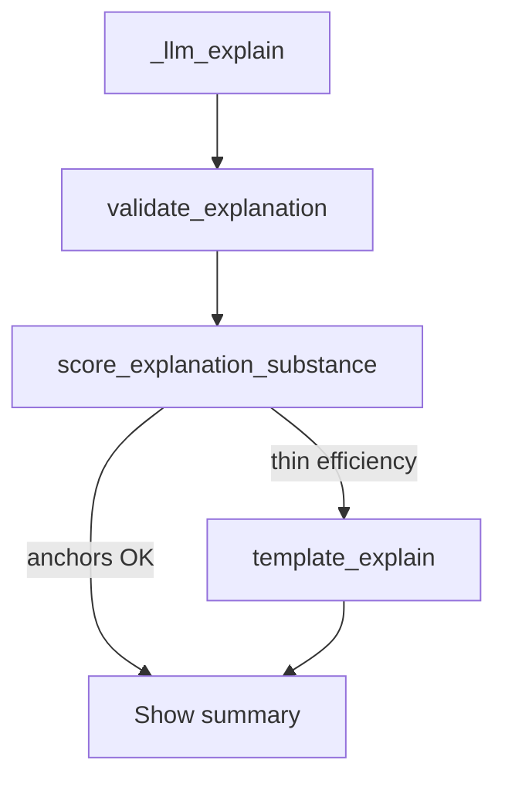

# Advice substance metric (runtime + offline)

## Problem

LLM Why? text often restates Mortal % as “more efficient / higher chance of improving” without citing hand facts. Your screenshots match that failure mode. Template + `shape_goals` / ukeire / dora is already more concrete when grounding repair kicks in.

There is no quality score today — only structural grounding in [`validate_explanation`](src/shanten_sensei/explain.py).

## Approach

Add a **substance metric** (concrete anchors hit vs thin efficiency claims), not a subjective “advice quality” score.



### 1. Offline scorer: `score_explanation_substance(turn, summary) -> SubstanceScore`

In [`explain.py`](src/shanten_sensei/explain.py):

```python
class SubstanceScore:  # small NamedTuple or dataclass
    thin: bool
    anchors: list[str]   # e.g. shanten, ukeire, wait_shape, shape_goal, dora, danger
    issues: list[str]    # e.g. thin_efficiency_claim
```

**Anchors** (summary mentions at least one when available on the turn):

- shanten / “acceptances” / ukeire count language
- `wait_shape` name if present on features
- any `shape_goals` tag (or glossed form)
- dora when `dora_in_hand` non-empty
- danger / genbutsu when relevant

**Thin flag** when all of:

- summary matches efficiency-tautology patterns (`more efficient`, `higher efficiency`, `higher (probability|chance)`, `keeps.*(flexible|options open)` as sole reason-ish), **and**
- cites Mortal % or “improving your hand” without a non-% anchor, **and**
- `anchors` is empty (or only Mortal-prob restatement)

If the turn has no usable anchors at all (rare: no shanten, no goals, no wait, no dora), do **not** mark thin — avoid false repairs.

### 2. Runtime gate

Extend [`validate_explanation`](src/shanten_sensei/explain.py): if `score_explanation_substance(...).thin`, append `"thin_efficiency_claim"`.

Existing `explain()` repair path already swaps to `template_explain`. Change: for **substance-only** repairs, do **not** append `(grounding repair: …)` to the live summary (that suffix is confusing in the overlay; keep it for hard grounding errors like wrong pin / invented yaku).

### 3. Prompt nudge (reduce how often the gate fires)

In `SYSTEM_PROMPT`, add a short rule:

- Do not justify Mortal by restating its % or saying “more efficient” alone.
- Prefer one concrete fact from the payload: acceptances/ukeire tiles, wait shape, shape_goals (+ glossary), or dora.

No Mortal % in Why text (chart already shows them) — align with the shape-goals plan.

### 4. Offline tests + tuning hook

In [`tests/test_shape_goals.py`](tests/test_shape_goals.py) or a small new `tests/test_explanation_substance.py`:

- Screenshot-like thin summaries → `thin=True`, validate fails
- Template summaries and goal/dora-rich lines → `thin=False`
- Good LLM-style line that cites “3-shanten / acceptances / tanyao / dora” → pass

Export `score_explanation_substance` so a later CLI/review pass can print scores without new UI work now.

## Out of scope

- Comparative ukeire-delta feature (best vs next-best) — nice later, not required for the metric
- LLM-as-judge / BLEU / human rubrics
- Overlay UI badge for “template vs LLM”
- Changing template prose beyond what repair already shows
