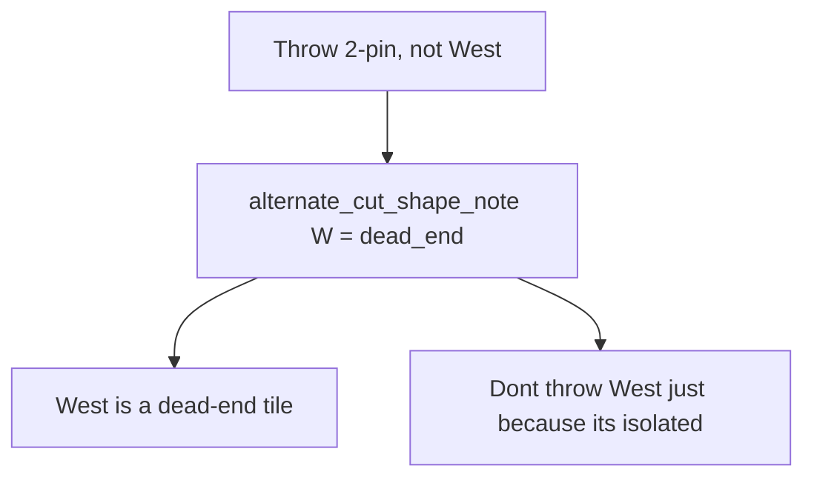

# Reframe “West is a dead-end” on the keep tile

Tonight’s tips are Mortal-correct (`Throw 2-pin, not West`) and copy-wrong. [`_alternate_midhand_shape_clause`](src/shanten_sensei/explain.py) runs `infer_hand_shape_notes` on the **runner-up** cut and dumps the same throw-voice used for Mortal’s pick:

```
Throw 2-pin, not West.
…
West is a dead-end tile.
```

`dead_end` / `floating_honor` / `floating_terminal` mean “this tile connects to nothing — throw it.” That belongs only on the **recommended** cut (`Throw West. West is a dead-end tile.`). On the contrasted tile it reads as throw West.

The dora clash fix already skipped this line when West is dora. The general case (isolated honor you are **keeping**) still prints it. [`SYSTEM_PROMPT`](src/shanten_sensei/explain.py) already says never attach dead-end to the alternate; the template and [`test_grounding_accepts_alternate_cut_dead_end`](tests/test_grounding.py) still allow it.



## Target copy

**Throw-reason notes on the alternate** (`dead_end`, `floating_honor`, `floating_terminal`):

- Short (when move paragraph already has `Throwing {best} keeps draws like …`): `Don't throw West just because it's isolated`
- Full (otherwise): `Don't throw West just because it's isolated — throwing 2-pin keeps more draws`

Never say `{alt} is a dead-end tile` after `Throw X, not {alt}`. Never use `keep it` (hits [`_PINNED_CUT_KEEP_IT_PATTERN`](src/shanten_sensei/grounding.py)). Never `keeping a dead-end` (hits polarity).

Keep existing skip when the alt tile is dora in hand.

**Keep-reason notes on the alternate** (`isolated_kanchan`, `isolated_penchan`, `sequence_protrusion`) stay as today: they explain why throwing Y is worse (`8-pin breaks up a closed middle`).

Recommended-cut dead-end is unchanged: `Throw North. North is a dead-end tile.`

**Defense:** today alt shape is skipped when `defense_led`. Still emit the isolated reframe so `8-sou is genbutsu` + `Don't throw West just because it's isolated` can coexist (the 8-sou screenshot). Leave kanchan/penchan/protrusion skipped when defense-led.

## Code

[`src/shanten_sensei/explain.py`](src/shanten_sensei/explain.py)

- In `_alternate_midhand_shape_clause`, pass the recommended-cut label. If `note.kind` is a throw-reason, return the isolated-keep sentence (short vs full from whether `keeps draws like` is already in `move_sents`).
- Call site (~2365): still skip dora-alt; when `defense_led`, append only the isolated-keep sentence, not kanchan/penchan/protrusion.
- Prompt: replace “never attach dead-end to the alternate” with the new example; forbid `{alt} is a dead-end` after `not {alt}`.

[`src/shanten_sensei/grounding.py`](src/shanten_sensei/grounding.py)

- Stop treating alt `dead_end` / floating as allowed cut-note claims in `_cut_shape_notes_for_turn` (do not append those kinds for the contrasted tile).
- New reject: contrasted tile + `{tile} is a dead-end/floating honor/floating terminal` → repair to template (covers LLM). Accept `don't throw {alt} just because it's isolated`.

## Tests

- Screenshot-shaped: `dahai 2p` vs `dahai W`, isolated West, 4p dora in hand → summary has `Don't throw` + `West` + `isolated`; **not** `west is a dead-end`.
- Flip [`test_grounding_accepts_alternate_cut_dead_end`](tests/test_grounding.py): `Throw 7-sou, not Chun. Chun is a dead-end tile.` now fails; reframe copy passes.
- Update [`test_screenshot_7s_vs_chun_coaching_depth`](tests/eval/test_screenshot_regressions.py): drop `dead-end` assert; require isolated-keep voice.
- Existing [`test_screenshot_chun_vs_west_dora_no_dead_end_on_dora`](tests/eval/test_screenshot_regressions.py) and cut-tile dead-end goldens stay.

Out of scope: Mortal’s pick; “Keeping dora 4-pin” on a later turn with no 4-pin in hand (separate `dora_in_hand` question if it shows up again).
