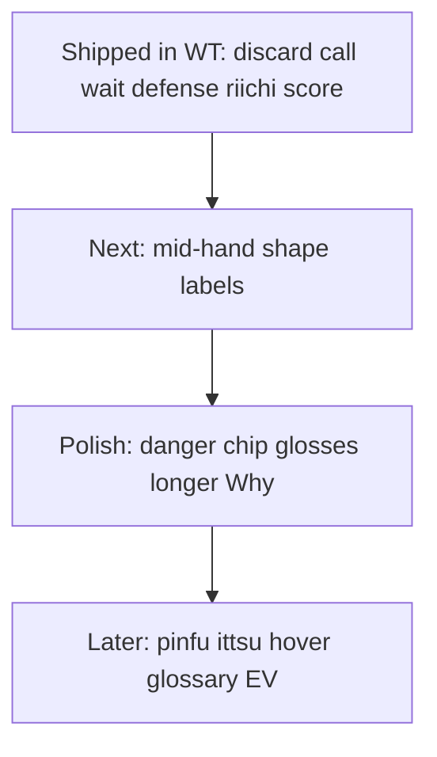

# What remains for beginner help

## Already done (working tree, not yet on main)

The [teaching gaps roadmap](.cursor/plans/teaching_gaps_roadmap_12a184ea.plan.md) and follow-ons are largely implemented uncommitted: Throw/Skip/Declare prose, wait + danger glosses, furiten-because, call tradeoffs, riichi tip branch, score-situation one-liners, Aiming-for + review chip parity, yakuhai “because”. Key surface: [`explain.py`](src/shanten_sensei/explain.py), [`glosses.py`](src/shanten_sensei/glosses.py), [`features.py`](src/shanten_sensei/features.py), [`web/review.html`](web/review.html).

**Practical first step for real beginners:** commit and ship that stack so live/review users get it.

## Ranked remaining gaps

### 1. Mid-hand efficiency labels (highest Sensei-repo value)

Beginners spend most turns *not* in tenpai. Why? already contrasts ukeire and aims (tanyao/yakuhai/…), but rarely names **why this tile is dead wood** before ready:

- Floating terminals/honors outside the aiming shape
- Isolated closed shapes (lone kanchan / penchan / ryanmen candidate) that block better cuts
- “Dead end” language for tiles with near-zero improving value when Mortal cuts them

**Approach (locked):** add a small `hand_shape_notes` (or similar) derived list in [`features.py`](src/shanten_sensei/features.py)—conservative tags only when citeable from the closed hand + `shape_goals`—then one short template sentence in the discard path of [`explain.py`](src/shanten_sensei/explain.py), e.g. `9-pin is a floating terminal outside tanyao` / `that clears a closed middle shape`. Reuse existing gloss voice; no new evaluator.

### 2. Small review/UI gloss gaps

- Danger chips in [`web/review.html`](web/review.html) still show raw `4m:suji`; Why? already glosses them—mirror `DANGER_GLOSS` in the status strip (or send labels from [`serve.py`](src/shanten_sensei/serve.py)).
- Furiten “because” only appears in Why? prose; optional chip tooltip is nice-to-have only.
- README’s optional **second-click deeper paragraph** is still unimplemented (hard-capped 1–2 sentences today).

### 3. Deeper yaku paths (careful)

[`infer_shape_goals`](src/shanten_sensei/features.py) only tags chinitsu/honitsu/tanyao/yakuhai/chiitoi/toitoi. Validation blocks LLM mentions of `pinfu` / `ittsu` / etc. unless tagged.

Expand only with **under-tagging** heuristics (same philosophy as today): e.g. menzen + no value pairs + open-ended sequence density → `pinfu`; clear 1–9 suit stretch → `ittsu`. Skip until mid-hand labels land—false yaku claims hurt beginners more than silence.

### 4. Explicitly defer (low beginner ROI or wrong repo)

- Hover glossary UI (parentheticals + Yaku list URL are enough)
- Full push/fold EV, ura, orasu tables, per-opponent threat
- Overlay toolbar/theme polish — sibling [`shanten-sensei-overlay`](https://github.com/rclarke009/shanten-sensei-overlay)

## Recommended next coding slice

**Mid-hand efficiency labels** in this repo, then danger-chip gloss polish in review as a tiny follow-up in the same PR if cheap.

Out of scope for that slice: new yaku tags, EV, overlay GUI, glossary modals.
