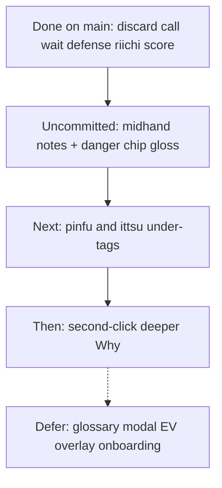

# What remains for beginner help

## Where you are now

Sensei’s beginner coach is already strong on **decision moments**: Throw/Skip/Declare prose, wait + danger glosses, furiten-because, call tradeoffs, riichi tip branch, score one-liners, Aiming-for + yakuhai “because”, review chip parity. That stack lives in commit `eadb7ba` on local `main` (ahead of origin by 1).

**Uncommitted in the working tree (~370 lines):** mid-hand `hand_shape_notes` + `SHAPE_NOTE_GLOSS` + discard-path sentence, plus review danger chips mirrored through `DANGER_GLOSS` ([`features.py`](src/shanten_sensei/features.py), [`explain.py`](src/shanten_sensei/explain.py), [`glosses.py`](src/shanten_sensei/glosses.py), [`web/review.html`](web/review.html)). The [beginner gaps plan](.cursor/plans/beginner_gaps_remaining_36e45c1c.plan.md) marked those todos complete — they just need a commit/push.

## Ranked remaining gaps

### 1. Ship the mid-hand slice (highest immediate value)

Beginners spend most turns *not* in tenpai. Mid-hand notes name dead wood before ready (“floating terminal outside tanyao”, “clears a closed middle shape”). Until this is committed and pushed, live/review users on origin do not get it.

**Action:** commit the dirty teaching files (not the `.cursor/plans/` noise unless you want them), push `main`.

### 2. Conservative deeper yaku tags (next Sensei-repo coding slice)

[`infer_shape_goals`](src/shanten_sensei/features.py) only tags chinitsu / honitsu / tanyao / yakuhai / chiitoi / toitoi. Validation in [`explain.py`](src/shanten_sensei/explain.py) rejects LLM mentions of `pinfu` / `ittsu` unless tagged — so the coach stays silent on common closed-hand aims.

**Locked approach (under-tag only):**

- `pinfu`: menzen, no value pairs/yakuhai pairs, open-ended sequence density, no open calls — tag only when clearly shape-like; never when open.
- `ittsu`: clear 1–9 stretch progress in one suit (e.g. two of three blocks present or strong contiguous coverage) — under-tag vs over-claim.
- Wire into existing `GOAL_GLOSS` + Aiming-for + substance grounding (patterns already listed for pinfu/ittsu).
- Golden tests: tag fires on clear fixtures; grounding still rejects invented pinfu when untagged.

False yaku claims hurt beginners more than silence — keep the same under-tagging philosophy as today’s goals.

### 3. Second-click deeper Why? (README promise)

README still says: default 1–2 sentences; optional deeper paragraph behind a second click. Today review/live only switch Offline template vs LLM — both stay short.

**Locked approach:** add an optional `detail` (or expand) path on `explain()` / serve that asks for one extra grounded paragraph (ukeire contrast, danger, score_situation, hand_shape_notes) without changing the short `summary`. Review: “More” toggles it; overlay can follow in the sibling repo with the same payload field.

### 4. Explicitly defer (low beginner ROI here)

| Gap | Why defer |
|-----|-----------|
| Hover glossary modal | Parentheticals + Yaku list URL already teach terms in context |
| Full push/fold EV, ura, orasu, per-opponent threat | Wrong layer; Mortal already decides; Sensei verbalizes |
| Tutorial / first-run onboarding | Mostly docs + overlay UX; setup lives in [`docs/live-setup.md`](docs/live-setup.md) |
| Overlay theme/toolbar polish | Sibling [`shanten-sensei-overlay`](https://github.com/rclarke009/shanten-sensei-overlay) |

## Recommended next coding slice

After committing/pushing mid-hand: **pinfu + ittsu under-tags** in this repo — small `infer_shape_goals` expansion, gloss strings, Aiming-for reuse, golden tests. No new evaluator, no glossary UI, no EV.

Out of scope for that slice: second-click deeper Why? (follow-up), overlay GUI, onboarding flows.
