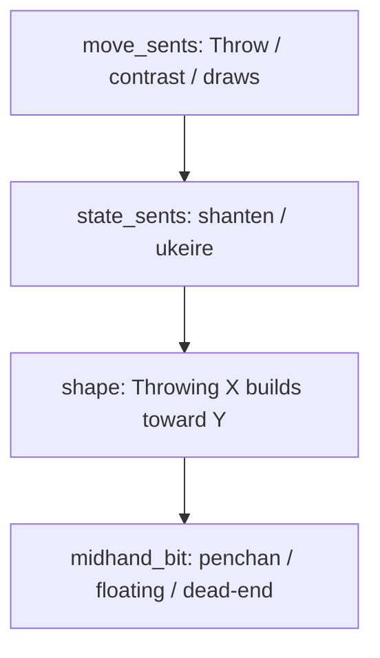

# Move-linked "builds toward" yaku phrasing

## Problem

Shape-goal lines like **"That fits pinfu"** sit after shanten/ukeire and read as if the *stats* or a vague "that" fit pinfu—not that the **recommended move** supports the yaku path shown in the Aiming-for strip.

## Target voice

Keep paragraph structure unchanged (user preference): shape line stays in the **state paragraph**, after shanten/ukeire.

**Discard (screenshot shape):**
```
Throw 9-pin, not South.
Throwing 9-pin keeps draws like 2-pin, 7-pin, 3-sou, and 8-sou.

You're 2-shanten with about 16 ukeire (tiles that improve the hand).
Throwing 9-pin builds toward pinfu (closed all-sequences; no value pair) with dora (bonus tile) 6-man.
9-pin clears an edge (penchan) shape.
```

**Tanyao + honor cut (dash clause):**
```
Throwing West builds toward tanyao (2–8 only; no 1/9, winds, or dragons)—it can't stay in that hand.
```
Use **"it"** instead of repeating the tile name when the gerund subject already names the cut.

**Skip-chi (call tips):**
```
Skipping the chi on 7-sou for 6-7-8 sou builds toward pinfu (closed all-sequences; no value pair).
```

**Dora-only (no shape goals):** leave as today — `Keeping dora (bonus tile) …` — no "builds toward" wrapper.

## Code changes — [`src/shanten_sensei/explain.py`](src/shanten_sensei/explain.py)

### 1. Gerund helper

Add near `_shape_goal_phrase`:

```python
def _gerund_move_subject(lead: str) -> str:
    """Imperative coach lead → gerund subject for 'builds toward' links."""
```

Rules (prefix match on first move sentence):
- `Throw {tile}` → `Throwing {tile}`
- `Skip the …` / `Skip` → `Skipping the …` / `Skipping`
- `Call pon on …` → `Calling pon on …`
- `Chi {tile}` → `Calling chi on {tile}` (chi labels omit "Call" today)
- `Declare riichi` / `Stay silent` → fall back to bare lead (riichi tips don't emit shape goals today)
- Unknown → return lead unchanged (safe fallback)

Strip emoji from tile in gerund only when needed for readability (reuse `_label_without_emoji`).

### 2. Refactor `_shape_goal_phrase`

Split responsibilities:

| Piece | Returns |
|-------|---------|
| `_shape_goal_tail(turn)` | Goal fragment only: `pinfu (gloss) / tanyao (gloss)` or same `with dora …`; `None` when empty |
| `_shape_goal_phrase(turn)` | Keep for dora-only: `keeping dora …`; delegate goal cases to tail |
| `_shape_goal_builds_toward_sentence(move_subject, turn)` | `{subject} builds toward {tail}` or `None` |

Replace all `if goal_bit.startswith("fits"): state_sents.append(f"That {goal_bit}")` with the new builder.

**Three call sites** (same paragraph placement):
- [`_template_explain_body`](src/shanten_sensei/explain.py) ~1953–1980 — subject from `Throwing {best_tile}`
- [`_template_explain_call`](src/shanten_sensei/explain.py) skip branch ~1644–1649 — subject from `_gerund_move_subject(move_sents[0])`
- [`_template_explain_call`](src/shanten_sensei/explain.py) call-win branch ~1686–1691 — subject from `_gerund_move_subject(move_sents[0])`

Preserve existing append logic on the shape sentence:
- tanyao terminal/honor dash → `—it can't stay in that hand` (not `—{tile} can't…`)
- yakuhai `_yakuhai_because_clause`
- dora + floating/dead-end line-break guard via `_goal_bit_mentions_dora` (update to check tail / "with dora", not `"fits"` prefix)

**Out of scope:** the separate tanyao call-skip line `You're still aiming for tanyao and holding terminals` — different pattern, unchanged.

### 3. `SYSTEM_PROMPT` examples

Update voice rules and locked examples (~177, 200–216):
- Prefer **`{move} builds toward {goal}`** over `That fits {goal}`
- Refresh discard, tanyao, yakuhai, and chi-skip examples to match

## Tests

| File | Changes |
|------|---------|
| [`tests/test_shape_goals.py`](tests/test_shape_goals.py) | `fits tanyao` → `builds toward tanyao`; update grounding sample summaries |
| [`tests/test_explanation_substance.py`](tests/test_explanation_substance.py) | LLM-style anchor sample + template asserts |
| [`tests/eval/test_template_goldens.py`](tests/eval/test_template_goldens.py) | `That fits chiitoi` → `builds toward chiitoi`; relax state-para regex from `That fits` to `builds toward` |
| [`tests/test_grounding.py`](tests/test_grounding.py) | yakuhai sample string if it hard-codes `That fits` |

Grounding anchors key off yaku **names**, not "fits" — no validator changes expected.

**Screenshot-shaped golden** (optional but valuable): pinfu + ukeire contrast + penchan midhand → assert `Throwing` + `builds toward pinfu` + penchan on its own line.

Run: `pytest tests/test_shape_goals.py tests/test_explanation_substance.py tests/eval/test_template_goldens.py tests/test_grounding.py -q`

## Flow (unchanged placement)


