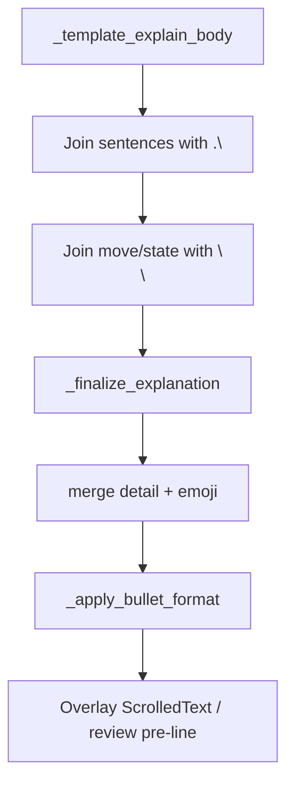

# Bullet-list formatting for Yakuman tips

## What you're seeing

Your screenshot tip is one dense block because:

1. **Paragraph 1** (throw / ukeire contrast / named tiles) — newline breaks are already implemented for full ukeire contrast (`note_kind == "contrast"`) in [`src/shanten_sensei/explain.py`](src/shanten_sensei/explain.py), but your running build may predate that (old wording like `Throwing 9-pin mostly improves via` vs current `If you threw 9-pin instead…`).
2. **Paragraph 2** (shanten, pinfu + dora, floating-honor cut reasons) — still joined with `. ` via `_join_summary_paragraphs`, so multiple teaching beats collapse into one line.
3. **No bullet glyphs** — even with `\n`, wrapped lines in the `ScrolledText` panel can still feel like a wall.

You chose **bullet lists**. We'll keep a single `Explanation.summary` string (no schema change) and render `•` prefixes everywhere.

## Target layout (your screenshot shape)

```
• Throw North, not 9-pin.
• That leaves about 20 improving tiles left vs about 17 if you throw 9-pin.
• Throwing North keeps draws like 2-pin, 6-pin, 7-pin, and 9-pin.
• If you threw 9-pin instead, you'd mostly improve via 2-pin, 7-pin, 8-sou, and South.

• You're 2-shanten.
• That fits pinfu (closed all-sequences; no value pair) with dora (bonus tile) 6-man.
• North is a floating honor outside pinfu (closed all-sequences; no value pair).
• 9-pin clears an edge (penchan) shape.
```

Blank line between the **move block** and **state block** gives two scannable groups without changing voice.



## Implementation

### 1. Newline-join both paragraphs (template layer)

In [`src/shanten_sensei/explain.py`](src/shanten_sensei/explain.py):

**Extend `_join_summary_paragraphs`** (~603–614):

- Add `second_between: str = ". "` param (mirror existing `first_between`).
- Change paragraph gap from single `\n` to **`\n\n`** when both groups are non-empty (stronger section break before bullets).

**In `_template_explain_body`** (~2021–2024):

```python
move_join = ".\n" if note_kind in ("contrast", "narrow_contrast") else ". "
state_join = ".\n" if len(state_sents) > 1 else ". "
summary = _join_summary_paragraphs(
    move_sents, state_sents,
    first_between=move_join,
    second_between=state_join,
)
```

Also apply `second_between=".\n"` when `len(state_sents) > 1` in discard-adjacent templates that build `state_sents` (`_template_explain_call`, `_template_explain_riichi`, `_template_explain_hora` if they emit multiple state sentences).

**Narrow contrast** — include in `move_join` so `Throw X, not Y` and the ukeire gap line get separate lines even when named-tile sentences are absent.

Existing dora + dead-end / floating-honor **embedded `\n`** inside a state sentence stays as-is; the bullet formatter treats each `\n` as a new bullet within that group.

### 2. Central bullet formatter (all paths)

Add near the join helpers:

```python
_BULLET_PREFIX = "• "

def _apply_bullet_format(summary: str) -> str:
    """Turn newline-separated prose into bullet lists per blank-line paragraph."""
    groups: list[str] = []
    for para in summary.split("\n\n"):
        lines = [
            ln.strip().removeprefix(_BULLET_PREFIX).strip()
            for ln in para.split("\n")
            if ln.strip()
        ]
        if lines:
            groups.append("\n".join(f"{_BULLET_PREFIX}{ln}" for ln in lines))
    return "\n\n".join(groups)
```

Call **once** at the end of [`_finalize_explanation`](src/shanten_sensei/explain.py) (~917), after `_ensure_tile_emojis`:

```python
summary = _apply_bullet_format(summary)
```

This covers template output, LLM output, and detail-merge appendages uniformly.

### 3. LLM prompt alignment (same file)

Update `SYSTEM_PROMPT` (~197–248):

- Replace plain-sentence examples with bullet-prefixed lines matching the target layout above.
- Rule: each teaching beat on its own line; prefix with `• `; use `\n\n` between move/ukeire block and shanten/goals/defense block; no semicolon joins for contrast named-tile lines.

### 4. UI — no changes required

- Overlay [`shanten-sensei-overlay/gui/main_gui.py`](../shanten-sensei-overlay/gui/main_gui.py) `ScrolledText` already displays `\n` and `•` literally.
- Review [`web/review.html`](web/review.html) `.why-box .summary { white-space: pre-line; }` already honors newlines.

After merging sensei changes, reinstall / restart the overlay so it picks up the updated package.

### 5. Tests

| File | What to assert |
|------|----------------|
| [`tests/eval/test_template_goldens.py`](tests/eval/test_template_goldens.py) | Update contrast goldens: lines start with `• `; move block and state block separated by `\n\n`; pinfu+dora screenshot fixture (N vs 9p, gap ≥3) has ≥4 move bullets and ≥3 state bullets |
| [`tests/test_explanation_substance.py`](tests/test_explanation_substance.py) | Relax `startswith("Throw")` → `startswith("• Throw")`; contrast test checks bullet lines |
| [`tests/test_grounding.py`](tests/test_grounding.py) | Spot-check `validate_explanation` still passes on bulletized template output (validators search mid-string; should be unaffected) |

Helper for tests (optional, in test file or explain module `__all__`):

```python
def strip_bullets(summary: str) -> str:
    return "\n".join(ln.removeprefix("• ").strip() for ln in summary.splitlines())
```

Use when comparing prose content without caring about prefix.

Run: `pytest tests/eval/test_template_goldens.py tests/test_explanation_substance.py tests/test_grounding.py -q`

## Out of scope

- New API fields or HTML `<ul>` rendering (bullets live in the string)
- Rewording coaching content (layout only)
- Reason-log-specific formatting (inherits bullets from summary automatically)
