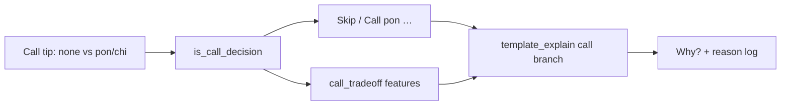

# Clearer call coaching (skip vs pon/chii)

## Problem (from your screenshot)

Live Why? is still **discard-shaped**. For skip-vs-call turns it produces nonsense like “Throw none, not pon” / “Mortal prefers none over pon…”, while Aiming-for correctly says tanyao. There is **no call branch** and **no open-vs-closed contrast**, so the coach cannot explain why Skip beats Pon.

The in-progress [clearer coach prose](.cursor/plans/clearer_coach_prose_afa2d7ba.plan.md) plan only covers discards (“Throw X”); this plan is the call counterpart.

## Locked approach

Keep a **single prose `summary`** (no new pros/cons UI fields). Encode tradeoffs as short coach sentences:

> Skip the pon on 3-sou. You’re still 2-shanten (2 steps from ready) closed with about 55 improving tiles. Calling would open the hand—no riichi—while you’re still aiming for tanyao (2–8 only…) and holding terminals.

When Mortal wants the call (e.g. fixture `pon W` vs `none`):

> Call pon on West. That locks a yakuhai triplet and gets you closer than staying closed.

## Code changes

### 1. Call labels — [`tiles.py`](src/shanten_sensei/tiles.py) + [`live.py`](src/shanten_sensei/live.py)

- Add `coach_action_label(action)`:
  - `none` → `Skip`
  - `pon W` / bare `pon` → `Call pon` / `Call pon on West` when tile known
  - `chi*` → `Chi` (+ tile when known); map `chi_low|mid|high` → `Chi`
  - `*kan*` → `Call kan…`
  - `dahai …` unchanged (still tile-only via existing `human_action_label`)
- Detect call-decision turns: `mortal_best` or contrast is in `{none, pon*, chi*, *kan*}`.
- **Unify live meta codes:** when recommended reaction is tile-bearing (`pon W`) and a candidate is bare `pon`/`chi_*`, treat them as the same family for contrast (avoid “Call pon West, not pon”). Prefer enriching `candidates_from_meta_options` / `turn_from_live` using reaction `pai` + `consumed` from the overlay reaction dict.

Overlay touch: [`sensei_adapter.build_turn`](file:///Users/rebeccaclarke/a_new_projects_folder/shanten-sensei-overlay/sensei_adapter.py) already passes the full `reaction`; ensure `action_to_label(reaction)` stays the pin and candidate bare codes don’t become a fake second option.

### 2. Call tradeoff features — [`features.py`](src/shanten_sensei/features.py) + [`schema.py`](src/shanten_sensei/schema.py)

Add a small optional block on `DerivedFeatures`, e.g. `call_tradeoff`:

- `stay_closed_shanten` / `stay_closed_ukeire` — current closed metrics (already computed)
- `call_action` — the call being contrasted (pon/chi/kan), when present among best/next-best
- `open_shanten` — after simulating the call when possible:
  - **pon:** remove 2× called tile from hand, `num_melds+1`
  - **chi/kan:** use `consumed` from review `expected` / live reaction when available; skip open_shanten if consumed unknown
- `opens_hand: true` when currently menzen and the contrasted action is a call
- Reuse existing `calculate_shanten` / meld padding; no full post-call ukeire in this pass (ukeire after open needs a discard plan we don’t have)

Wire from `extract_features` / `turn_from_live` / ingest when the tip is a call decision. Review fixtures [`diverge_004`](fixtures/diverge_004/entry.json) (`pon W` + consumed) and [`diverge_005`](fixtures/diverge_005/entry.json) (chi) are the golden sources.

### 3. Template + prompt — [`explain.py`](src/shanten_sensei/explain.py)

In `template_explain`, **branch before** the Throw sentences:

1. **Action:** `Skip` / `Skip the pon on {tile}` / `Call pon on {tile}, don’t skip` (using `coach_action_label`).
2. **Closed efficiency:** glossed shanten + improving-tile count (current closed hand).
3. **Tradeoff sentence(s)** from `call_tradeoff`:
   - If Skip wins and hand is menzen: open loses riichi; if `open_shanten` known and not clearly better, say calling doesn’t get you much closer / still far.
   - If Aiming-for includes tanyao and hand still has terminals/honors: note that shape isn’t ready to open yet.
   - If Call wins: cite yakuhai/shape lock and/or better `open_shanten` when available.
4. Keep existing discard path unchanged for dahai tips.

Update `SYSTEM_PROMPT` with the same Skip/Call voice + one locked skip-vs-pon example; forbid leading with Throw/Mortal prefers on call tips. Substance anchors: accept `Skip`/`Call`/`open`/`riichi` as valid call anchors alongside existing improving-tiles / fits.

### 4. Glosses — [`glosses.py`](src/shanten_sensei/glosses.py) (minimal)

Only if needed for Aiming-for reuse; prefer keeping call verbs in `tiles.coach_action_label` rather than expanding the yaku gloss map.

## Tests

- Golden template: live-style `none` vs `pon` + tanyao goals + 2-shanten → summary contains `Skip`, `Call`/`pon`, `riichi` or `open`, and `fits tanyao` / terminals note — **not** `Throw`.
- `diverge_004` / `diverge_005`: offline explain pins correctly; call voice; no “Throw pon”.
- Label unification: recommended `pon W` + meta `pon` → contrast is Skip (or absent), not “not pon”.
- Feature: pon simulation drops shanten or reports opens_hand when menzen.
- Update any string assertions that assumed Throw on call fixtures.

## Out of scope

- New pros/cons UI widgets / schema fields beyond `summary`
- Full post-call ukeire / best-discard-after-call search
- Claiming Mortal’s internal yaku plan beyond heuristic `shape_goals`
- Discard Throw-voice polish already covered by clearer_coach_prose
