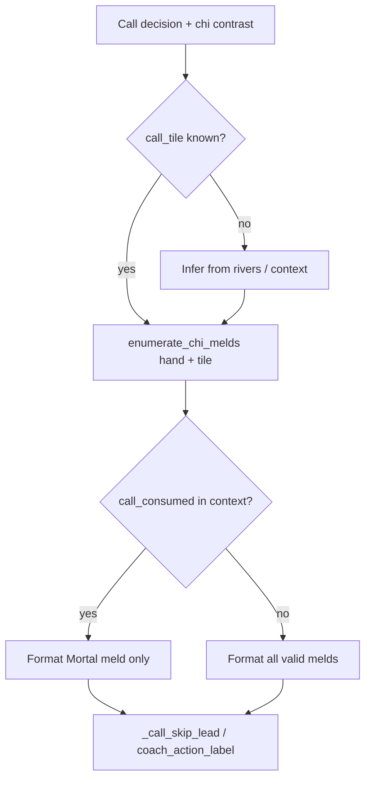

# Chi meld detail in skip/call tips

## Problem (from your screenshot)

Skip-chi tips already explain **why not** (opens hand, no riichi, still 2-shanten, pinfu needs closed sequences). They do **not** say **which** chii is on the table:

- Discard: **7-sou**
- Valid melds: **6-7-8** (6s+8s) and **7-8-9** (8s+9s)
- Current lead: `Skip the chi` (sometimes without even naming 7-sou if `call_tile` is missing)

**Target voice** (your preference: Mortal’s meld when known, else list all):

```
Skip the chi on 7-sou for 6-7-8 sou.
You're 2-shanten closed with about 11 improving tiles.
Calling would open the hand—no riichi.
You're not in tenpai yet and can still improve closed.
That fits pinfu (closed all-sequences; no value pair).
```

When `consumed` is unknown and two melds exist:

```
Skip the chi on 7-sou—you could meld 6-7-8 sou or 7-8-9 sou.
…
```



## Code changes

### 1. Enumerate chi melds — [`src/shanten_sensei/features.py`](src/shanten_sensei/features.py) (or [`tiles.py`](src/shanten_sensei/tiles.py) if kept tile-pure)

Add `enumerate_chi_melds(hand: list[str], call_tile: str) -> list[tuple[str, str, str]]`:

- Suit tiles only (1–9 m/p/s); honors → `[]`
- For each sequence position where `call_tile` can sit (low / mid / high), check the two **hand** tiles exist
- Return sorted unique triples `(low, mid, high)` in mjai codes

Add `chi_meld_label(seq: tuple[str, str, str]) -> str` → compact English, e.g. `6-7-8 sou` (reuse `_SUIT_NAMES` from [`tiles.py`](src/shanten_sensei/tiles.py); no emoji in the sequence phrase to save words).

### 2. Wire `call_consumed` into features context

Today `resolved_consumed` is used for `build_call_tradeoff` but **not** stored on `turn.features.context` ([`live.py`](src/shanten_sensei/live.py) ~354–355 only sets `call_tile`).

- In [`live.py`](src/shanten_sensei/live.py): `feat_context["call_consumed"] = resolved_consumed` when present
- In [`ingest.py`](src/shanten_sensei/ingest.py): same after resolving `call_consumed` from `expected` / `actual`

Template and LLM payload already expose `context` via [`_build_llm_payload`](src/shanten_sensei/explain.py).

### 3. Infer chi `call_tile` when live meta is bare `chi_*`

Extend [`infer_call_tile`](src/shanten_sensei/live.py) (or add `infer_chi_call_tile` called from the same place):

- When candidates include `chi` / `chi_low|mid|high` and `call_tile` is still missing
- Take latest discard from `visible_discards` (same river-end pattern as pon inference)
- Return it only if `enumerate_chi_melds(hand, tile)` is non-empty

Fixes generic `Skip the chi` when overlay passes `chi_mid` + `none` but forgets `pai`.

### 4. Coach phrasing — [`src/shanten_sensei/explain.py`](src/shanten_sensei/explain.py)

Add `_chi_meld_detail(turn, call_action: str) -> str | None`:

| Case | Phrase fragment |
|------|-----------------|
| `call_consumed` known + matches one meld | `for 6-7-8 sou` |
| `call_consumed` unknown, 1 meld | `for 6-7-8 sou` |
| `call_consumed` unknown, 2+ melds | `—you could meld 6-7-8 sou or 7-8-9 sou` |
| No `call_tile` or no melds | `None` (keep current lead) |

Update **`_call_skip_lead`** (chi branch, ~1212–1215):

```python
# Before: "Skip the chi on 7-sou"
# After:  "Skip the chi on 7-sou for 6-7-8 sou"
#     or: "Skip the chi on 7-sou—you could meld … or …"
```

Pass `turn` into `_call_skip_lead` from [`_template_explain_call`](src/shanten_sensei/explain.py) (~1511).

Mirror on **call-wins** path: extend [`coach_action_label`](src/shanten_sensei/tiles.py) chi branch **or** append meld detail in `_template_explain_call` when `best_kind != "none"` so `Chi 7-sou for 6-7-8 sou, don’t skip` stays consistent.

**Why-not copy:** leave existing `open_note`, shanten/ukeire, pinfu/tanyao goal sentences unchanged—they already answer “why skip.” No extra sentence unless word budget allows a single tie-in (out of scope unless tests show confusion).

### 5. LLM prompt — same file [`explain.py`](src/shanten_sensei/explain.py)

- Add rule: on chi tips, name the sequence meld (`for 6-7-8 sou` or list all when `call_consumed` absent)
- Update the existing chi example (~225–227) to include meld text
- Expose `call_consumed` in payload (already in `context` after step 2)

### 6. Grounding

No new yaku claims. Optional light check in [`grounding.py`](src/shanten_sensei/grounding.py): if summary mentions `for \d-\d-\d` sou/man/pin, ensure `call_tile` is grounded—only if cheap; otherwise rely on template path for offline goldens.

## Tests

| File | Case |
|------|------|
| New `tests/test_chi_melds.py` | `enumerate_chi_melds` unit cases: single meld (diverge_005 shape), double meld (screenshot hand), honor discard → `[]` |
| [`tests/test_call_coaching.py`](tests/test_call_coaching.py) | Screenshot-shaped `turn_from_live`: hand with 6s/8s/9s, `recommended="none"`, `call_tile="7s"`, `shape_goals=["pinfu"]` → summary contains `7-sou` + `6-7-8` and `7-8-9` (no consumed) |
| Same file | With `call_consumed=["6s","8s"]` → summary contains `6-7-8` only, not `7-8-9` |
| [`tests/test_call_coaching.py`](tests/test_call_coaching.py) `test_diverge_005_chi_voice` | Skip or call path mentions `4-5-6` / `4-man` meld when consumed `[4m,6m]` |
| [`tests/eval/test_template_goldens.py`](tests/eval/test_template_goldens.py) | Optional golden row for pinfu skip-chi if not covered in call_coaching |

Assert `validate_explanation` still passes (word count stays under 80-word cap).

## Out of scope

- Overlay changes beyond what `reaction.pai` + `consumed` already provide (infer-from-river is best-effort fallback)
- Picking *which* meld Mortal prefers when multiple exist but `consumed` is missing (list all per your choice)
- Post-call ukeire / discard-after-chi simulation
