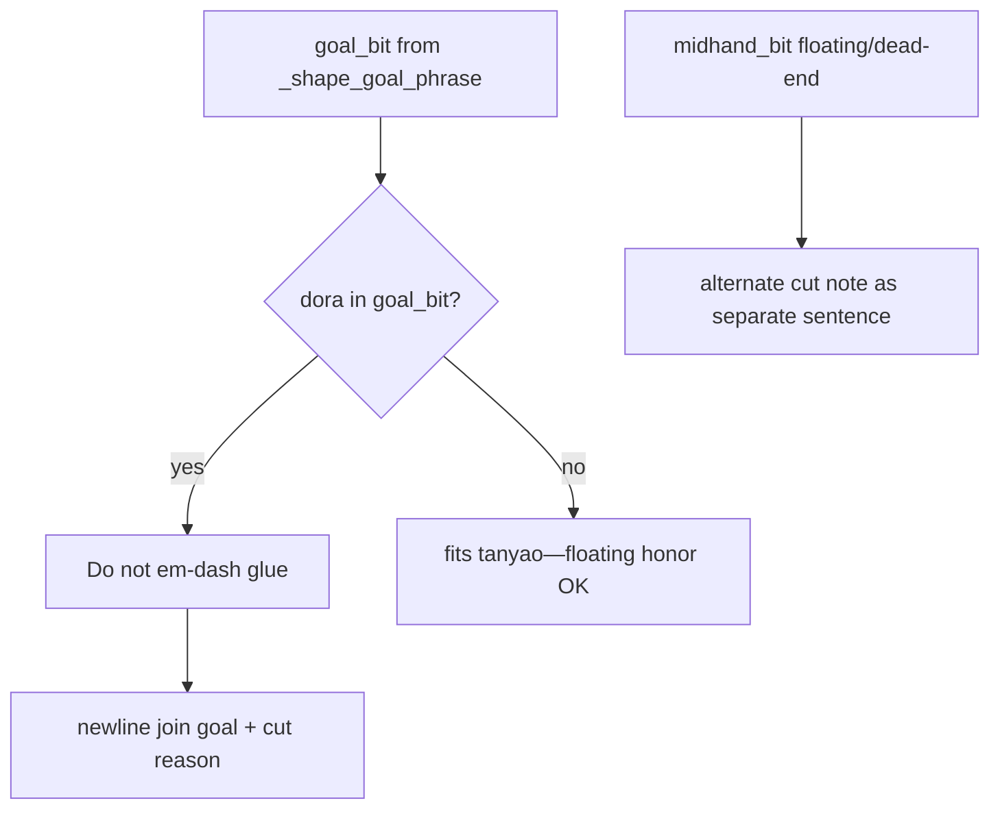

# Fix chiitoi + dora run-on sentence

## What you’re seeing

Paragraph 2 in your screenshot reads (roughly):

```
You're 2-shanten. That fits chiitoi (seven pairs) with dora (bonus tile) 1-man—West is a floating honor outside chiitoi (seven pairs). North is a floating honor outside chiitoi (seven pairs).
```

The run-on is the em-dash after `1-man`: it stitches **shape goal + dora** onto **why West is a good cut**. That’s the same polarity clash as the earlier dora/dead-end fix ([`dora_dead-end_line_breaks_acf56d29.plan.md`](.cursor/plans/dora_dead-end_line_breaks_acf56d29.plan.md)), but the guard only covers `goal_bit.startswith("keeping")` — not `fits … with dora …`.

Paragraph 1 (`Throw West, not North. That leaves about 10 … vs about 9 …`) is fine.

## Root cause

In [`src/shanten_sensei/explain.py`](src/shanten_sensei/explain.py) `_template_explain_body` (~1948–1994):

```1948:1994:src/shanten_sensei/explain.py
    if goal_bit and not defense_led:
        ...
        if midhand_bit and (
            "floating" in midhand_bit or "dead-end" in midhand_bit
        ):
            # Dora-keep vs cut-reason are opposite polarities — don't dash-glue.
            if not goal_bit.startswith("keeping"):
                shape_sentence += f"—{midhand_bit}"
                midhand_bit = None
        ...
    if midhand_bit and not defense_led:
        if (
            goal_bit
            and goal_bit.startswith("keeping")
            ...
        ):
            state_sents[-1] = (
                f"{state_sents[-1]}\n{_sentence_case(midhand_bit)}"
            )
```

- `_shape_goal_phrase` returns `fits chiitoi … with dora …` when goals + `dora_in_hand` ([~1212–1215](src/shanten_sensei/explain.py))
- Because `goal_bit` does **not** start with `keeping`, West’s `floating_honor` note gets em-dash-glued → run-on
- `midhand_bit` is cleared, so North’s alternate floating-honor note correctly lands as a **separate** sentence — which makes the glued first half even more awkward

## Target layout

```
Throw West, not North. That leaves about 10 improving tiles left vs about 9 if you throw North.

You're 2-shanten.
That fits chiitoi (seven pairs) with dora (bonus tile) 1-man.
West is a floating honor outside chiitoi (seven pairs).
North is a floating honor outside chiitoi (seven pairs).

West is genbutsu (safe — opponent already discarded it, so they can't ron it).
```

(Exact ukeire numbers depend on fixture; structure is what matters.)

## Implementation

### 1. Broaden the “don’t dash-glue” guard

Add a small helper near `_shape_goal_phrase` (or inline) in [`explain.py`](src/shanten_sensei/explain.py):

```python
def _goal_bit_mentions_dora(goal_bit: str) -> bool:
    return "dora" in goal_bit.lower()
```

Replace the `startswith("keeping")` check at ~1957 with:

```python
if not _goal_bit_mentions_dora(goal_bit):
    shape_sentence += f"—{midhand_bit}"
    midhand_bit = None
```

This keeps intentional dash glue for plain `fits tanyao—West is a floating honor…` (no dora in goal line) while stopping dora + cut-reason glue.

### 2. Newline-join dora goal + cut reason (mirror keeping-dora path)

Extend the block at ~1978–1987 so newline-join fires when:

- `goal_bit` mentions dora (`keeping` **or** `with dora`), **and**
- `midhand_bit` is a floating/dead-end cut reason

Same pattern as existing `Keeping dora …\n1-sou is a dead-end tile` fix.

### 3. Tests

| File | Case |
|------|------|
| [`tests/eval/test_template_goldens.py`](tests/eval/test_template_goldens.py) | New screenshot-shaped golden: chiitoi hand, `dora_in_hand=["1m"]`, `dahai W` vs `dahai N`, both `floating_honor` notes → assert **no** regex `with dora[^.\n]*—[^.\n]*floating` |
| Same file | Assert `summary.split("\n")` has separate lines starting with `That fits chiitoi` and `West is a floating honor` |
| [`tests/test_explanation_substance.py`](tests/test_explanation_substance.py) | Optional: assert existing `keeping dora` + dead-end tests still pass (no regression) |

Fixture sketch (match screenshot hand):

- `shape_goals=["chiitoi"]`, `shanten=2`, `dora_in_hand=["1m"]`
- `mortal_best="dahai W"`, `contrasted` / diverge → `dahai N`
- `hand_shape_notes`: `floating_honor` on `W`; alternate inference tags `N`
- Ukeire contrast ≥ 3 if needed for contrast lead in para 1

### 4. Out of scope (optional follow-up)

- Merging `West … outside chiitoi` + `North … outside chiitoi` into one sentence when both alts share the same note kind (reduces repetition but changes voice)
- Changing dash glue for non-dora `fits tanyao—floating honor` tips (still reads OK as one teaching beat)


