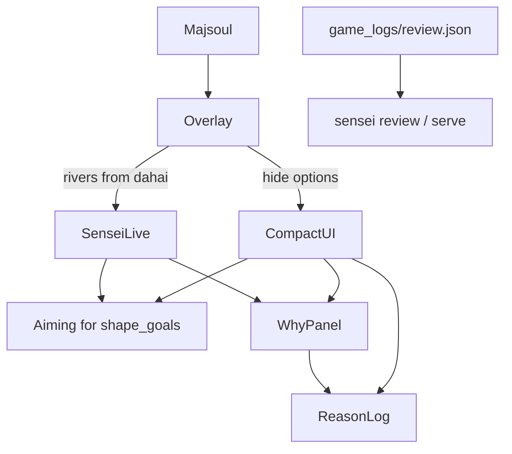

# Compact coaching overlay

## Context

Live play UI is the sibling overlay ([`shanten-sensei-overlay/gui/main_gui.py`](file:///Users/rebeccaclarke/a_new_projects_folder/shanten-sensei-overlay/gui/main_gui.py)), not this repo’s review HTML. Today it shows a large **AI guidance** panel (top pick + up to 3 `%` alternatives, `height=5`) and a separate **Why?** panel that only keeps the *latest* summary. `shape_goals` already exist in Sensei ([`features.infer_shape_goals`](src/shanten_sensei/features.py) + glosses in [`explain._GOAL_GLOSS`](src/shanten_sensei/explain.py)) but are never shown as a persistent UI chip. Live `build_turn` also omits rivers, so visible-adjusted ukeire cannot update when others discard.

**Previous games (your last question):** already partly there, but not as an in-app archive. You drop mjai-reviewer JSON under [`game_logs/`](game_logs/) (gitignored) and run `sensei review` / `sensei serve`. The CLI does **not** write history; overlay `log/` files are debug only. No Sensei multi-game browser exists yet — this plan documents that and adds only a **per-session reason journal** (in-window + optional file), not a full game archive.

## 1. Compact mode — hide options, smaller frame

**Where:** overlay [`gui/main_gui.py`](file:///Users/rebeccaclarke/a_new_projects_folder/shanten-sensei-overlay/gui/main_gui.py), [`common/settings.py`](file:///Users/rebeccaclarke/a_new_projects_folder/shanten-sensei-overlay/common/settings.py), [`gui/settings_window.py`](file:///Users/rebeccaclarke/a_new_projects_folder/shanten-sensei-overlay/gui/settings_window.py)

- Add setting `hide_ai_options` (default **True** for this teaching fork).
- When on:
  - Do not fill `ai_guide_var` with the top-3 `%` list from `mjai_reaction_2_guide`.
  - `grid_remove` the AI guidance label (and its header row except keep the **Why?** button somewhere visible — e.g. next to Aiming-for).
  - Shrink default geometry (e.g. ~620×580 → ~480×420) so the window is glanceable beside Majsoul.
- When off: current behavior unchanged.
- Turning compact mode on also turns **Auto Why?** on (so the reason log fills without clicking every turn).

## 2. Always show “Aiming for”

**Sensei package (small):** export a shared formatter (move gloss map to a tiny helper used by explain + overlay), e.g. `format_aiming_for(shape_goals) -> "tanyao (2–8 only…)"` or `"no clear yaku shape yet"`.

**Overlay:**
- New always-visible strip under the toolbar: `Aiming for: …`
- Refresh whenever features are recomputed — not only when Why? text is current.
- Wire rivers so board updates stay accurate:
  - In [`game/game_state.py`](file:///Users/rebeccaclarke/a_new_projects_folder/shanten-sensei-overlay/game/game_state.py) / kyoku state: accumulate rivers from each `DAHAI` (`actor` → tile list); clear on `start_kyoku`.
  - Pass `visible_discards` into [`sensei_adapter.build_turn`](file:///Users/rebeccaclarke/a_new_projects_folder/shanten-sensei-overlay/sensei_adapter.py) → existing [`turn_from_live(..., visible_discards=...)`](src/shanten_sensei/live.py).
- Lightweight refresh path: on game-info / river change, call `extract_features` (or `build_turn` without LLM) to update Aiming-for + status strip even when Why? cache was cleared. Full LLM Why? still only on Auto Why / button.
- Goals already recompute from the post-discard hand each call; with rivers wired, ukeire/status (and any Why text citing acceptances) stay honest as opponents discard. No new Mortal “intent” claim — still heuristic `shape_goals`.

## 3. Running reason log

**Where:** overlay `SenseiCoach` + main GUI

- Keep an in-memory list for the current kyoku/session: `{kyoku, honba, pinned_action, summary, source}`.
- On each successful `explain_why`, **append** (do not replace). Clear on new kyoku / leave game.
- UI: scrollable `tk.Text` (or Listbox) below Why?, ~4–6 lines visible, older lines scroll back — so if the interface moved on, you can re-read.
- Why? panel itself stays the latest turn only (short); the log is the history.
- Optional file: append JSONL to `game_logs/coach_session_*.jsonl` (or overlay `log/coach_*.jsonl`) for later reference — not a substitute for mjai-reviewer.

## 4. Previous games — clarify, don’t rebuild

Answer in product terms (no big archive feature this pass):

| What you want | Status |
|---|---|
| Post-game “where did I go wrong?” | Already: export → `game_logs/review.json` → `sensei serve` / `sensei review` |
| In-game Why? history | New: reason log above |
| Browsable multi-game Sensei library | Not built — out of scope unless you ask later |

## 5. Tests

- Overlay: `hide_ai_options` skips options string; Aiming-for updates when `shape_goals` change; reason log appends and clears on kyoku.
- Adapter: `build_turn` passes rivers → `ukeire.count` drops when a wait tile is in a river (reuse Sensei unit expectations).
- Sensei: small unit test for `format_aiming_for` gloss strings.

## Out of scope

- Hiding the browser HUD tip separately (desktop window is the focus).
- Multi-game history DB / gallery.
- Claiming Mortal’s internal yaku plan (still `shape_goals` heuristics only).
