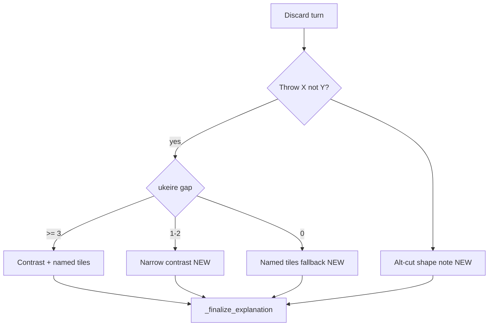

# Consistent coaching depth for discard tips

## What you’re seeing

The two screenshots are the **same template path** (`template_explain` → `_finalize_explanation`), but different **fact gates** fired:

| Turn | Tip shape | Why it feels rich |
|------|-----------|-------------------|
| Chun vs 9-man | Contrast + defense + shape | `ukeire` 45 vs 41 (gap **≥ 3**) → contrast sentence + named improving tiles; Chun is **genbutsu**; Chun gets a shape note (floating honor / dead-end) |
| 7-sou vs Chun | Instruction only | Ukeire gap is likely **1–2** → no `wall_note` contrast; recommended cut 7-sou sits in **7-8-9 sou** → no `hand_shape_notes` on Mortal’s tile; Chun (the alternate) may be dead wood but we **never evaluate shape on the alternate** |

The template only stacks “why” when grounded facts exist. Today the biggest switch is in [`_wall_note_detail`](src/shanten_sensei/explain.py):

```300:312:src/shanten_sensei/explain.py
    if alt is not None and ukeire.count - alt.count >= 3:
        ...
        return ("contrast", f"about {ukeire.count} improving tiles left vs about {alt.count} ...")
```

Below that threshold, and with no shape/defense anchors, you get the minimal pattern at ~1731–1736:

> Throw 7-sou, not Chun. You're 3-shanten with about 33 ukeire.



You chose **both** narrow ukeire math and alternate-cut shape notes when the big contrast does not fire.

---

## Implementation plan

### 1. Narrow ukeire contrast (gap 1–2)

**File:** [`src/shanten_sensei/explain.py`](src/shanten_sensei/explain.py)

- Extend `_wall_note_detail` with a third kind, e.g. `"narrow_contrast"`, when `alt is not None` and `1 <= ukeire.count - alt.count < 3`.
- Wording (grounded, exact counts): e.g. *"That leaves about 33 improving tiles vs about 31 if you throw Chun"* — same alt-label logic as today (`_contrast_alt_action`).
- In `_template_explain_body` discard path (~1694–1698), treat `"narrow_contrast"` like `"contrast"` for placement in `move_sents`, but **do not** call `_named_improving_tiles_sentence` (that helper stays gated at `>= 3`).

**Grounding:** [`src/shanten_sensei/grounding.py`](src/shanten_sensei/grounding.py)

- Update `_false_ukeire_contrast_error` / `_wall_note_kind` so narrow contrasts are allowed when kind is `"narrow_contrast"` and counts match `ukeire` / `ukeire_alt` (same strict count check, different threshold).
- Extend `_wall_facts_available` so substance scoring treats narrow contrast as a citeable wall fact.

### 2. Alternate-cut shape teaching

**Files:** [`src/shanten_sensei/features.py`](src/shanten_sensei/features.py), [`src/shanten_sensei/explain.py`](src/shanten_sensei/explain.py)

- Add a small helper (e.g. `infer_alternate_shape_note(turn)`) that, when `next_best_action(turn)` or the contrasted action differs from Mortal’s cut, runs `infer_hand_shape_notes(..., cut_tile=alt_tile)` on the **current hand**.
- In discard template (~1716+), when `contrasted` is set and Mortal’s cut has no `midhand_bit`, append a grounded sentence for the alternate, e.g. *"Chun is a dead-end tile"* via existing `_midhand_shape_clause` voice (reuse gloss helpers; do **not** append raw glossary `— lone wind or dragon` from `build_detail_paragraph`).
- Register grounding: allow dead-end/floating claims on the **alternate** tile when the note is computed for that tile (extend `_hand_shape_note_claim_error` patterns if needed).

This directly fixes the 7-sou vs Chun screenshot: efficiency pick stays 7-sou, but the tip explains why Chun is the wrong throw.

### 3. Named-improving-tiles fallback (no contrast at all)

**File:** [`src/shanten_sensei/explain.py`](src/shanten_sensei/explain.py)

- New helper, e.g. `_improving_tiles_preview_sentence(turn)`, when:
  - `contrasted` action is set,
  - no `wall_note` (gap 0),
  - `len(ukeire.tiles) >= 2`
- One sentence only: *"Throwing 7-sou keeps draws like 4-man, 6-man, and 1-pin"* (top 3–4 from `ukeire.tiles`, existing `_format_tile_list`).
- Skip if that sentence would duplicate text already in `move_sents`.

### 4. Minimum-depth guard (template only)

**Files:** [`src/shanten_sensei/explain.py`](src/shanten_sensei/explain.py), [`src/shanten_sensei/grounding.py`](src/shanten_sensei/grounding.py)

- After assembling discard `move_sents` / `state_sents`, if `contrasted_action` is set and the summary would be only *Throw X, not Y* + shanten/ukeire count (no contrast, shape, defense, or named tiles), run the fallback chain: narrow contrast → alt shape → improving-tiles preview (first that applies).
- Optionally tighten `score_explanation_substance`: for contrasted discards, treat bare shanten+ukeire as `thin_efficiency_claim` so LLM repair falls back to the richer template.

### 5. Detail-merge hygiene (related cleanup)

**File:** [`src/shanten_sensei/explain.py`](src/shanten_sensei/explain.py)

- Finish the in-progress work from [remove_orphan_shape_gloss plan](.cursor/plans/remove_orphan_shape_gloss_9ab49df7.plan.md): when defense leads, skip shape-note glossary rows in `build_detail_paragraph` so the Chun screenshot does not end with a dangling `— lone wind or dragon` after genbutsu teaching.
- Ensures “rich” tips stay coherent, not accidentally verbose from merged glossary fragments.

---

## Tests to add / update

| Case | File |
|------|------|
| Ukeire gap 2 → narrow contrast in summary | [`tests/test_explanation_substance.py`](tests/test_explanation_substance.py) |
| Grounding accepts narrow contrast counts; rejects invented gaps | [`tests/test_grounding.py`](tests/test_grounding.py) |
| 7-sou vs Chun: alt floating honor/dead-end sentence | [`tests/eval/test_screenshot_regressions.py`](tests/eval/test_screenshot_regressions.py) (new fixture from your screenshot hand) |
| Gap 0 + contrasted: named tiles preview only | `test_explanation_substance.py` |
| Defense-led Chun: no orphan glossary line | `test_template_goldens.py` (complete pending test from orphan-gloss plan) |
| Fuzz still passes | [`tests/test_grounding_fuzz.py`](tests/test_grounding_fuzz.py) |

Run: `uv run pytest tests/test_explanation_substance.py tests/test_grounding.py tests/eval/ -q`

---

## Expected copy after fix

**7-sou vs Chun (your thin screenshot):**

> Throw 7-sou, not Chun. That leaves about 33 improving tiles vs about 31 if you throw Chun. Throwing 7-sou keeps draws like 4-man, 6-man, and 1-pin. Chun is a dead-end tile. You're 3-shanten.

(Exact tiles/counts come from live features; sentences drop when a fact is absent.)

**Chun vs 9-man (already good):** unchanged core behavior; orphan glossary line removed on defense-led tips.

---

## Out of scope

- Overlay UI changes
- Citing Mortal probability %
- Lowering the **named-tiles-on-contrast** threshold below 3 (keeps big-gap tips from getting noisy)
- Inventing yaku not in `shape_goals`
