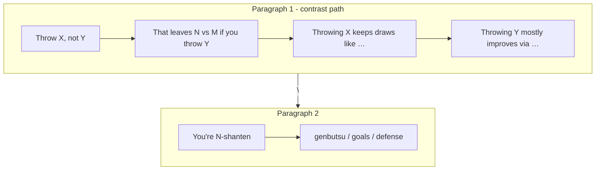

# Contrast tip line breaks

## What the screenshot is doing

The Yakuman bubble is comparing **two discard options**:

| Phrase | Meaning |
|--------|---------|
| `Throw 4-man, not 2-sou` | Mortal’s best cut vs the next-best (or your tile if diverged) |
| `vs about 42 if you throw 2-sou` | Ukeire count on the **alternate** cut |
| `throwing 2-sou mostly improves via …` | Which tiles improve if you took the alternate |

So 2-sou is intentional — it is not a second recommendation. The readability problem is formatting: paragraph 1 joins every move sentence with `. ` in [`_join_sentence_list`](src/shanten_sensei/explain.py), so throw lead + ukeire contrast + named-tile comparison read as one wall of text. There is already a `\n` before shanten/defense via [`_join_summary_paragraphs`](src/shanten_sensei/explain.py), but nothing separates the contrast sentences inside paragraph 1.

**Target layout** (your choice: one line per sentence):

```
Throw 4-man, not 2-sou.
That leaves about 47 improving tiles left vs about 42 if you throw 2-sou.
Throwing 4-man keeps draws like 6-man, 7-man, 8-man, and 9-man.
Throwing 2-sou mostly improves via 4-man, 6-man, 7-man, and 8-man.

You're 3-shanten.
An opponent already discarded 4-man, so they can't ron it from you.
```

No new API fields. Still a single `Explanation.summary` string with embedded `\n`. Overlay `ScrolledText` and review UI `white-space: pre-line` already render these.



## Code changes

### 1. Newline-join move sentences on ukeire contrast

In [`src/shanten_sensei/explain.py`](src/shanten_sensei/explain.py):

- Extend `_join_sentence_list` with an optional `between` argument (default `". "`; contrast path uses `".\n"`).
- Extend `_join_summary_paragraphs(first, second, *, first_between=...)` so paragraph 1 can use per-line breaks while paragraph 2 keeps `. ` joining (and embedded `\n` for dora+dead-end pairs stays as-is).
- In `_template_explain_body`, when `note_kind == "contrast"`, call:

```python
summary = _join_summary_paragraphs(
    move_sents, state_sents, first_between=".\n"
)
```

Non-contrast discards unchanged.

### 2. Split best vs alt named-tile lines

In [`_named_improving_tiles_sentence`](src/shanten_sensei/explain.py) (~600–622):

- Today returns one string with a **semicolon** glue: `Throwing 4-man keeps draws like …; throwing 2-sou mostly improves via …`
- Change to **two sentences** returned as a list (or append two items in `_template_explain_body`):

```python
[
  f"Throwing {best_label} keeps draws like {best_named}",
  f"Throwing {alt_label} mostly improves via {alt_named}",
]
```

Caller appends both to `move_sents` so the contrast newline join puts them on separate lines.

### 3. LLM prompt nudge (same file)

Add one `SYSTEM_PROMPT` example for ukeire-contrast tips showing the four-line move block before the shanten break (mirror template voice). Keeps LLM output aligned when API key is on.

### 4. Tests

| File | Assert |
|------|--------|
| [`tests/test_explanation_substance.py`](tests/test_explanation_substance.py) `test_named_improving_tiles_on_ukeire_contrast` | Summary contains `.\n` or multiple `\n` in move block; **no** `; throwing` semicolon pattern |
| [`tests/eval/test_template_goldens.py`](tests/eval/test_template_goldens.py) `test_template_tanyao_honor_ukeire_contrast` | `move_para.split(".\n")` or line-based asserts: throw lead, `vs about`, and state still after first top-level `\n` |
| New golden (screenshot-shaped) | `dahai 4m` vs `dahai 2s`, ukeire contrast ≥3, named tiles on both sides → 4 move lines + `\n` + shanten/defense |

No grounding validator changes expected — anchors still match the same substrings.

## Out of scope

- Overlay / review UI CSS (already honor `\n`)
- Rewording the comparison (content is correct; this is layout only)
- Blank-line (`\n\n`) between paragraphs — prompt says single `\n` only
