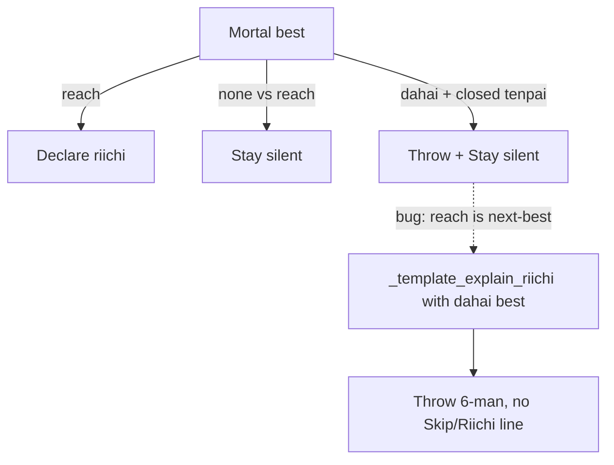

# Tell the user to skip riichi on dama tenpai

Tonight Mortal’s recommendation is **throw 6-man** (dama), not declare. Mahjong Soul is showing **Riichi / Skip**. Yakuman only said Throw + tanki wait + genbutsu — no riichi call.

That is already supposed to be a dama tip. [`is_tenpai_dama_discard_turn`](src/shanten_sensei/live.py) exists so closed tenpai + `dahai` best adds **Stay silent—don’t declare riichi yet** after Throw. Two holes drop that line on this exact live shape.

## What went wrong

[`is_riichi_decision_turn`](src/shanten_sensei/live.py) is true when **next-best is `reach`**, even if `mortal_best` is `dahai 6m`. Typical Mortal meta for this prompt:

`[("6m", 0.7), ("reach", 0.2), ...]`

That steals [`_template_explain_riichi`](src/shanten_sensei/explain.py), which only handles:

- `reach` → Declare riichi
- `none` → Stay silent

A `dahai` best falls through to `coach_action_label` → **Throw 6-man**, then the riichi tenpai line (`You’re tenpai (ready) with a tanki wait`). Stay silent never runs. `is_tenpai_dama_discard_turn` is false whenever riichi-decision is true, so the discard-path append is skipped too.

A second hole: even on a correctly classified dama turn, grounding **rejects** “Declare riichi” but does **not require** Stay silent. Live LLM Why? can omit it and still pass.

Low-prob reach as a *third* candidate already stays on Throw + Stay silent ([`test_dahai_with_low_prob_reach_stays_throw`](tests/test_riichi_coaching.py)). Reach as *second* candidate does not.

## Locked copy

Bot-backed only (your choice):

- Mortal best **`reach`** → existing **Declare riichi, discard {tile}**
- Mortal best **`none`** vs reach → existing **Stay silent**
- Mortal best **`dahai`** on closed tenpai (Riichi/Skip on the table) → **Throw {tile}** then **Stay silent—don’t declare riichi yet**

Do not use **Skip** (call-only). Do not invent riichi/skip when Mortal has no reach-vs-dahai signal and the hand is not closed tenpai.

Keep Throw as the lead (they still cut 6-man after Skip). Make Stay silent its own bullet so it is visible next to the game buttons (`.\n` join when dama).

Do **not** write `Throw 6-man, not reach` — `human_action_label("reach")` is the bare word `reach`.

## Code

**1. Stop stealing the riichi template for dama**

[`is_riichi_decision_turn`](src/shanten_sensei/live.py): true only when Mortal’s best is `reach`, or best is `none` with reach in the comparison set. Drop:

- `alt is reach` while best is `dahai`
- diverge `player_action is reach` while best is `dahai`

Those turns become `is_tenpai_dama_discard_turn` (already requires menzen, not already riichi, shanten 0 / tenpai).

**2. Discard lead: never “not reach”**

In [`_template_explain_body`](src/shanten_sensei/explain.py), if the contrast action is `reach`, lead `Throw {tile}` (optionally contrast the next *dahai* candidate). Then the existing dama append.

**3. Riichi template safety net**

In [`_template_explain_riichi`](src/shanten_sensei/explain.py), if `best_kind == "dahai"`, emit Throw + Stay silent — never Declare riichi.

**4. Grounding**

When `is_tenpai_dama_discard_turn`, require `\bstay silent\b` (or don’t-declare-riichi). Missing line → validation error → live LLM falls back to template ([`serve.py`](src/shanten_sensei/serve.py) / overlay `explain()`).

Keep the existing reject of un-negated “Declare riichi” on dama.

**5. Prompt**

[`SYSTEM_PROMPT`](src/shanten_sensei/explain.py) dama clause already says add Stay silent after Throw. Add one locked example that matches this screenshot: Throw 6-man + Stay silent on closed tenpai with reach as next-best.

## Tests

Screenshot-shaped chiitoi tenpai in [`tests/test_riichi_coaching.py`](tests/test_riichi_coaching.py) (and a short golden if the existing dama golden is too far from this hand):

Hand: `1m 1m 5mr 6m 7m 7m 2p 2p 3p 3p 4s 4s 7s 7s`, recommended `dahai 6m`, candidates `[("6m", 0.7), ("reach", 0.2)]`.

Assert:

- `not is_riichi_decision_turn`
- `is_tenpai_dama_discard_turn`
- summary has **Throw** + **Stay silent** and not **Declare riichi**
- no `not reach`
- `validate_explanation` rejects a Throw-only summary

Keep existing declare / stay-silent-`none` / already-riichi / low-prob-reach tests.

## Out of scope

Overlay HUD (`Riichi, Discard …` vs `Discard …`) — already follows reaction type. This is Why? copy only. Do not advise riichi when Mortal did not rank `reach` and the hand is not closed tenpai.