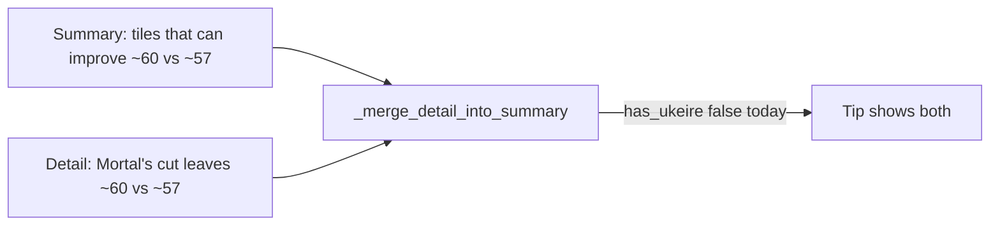

# Dedup Mortal’s-cut ukeire echo

## What’s wrong

Screenshot tip stacks the same acceptance contrast twice:

1. Lead (LLM/template): *That leaves about 60 tiles that can improve your hand, vs about 57 if you throw 1-man*
2. Merged detail from [`build_detail_paragraph`](src/shanten_sensei/explain.py): *Mortal’s cut leaves about 60 improving tiles vs about 57 on the alternative*



[`_merge_detail_into_summary`](src/shanten_sensei/explain.py) was already supposed to skip Mortal’s-cut / improving-tile chunks when the summary cites ukeire ([tighten tip verbosity](.cursor/plans/tighten_tip_verbosity_fc5dc5cd.plan.md)), but `has_ukeire` only matches `improving tiles` / `acceptances`:

```745:770:src/shanten_sensei/explain.py
    has_ukeire = bool(
        re.search(r"\b(?:improving tiles?|acceptances?)\b", summary_l)
    )
    ...
        if re.search(r"\bmortal['\u2019]?s cut\b", chunk_l) and (
            has_defense or has_ukeire
        ):
            continue
        ...
        if has_ukeire and re.search(r"\bimproving tiles?\b", chunk_l):
            continue
```

Preferred prompt voice is *tiles that can improve…*, so efficiency tips like the screenshot leave `has_ukeire` false and the detail line ships.

Detail may still keep the contrast for the review API (`detail` field); only the bubble merge must not re-inflate.

## Locked fix

In [`_merge_detail_into_summary`](src/shanten_sensei/explain.py):

1. Widen `has_ukeire` to also match `\btiles that can improve\b` (same family as existing substance/ukeire anchors).
2. Keep the existing skips for `Mortal’s cut…` and improving-tile chunks once `has_ukeire` is true — no new prose sources.

No change to [`build_detail_paragraph`](src/shanten_sensei/explain.py) ukeire sentence (tests still expect it on `detail`); no prompt rewrite required for this bug.

Secondary echo in the same screenshot (*floating terminal* in summary + *lone 1/9 with no connector* from detail shape gloss) is out of scope unless it still shows after the ukeire fix and you want a follow-up.

## Tests

In [`tests/test_explanation_substance.py`](tests/test_explanation_substance.py):

- Unit-style: summary using *about N tiles that can improve your hand, vs about M…* + detail containing *Mortal’s cut leaves about N improving tiles vs about M…* → merged tip has **no** `mortal` / no second *leaves about N improving tiles* restatement.
- Keep existing defense-led merge golden: tip still omits Mortal’s-cut metrics; `detail` may still mention improving tiles.
