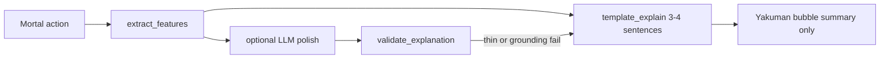

# Deeper single-block Why? explanations

## What the screenshots are telling us

Your feedback is about **content depth**, not overlay UI (display is fine as-is). The gaps are:

| Screenshot pattern | What users feel is missing | Root cause today |
|---|---|---|
| Ukeire-only tips (`60 tiles vs 18`) | *Why* those numbers matter | [`template_explain`](src/shanten_sensei/explain.py) cites counts but rarely names example improving tiles or shape tradeoffs |
| Defense tips (`East is genbutsu`) | Rule explanation, not jargon | Genbutsu teaching voice is in progress (uncommitted WT); suji/one-chance still gloss-only |
| Call skip (`Skip the pon… closed with 12 tiles`) | What opening would cost beyond "no riichi" | [`call_tradeoff`](src/shanten_sensei/features.py) has `open_shanten` but not post-call ukeire |
| Multi-factor discards (dora + genbutsu + efficiency) | Only one reason surfaces | Template `elif` chains suppress stacked reasons; 80-word cap + 1–2 sentence prompt limit |

The good news: the architecture is already right—Mortal picks, Sensei verbalizes grounded [`DerivedFeatures`](src/shanten_sensei/schema.py). Depth comes from **more facts in features + richer template sentences**, not a second brain.

**Locked choice from you:** one longer bubble (3–4 sentences), no separate "More" click. That means we should **merge** what today lives in [`build_detail_paragraph`](src/shanten_sensei/explain.py) into the main `summary`, not hide it behind review-only UI.

---

## Phase 0 — Ship genbutsu teaching work (quick win)

Uncommitted changes in [`explain.py`](src/shanten_sensei/explain.py), [`features.py`](src/shanten_sensei/features.py), [`glosses.py`](src/shanten_sensei/glosses.py), [`schema.py`](src/shanten_sensei/schema.py) already implement seat-aware genbutsu prose per [richer_genbutsu_tips plan](.cursor/plans/richer_genbutsu_tips_3017276c.plan.md). This directly addresses defense tips like screenshot 3/4.

---

## Phase 1 — Raise the length budget + fold detail into summary

Today the coach is artificially short:

- [`SYSTEM_PROMPT`](src/shanten_sensei/explain.py) says "One or two sentences"
- [`validate_explanation`](src/shanten_sensei/explain.py) rejects summaries over **80 words**
- [`build_detail_paragraph`](src/shanten_sensei/explain.py) already assembles extra grounded facts (named waits, danger glosses, shape notes, score situation) but attaches them only to `Explanation.detail`

**Changes:**

1. Update `SYSTEM_PROMPT` to ask for **3–4 sentences** with a fixed structure:
   - Sentence 1: action (`Throw X, not Y` / `Skip the pon…`)
   - Sentence 2: primary reason (efficiency contrast, defense rule, or value)
   - Sentence 3: secondary reason (shape goal, mid-hand tile label, or call tradeoff)
   - Sentence 4 (optional): point situation / furiten / wall thinning

2. Raise word cap from 80 → **~130** (enough for 3–4 glossed sentences; still blocks essays).

3. In [`_finalize_explanation`](src/shanten_sensei/explain.py), **append** `build_detail_paragraph(turn)` sentences to `summary` when they add facts not already present (dedupe by substring check). Keep `detail` field for review API backward compat; overlay already reads `summary` only, so the merged text is what users see.

4. Update substance tests in [`tests/test_explanation_substance.py`](tests/test_explanation_substance.py) for the new length budget.

---

## Phase 2 — Richer discard "why" (highest screenshot impact)

Target the pattern in screenshot 2: not just "60 vs 18 improving tiles" but *what that means for the hand*.

### 2a. Named improving tiles on big contrasts

When `ukeire_alt` contrast fires (≥3 tile gap), add one sentence naming top improving tiles:

> Throwing 3-man keeps draws like 2-man, 4-man, and 5-man; throwing 9-sou mostly waits on sou tiles only.

Implementation: small helper in [`explain.py`](src/shanten_sensei/explain.py) using `turn.features.ukeire.tiles[:4]` with `human_tile_label`. Only when contrast exists and tile list is non-empty. Grounding: reuse existing `_false_ukeire_contrast_error` patterns.

### 2b. Suji / one-chance teaching voice (mirror genbutsu)

Genbutsu now has [`_genbutsu_teaching_sentence`](src/shanten_sensei/explain.py). Add parallel helpers in `_danger_compare_sentences`:

| Tag | Teaching sentence (example) |
|---|---|
| `suji` | `4-pin is suji—if someone waited on 1-pin or 7-pin, they'd likely have discarded 4-pin already.` |
| `one-chance` | `6-sou is one-chance—the middle tile is nearly all out, so a 5–7 wait is unlikely.` |

Keep conservative: only when `danger_detail` / tag is present. Update [`DANGER_GLOSS`](src/shanten_sensei/glosses.py) parentheticals to match.

### 2c. Stop `elif` chains from dropping secondary reasons

In [`template_explain`](src/shanten_sensei/explain.py) discard path (~1354–1411), several branches are mutually exclusive (`wait_shape` vs ukeire contrast vs shanten bundle). Refactor so **multiple** grounded sentences can accumulate:

- Always include shanten + acceptances in `state_sents` when not already in `move_sents`
- Mid-hand shape note (`_midhand_shape_clause`) should not be suppressed when ukeire contrast already fired
- Danger + dora + shape goal should stack when all apply (screenshot 3: genbutsu **and** keeping dora)

### 2d. Thin-wall specifics more often

[`_wall_note_detail`](src/shanten_sensei/explain.py) already emits "only 1× 2-pin left". Lower the threshold or always append when `remaining_by_tile` has any tile at ≤1 copies and that tile is in `ukeire.tiles`.

---

## Phase 3 — Richer call skip / call take explanations

Screenshot 5 is decent but stops at counts. Users want to know **what they'd give up by calling**.

### 3a. Post-call ukeire (conservative simulation)

Extend [`build_call_tradeoff`](src/shanten_sensei/features.py):

- After simulating pon/chi (hand minus consumed + meld), compute `open_ukeire` via existing `calculate_ukeire` on the open hand **before** discard (approximate: use best-effort discard or skip if ambiguous)
- Add `open_ukeire_count` to [`CallTradeoff`](src/shanten_sensei/schema.py)

Template sentence when skip wins:

> Calling would leave about 8 improving tiles vs about 12 closed—and you'd lose riichi.

Only cite when `open_ukeire_count` is known and meaningfully worse.

### 3b. Call-win path: what the call accomplishes

When Mortal wants the call, add grounded clauses:

- Pon on yakuhai → "That locks a yakuhai triplet for a guaranteed yaku when you win"
- Chi that drops shanten → "That completes a sequence and drops you to 1-shanten open"
- When `open_shanten < stay_closed_shanten` → keep existing tempo line but pair with shape goal

Wire through [`_template_explain_call`](src/shanten_sensei/explain.py) `state_sents` (currently sparse on the "call wins" branch).

---

## Example target copy (discard + defense + shape)

For a turn like screenshot 3:

> Throw 8-sou, not red 5-man. That leaves about 16 improving tiles vs about 12 if you throw red 5-man—mostly pin and sou draws. Red 5-man is dora (bonus tile), so keeping it boosts your score if you win. An opponent already discarded 8-sou, so they can't ron it; red 5-man isn't safe that way.

For a call skip like screenshot 5:

> Skip the pon on 9-pin. You're 1-shanten closed with about 12 improving tiles. Calling would open the hand—no riichi—and only about 7 tiles would still improve it, while you're not in tenpai yet.

---

## What we are explicitly NOT doing

- Overlay UI changes (display is fine; all work is in this Sensei repo)
- Citing Mortal probability % in prose (chart already shows it)
- Inventing yaku not in `shape_goals`
- Full EV / push-fold tables or per-opponent threat modeling
- A separate "More" panel (per your preference)
- Changing which move Mortal recommends

---

## Test plan

| Area | Tests |
|---|---|
| Length budget | Golden summaries 100–130 words pass validation |
| Named tiles | Ukeire contrast fixture names ≥2 improving tiles |
| Suji/one-chance | New teaching sentences in `_danger_compare_sentences` |
| Call open ukeire | Feature test for pon simulation; template cites closed vs open count |
| Regression | Existing [`test_explanation_substance.py`](tests/test_explanation_substance.py), [`test_call_coaching.py`](tests/test_call_coaching.py), genbutsu goldens |

Run: `pytest tests/test_explanation_substance.py tests/test_call_coaching.py tests/test_features.py tests/test_glosses.py -q`
