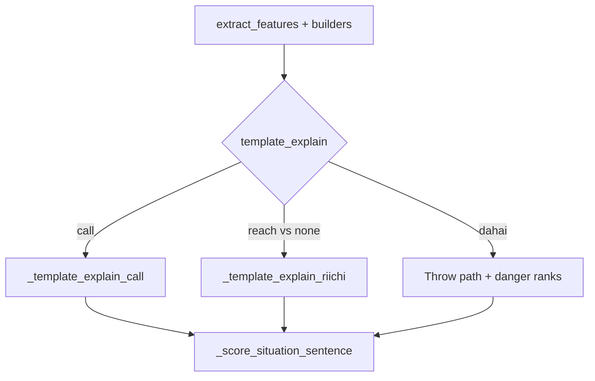

# Defense, riichi, and score coaching

Mirror the shipped call-coaching pattern: Mortal still picks the move; Sensei only verbalizes citeable facts. No new evaluator, no new Why? schema fields beyond optional feature blocks.

## 1. Suji / one-chance danger tags

**Extend** [`basic_danger_tags`](src/shanten_sensei/features.py) (keep the name; expand behavior).

Tag priority for a candidate (strongest wins): `genbutsu` > `one-chance` > `suji`.

| Tag | Rule (v1, teaching-grade) |
|-----|---------------------------|
| `genbutsu` | Unchanged: caller list and/or any river |
| `suji` | For each number discard `N` in suit `s` across rivers, mark `N±3` in that suit (valid 1–9) as suji if not already genbutsu |
| `one-chance` | From `collect_visible_tiles` counts: if ≥3 copies of number `N` are visible, mark `N−1` / `N+1` in that suit as one-chance (kanchan middle almost out) |

Pass visible tiles into the danger helper from `extract_features` (already collected there).

**Glosses** in [`glosses.py`](src/shanten_sensei/glosses.py):

- `genbutsu` → safe — already discarded  
- `suji` → interval-safe vs a common wait  
- `one-chance` → middle tile almost all out  

**Template** in [`explain.py`](src/shanten_sensei/explain.py) discard path (replace genbutsu-only block ~784–791):

- Rank tags numerically; if Mortal’s cut ranks safer than the contrast cut → defense/mixed focus and a sentence like: `Throw 4-man—it's suji (interval-safe vs a common wait). 6-man isn't.`
- If Mortal’s cut is tagged and there is no weaker contrast → short aside: `{tile} is also genbutsu/suji/one-chance (…)`.
- If player cut is safer but efficiency won → keep existing “safe but efficiency is worse” voice with the glossed tag.

**Substance / LLM**: widen danger anchors beyond `\bgenbutsu\b` to also match `suji` / `one-chance`; add a defense voice example to `SYSTEM_PROMPT`; include danger glossary in `build_user_payload`.

Review already surfaces `danger` chips via [`serve.py`](src/shanten_sensei/serve.py)—new tag strings appear automatically.

## 2. Riichi tip branch

**Detect** (do not treat as call):

- [`tiles.py`](src/shanten_sensei/tiles.py): `is_riichi_decision_action` → `parse_action_kind == "reach"`.
- [`live.py`](src/shanten_sensei/live.py): `is_riichi_decision_turn` — true when `reach` is `mortal_best`, diverge `player_action`, `next_best_action`, or any candidate **and** the turn is not already a call decision.

**Branch order** in `template_explain`: call → riichi → discard.

**`_template_explain_riichi`** (new, parallel to `_template_explain_call`):

- Lead with existing `coach_action_label("reach")` → `Declare riichi`, or `Stay silent` when Mortal’s best is `none` vs a reach contrast (do **not** reuse “Skip”, which is call-only).
- Cite existing statuses only (no new tradeoff model): tenpai, glossed wait shape, furiten-because (reuse `_furiten_because_sentence`), dora in hand when present, thin wall via existing `tiles_left` / wall note if useful.
- Focus: `value` when declaring with dora; `defense` when furiten / stay silent under pressure; else `tempo`/`efficiency` as fits.

Wire nothing special in ingest/live beyond detection—`reach` already flows through candidates and labels. Update `SYSTEM_PROMPT` + payload with a riichi example and `riichi_decision: true` flag so the LLM doesn’t say “Throw reach”.

## 3. Score-situation hints

**Add** `ScoreSituation` on [`DerivedFeatures`](src/shanten_sensei/schema.py):

- `riichi_opponents: int`
- `score_diff: "leading" | "trailing" | "even" | null`
- `late_game: bool` — `tiles_left is not None and tiles_left <= 30`, or `kyoku is not None and kyoku >= 7` (all-last / South 4 in 0-based mjai kyoku)

**Builder** `build_score_situation(game_state)` in `features.py`:

- `scores[0]` = coached player (mjai-reviewer `relative_scores` / live scores already oriented that way).
- `score_diff`: compare player to best opponent; within 3000 → `even`.
- `riichi_opponents`: count `riichi_flags[1:]` (or all True flags minus self if length matches).

Attach in [`extract_features`](src/shanten_sensei/features.py) callers once `GameState` fields exist—simplest: build in `turn_from_entry` / `turn_from_live` after extract (same place as `call_tradeoff`), or pass scores/flags/kyoku/tiles_left into `extract_features`. Prefer attach-after-extract like call tradeoff to keep extract signature small.

**Prose**: `_score_situation_sentence(turn)` — at most one short sentence, appended to call/riichi/discard tips when facts fire:

- Opponent riichi → safety nudge (`focus` → defense/mixed)
- Trailing + late_game → urgency to take value/riichi when Mortal pushes
- Leading + opponent riichi → fold/safety when Mortal’s cut is danger-tagged

Never invent placement names beyond leading/trailing/even. Mirror field into `build_user_payload` + prompt (“cite score_situation when present”).

## 4. Tests

| File | Coverage |
|------|----------|
| [`tests/test_features.py`](tests/test_features.py) | Suji from river `4m` → `1m`/`7m`; one-chance when 3×`5p` visible → `4p`/`6p`; genbutsu still wins |
| New `tests/test_riichi_coaching.py` | Live golden: Declare riichi vs Stay silent; no “Throw”; wait/furiten/dora keywords |
| [`tests/test_explanation_substance.py`](tests/test_explanation_substance.py) | Safer Mortal cut → suji/one-chance defense sentence; score_situation opponent-riichi / trailing late-game one-liner; substance anchors accept new tags |
| [`tests/test_glosses.py`](tests/test_glosses.py) | Danger gloss strings |

## 5. Roadmap hygiene

Mark `later-defense-riichi` complete in [`.cursor/plans/teaching_gaps_roadmap_12a184ea.plan.md`](.cursor/plans/teaching_gaps_roadmap_12a184ea.plan.md) once shipped (no README rewrite beyond what’s already promised).

## Out of scope

- Per-opponent threat targeting (global river union is enough for v1)
- Full push/fold EV, ura EV, orasu placement tables
- Hover glossary UI
- Overlay-only GUI changes (sibling repo gets the same `Explanation.summary` automatically)