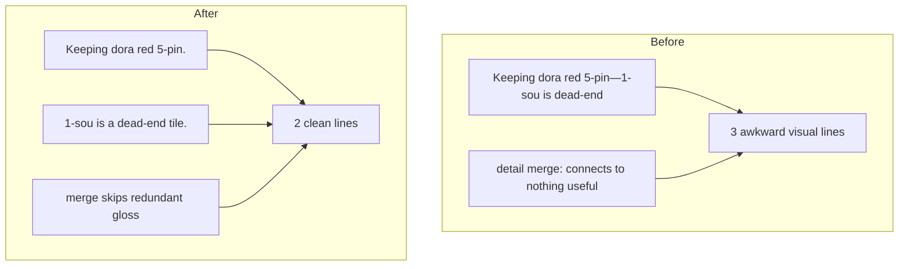

# Fix dora + dead-end line breaks

## What the screenshot shows (broken)

The last three visual lines come from paragraph 2 + detail merge:

```
Keeping dora (bonus tile) red          ← UI wrap mid-phrase
5-pin—1-sou is a dead-end tile.        ← dash-glued opposite ideas
1-sou — connects to nothing useful.    ← redundant detail gloss
```

Root cause in [`src/shanten_sensei/explain.py`](src/shanten_sensei/explain.py) (~1885–1891): when `goal_bit` is `keeping dora …` and `midhand_bit` is `{cut} is a dead-end tile`, the template **em-dash-glues** them into one sentence:

```python
shape_sentence += f"—{midhand_bit}"  # → "Keeping dora red 5-pin—1-sou is a dead-end tile."
```

Then [`_finalize_explanation`](src/shanten_sensei/explain.py) merges [`build_detail_paragraph`](src/shanten_sensei/explain.py) shape-note gloss (`1-sou — connects to nothing useful`) onto a **third** `\n`-separated line.

## Target layout (your choice)

Two intentional lines in paragraph 2; no third gloss line:

```
Throw 1-sou, not South. … You're 5-shanten with about 91 ukeire (tiles that improve the hand).
Keeping dora (bonus tile) red 5-pin.
1-sou is a dead-end tile.
```

## Implementation

### 1. Keep the dash-glue guard (already in working tree)

The uncommitted change correctly skips em-dash merge when `goal_bit.startswith("keeping")`. Keep it and the existing test [`test_template_dora_keep_separate_from_dead_end_cut`](tests/test_explanation_substance.py).

### 2. Join dora-keep + cut-reason with `\n` (not `. `)

In `_template_explain_body` (~1880–1911), when both survive as separate thoughts:

- `goal_bit` → `Keeping dora (bonus tile) red 5-pin` (via `_shape_goal_phrase`)
- `midhand_bit` → `1-sou is a dead-end tile` (via `_midhand_shape_clause`)

**Instead of** two entries in `state_sents` joined by `_join_sentence_list` (`. `), newline-glue them when `goal_bit.startswith("keeping")` and `midhand_bit` is a floating/dead-end cut reason:

```python
# After state_sents.append(shape_sentence) when keeping + midhand_bit remain:
state_sents[-1] = f"{state_sents[-1]}\n{_sentence_case(midhand_bit)}"
midhand_bit = None
```

`_join_summary_paragraphs` stays unchanged — paragraph 1 still ends with `\n`, paragraph 2 can contain an embedded `\n` for these paired sentences (overlay already honors `\n` via `white-space: pre-line` in review UI; ScrolledText shows them in the desktop overlay).

### 3. Suppress redundant shape-note gloss in detail merge

In [`_merge_detail_into_summary`](src/shanten_sensei/explain.py) (~841–871), skip detail chunks like `{tile} — connects to nothing useful` when the summary already teaches the same cut note for that tile, e.g.:

- summary contains `is a dead-end tile` and chunk matches `— connects to nothing useful`
- (same pattern for floating terminal/honor glosses if summary already has `floating terminal` / `floating honor`)

Use the tile label from the chunk prefix (`human_tile_label` / strip before `—`) and a small regex against `summary_l` rather than exact substring match (current `probe in summary_l` misses this case).

`detail` field can still retain the gloss for review API; only the merged **summary** omits it.

### 4. Tests

Extend [`tests/test_explanation_substance.py`](tests/test_explanation_substance.py):

| Test | Assert |
|------|--------|
| `test_template_dora_keep_separate_from_dead_end_cut` (existing) | No `keeping dora…—…dead-end` dash pattern |
| New `test_template_dora_keep_and_dead_end_on_separate_lines` | Screenshot-shaped fixture (`dahai 1s`, `dora 5pr`, `dead_end` on `1s`): `summary.split("\n")` has length **2**; line 2 starts with `Keeping dora`; line 3 (index 2) is `1-sou is a dead-end tile`; **no** `connects to nothing useful` in summary |
| Update `test_merge_skips_mortal_cut_ukeire_when_glossed_ukeire_phrase` | Use multi-line summary input matching new shape; assert gloss not re-appended |

Golden expected string (with emojis):

```
Throw 🀐1-sou, not 🀁South. … ukeire …\nKeeping dora (bonus tile) 🀝red 5-pin.\n🀐1-sou is a dead-end tile.
```

## Out of scope

- Non-breaking glue for `red 5-pin` (UI wrap should land on the `\n` between sentences now)
- Changing the global paragraph-2 join rule for all state sentences (only the keeping-dora + cut-reason pair)
- Removing shape-note gloss from `build_detail_paragraph` entirely (other tips may still need it when summary doesn’t already state the cut reason)


