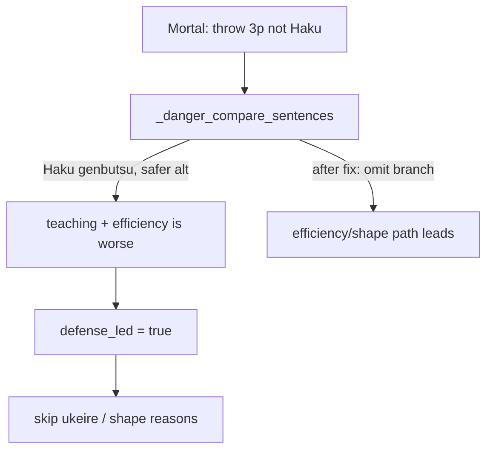

# Drop “but efficiency is worse”

## What’s wrong

Screenshot tip:

> Throw 3-pin, not Haku. An opponent already discarded Haku, so they can't ron it from you, **but efficiency is worse.** you're even on points.

Source is the **player-safer** branch in [`_danger_compare_sentences`](src/shanten_sensei/explain.py):

```1322:1331:src/shanten_sensei/explain.py
    elif player_tag and player != best and player_r >= best_r:
        if player_tag in ("genbutsu", "suji", "one-chance") and player_code:
            teaching = _danger_teaching_sentence(...)
            out.append(f"{teaching}, but efficiency is worse")
        else:
            out.append(f"{player_tile} is {glossed} but efficiency is worse")
        nudge = "mixed"
```

Two stacked problems:

1. **Vague efficiency** — no ukeire numbers; substance rules already ban thin “higher efficiency” claims, but not this exact phrase.
2. **Wrong defense lead** — any non-empty `danger_bits` sets `defense_led`, which skips bare shanten/ukeire and shape goals. So an *efficiency* pick over a safer alt still gets defense teaching about the tile you are **not** throwing, and loses the concrete “why throw 3-pin” voice (ukeire / yakuhai / Hand-stats).

The hand-open wording fix does not touch this path (explicitly out of scope there).



## Locked fix

### 1. Omit the player-safer danger sentence

In [`_danger_compare_sentences`](src/shanten_sensei/explain.py), when the contrast/player tile is safer (or equal) than Mortal’s cut but is **not** the recommended cut: **append nothing and leave `nudge` unset** (same as “no useful danger compare”).

Keep the other two branches unchanged:

- Best safer than contrast → teach genbutsu/suji/one-chance on **mortal_best**
- Best tagged, no weaker contrast → teach on best

Aligned with [tighten tip verbosity](.cursor/plans/tighten_tip_verbosity_fc5dc5cd.plan.md): defense copy is **recommended cut only**. Efficiency-over-safe is explained by existing `wall_note` contrast / shape / midhand / bare metrics once `defense_led` is false.

### 2. Reject the phrase if the LLM reintroduces it

Add to `_THIN_CLAIM_PATTERNS` in [`explain.py`](src/shanten_sensei/explain.py):

- `\befficiency is worse\b`

So `validate_explanation` → `thin_efficiency_claim` → template fallback when the model says it with no anchors.

### 3. Tests

In [`tests/test_explanation_substance.py`](tests/test_explanation_substance.py):

- Template golden: Mortal cut vs safer genbutsu alt (screenshot shape: best `3p`, contrast `5z`/Haku genbutsu) → summary has **no** `efficiency is worse`, and does **not** lead with “already discarded Haku… can’t ron” about the non-cut.
- Assert normal defense-led tip (genbutsu **on** mortal_best) still teaches genbutsu.
- Assert `efficiency is worse` alone triggers `thin_efficiency_claim` when anchors are absent.

## Out of scope

- Changing Mortal’s recommended discard
- Rewriting all other “efficient / intact” LLM phrasings beyond this phrase
- Overlay Hand stats / Aiming for UI
