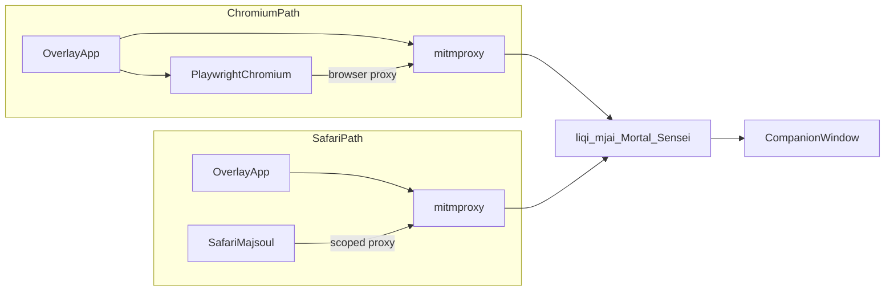

# Dual-client local install: architecture + precautions docs

## Scope (this pass)

**In:** two markdown docs in [`docs/`](docs/) plus short links from [`README.md`](README.md) and [`docs/live-setup.md`](docs/live-setup.md).

**Out:** Safari proxy implementation, Mac Majsoul app, Docker, hosted live site, in-page Safari HUD, packaging/notarization.

**Default locked in:** Safari browser only for non-Chromium users; coach always in the **tkinter companion window** beside the game (dual windows). Chromium users keep today’s Playwright path.

## Target docs

### 1. [`docs/dual-client-architecture.md`](docs/dual-client-architecture.md)

Audience: maintainers / future implementers.

Contents:

- **Product model:** one local Sensei/overlay install; two game-client paths.
- **Shared core (unchanged):** mitmproxy → liqi → mjai → Mortal → Sensei `explain()` / live features; practice-only gate via [`sensei_mode.py`](file:///Users/rebeccaclarke/a_new_projects_folder/shanten-sensei-overlay/sensei_mode.py).
- **Path Chromium (today):** Playwright launches Chromium with **browser-only** proxy to `127.0.0.1:{mitm_port}` ([`game/browser.py`](file:///Users/rebeccaclarke/a_new_projects_folder/shanten-sensei-overlay/game/browser.py)); optional in-page HUD via `page.evaluate`; companion GUI always available ([`gui/main_gui.py`](file:///Users/rebeccaclarke/a_new_projects_folder/shanten-sensei-overlay/gui/main_gui.py)).
- **Path Safari (future implementation, designed now):** do **not** start Chromium; mitm already supports `GameClientType.PROXY` when WS arrives without Playwright ([`common/utils.py`](file:///Users/rebeccaclarke/a_new_projects_folder/shanten-sensei-overlay/common/utils.py)); user plays Majsoul in Safari; coach UI is companion-only (no Safari content-script HUD in v1).
- **Safari traffic shape (design requirement for later code):** local proxy only; **domain-scoped** to Majsoul hosts (not system-wide forever); clear session ON/OFF tied to overlay start/stop.
- **Window layout:** game left / coach right (user-arranged); docs describe the intended dual-window UX you already use.
- **Explicit non-goals:** Mac native Majsoul app, zero-install live website, ranked assist.

### 2. [`docs/proxy-trust-precautions.md`](docs/proxy-trust-precautions.md)

Audience: users and maintainers. Plain language.

Contents:

- **What trusting the MITM cert means** (and what it does not mean for remote hackers).
- **Musts for Sensei:**
  - Per-machine cert under overlay `mitm_config/` (never ship one shared CA private key to all users).
  - Proxy listens on loopback only.
  - Prefer **Majsoul-only** proxy scope for Safari path; never recommend leaving a system-wide proxy on after coaching.
  - Auto-disable / document disable steps when overlay quits.
  - Companion window for Safari (no in-page HUD) to limit page-world privilege.
  - Practice/friend only; ranked Why? stays gated.
  - Users install only from the official repo / known release; treat fake “Sensei” builds as the main spyware vector.
- **Chromium vs Safari risk comparison table** (browser-scoped Playwright proxy vs Safari/OS proxy scope).
- **User checklist:** install cert → start helper → open Majsoul correctly → play practice → quit helper → confirm proxy/cert guidance.
- **Incident / uninstall:** how to remove trusted cert (point at existing macOS `security` / Windows `certutil` flows in [`common/utils.py`](file:///Users/rebeccaclarke/a_new_projects_folder/shanten-sensei-overlay/common/utils.py); mark macOS path as needs verification).

### 3. Light cross-links

- [`docs/live-setup.md`](docs/live-setup.md): add a short “Two client paths” blurb — Chromium = Start Browser today; Safari = designed, not shipped; link both new docs.
- [`README.md`](README.md): one line under architecture / Phase 2 pointing to the dual-client doc + precautions.

## Writing constraints

- Docs-only in this pass; no overlay code changes.
- Be honest that Safari path is **architecture + safety contract**, not a working button yet; Chromium path is the supported live path today.
- Reuse terms already in overlay: `PROXY` client, mitm cert install, companion GUI vs overlay HUD.
- Keep precautions actionable; avoid fear-mongering and avoid promising notarization/code-signing until a packaging pass.

## Acceptance

- Both docs exist and agree with each other (Safari = companion + scoped proxy; no Mac app; no hosted live).
- Live-setup and README link to them.
- A future implementer can open the architecture doc and know which overlay modules to extend without redesigning capture.