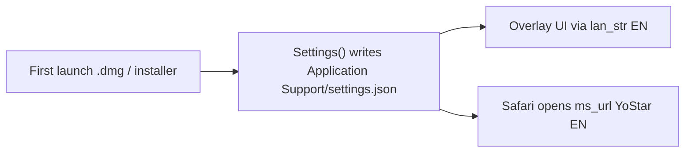

# Default deliverable package to English

## Current state

| Setting | Intended | Actual on fresh install |
|---------|----------|-------------------------|
| **Majsoul URL** (`ms_url`) | English YoStar | Already `https://mahjongsoul.game.yo-star.com/` in [`common/settings.py`](file:///Users/rebeccaclarke/a_new_projects_folder/shanten-sensei-overlay/common/settings.py) and [`scripts/install-macos.command`](file:///Users/rebeccaclarke/a_new_projects_folder/shanten-sensei-overlay/scripts/install-macos.command) |
| **Overlay UI language** (`language`) | English | **Defaults to Chinese (`ZHS`)** due to a bug |

The language bug is here:

```44:44:../shanten-sensei-overlay/common/settings.py
self.language:str = self._get_value("language", list(LAN_OPTIONS.keys())[-1], self.valid_language)
```

`LAN_OPTIONS` is ordered `EN` then `ZHS`, so `[-1]` picks **ZHS**. Fresh `.dmg` users (no `~/Library/Application Support/ShantenSensei/settings.json` yet) get a Chinese toolbar/status strip even though Sensei coaching text is always English.

Majsoul URL was fixed earlier (from `game.maj-soul.com` → YoStar); deliverable paths already point at YoStar. This plan locks that in and fixes UI language.



## Changes (overlay repo — primary)

All implementation is in **shanten-sensei-overlay**; this repo only needs a doc tweak.

### 1. Fix language default in `common/settings.py`

Replace the fragile `list(LAN_OPTIONS.keys())[-1]` with an explicit default:

```python
DEFAULT_LANGUAGE = "EN"
# ...
self.language: str = self._get_value("language", DEFAULT_LANGUAGE, self.valid_language)
```

Optionally define `DEFAULT_LANGUAGE = "EN"` next to `LAN_OPTIONS` in [`common/lan_str.py`](file:///Users/rebeccaclarke/a_new_projects_folder/shanten-sensei-overlay/common/lan_str.py) and import it — keeps the “English is default” intent in one place.

### 2. Seed English in installer-written `settings.json`

[`scripts/install-macos.command`](file:///Users/rebeccaclarke/a_new_projects_folder/shanten-sensei-overlay/scripts/install-macos.command) already sets `ms_url` to YoStar. Add:

```json
"language": "EN"
```

so source-install users match `.dmg` behavior even before `Settings()` re-saves.

### 3. First-run wizard: set English explicitly on finish

In [`gui/first_run_wizard.py`](file:///Users/rebeccaclarke/a_new_projects_folder/shanten-sensei-overlay/gui/first_run_wizard.py) `_on_finish`, before `save_json()`:

- `self.st.language = "EN"` (belt-and-suspenders for deliverable path)
- Confirm `self.st.ms_url` stays YoStar (no change needed if default is correct; wizard’s “Quit Safari & reopen Majsoul” already uses `self.st.ms_url`)

Optional copy tweak in the Safari step: “Opens the **English** Majsoul client (YoStar)” so users know why Safari goes to that URL.

### 4. Add a regression test

New test in overlay `tests/` (e.g. `test_settings_defaults.py`):

- Fresh `Settings(tmp_path / "settings.json")` with empty/missing file
- Assert `st.language == "EN"`
- Assert `st.ms_url == "https://mahjongsoul.game.yo-star.com/"`

### 5. Docs (both repos)

- **Overlay** [`INSTALL.md`](file:///Users/rebeccaclarke/a_new_projects_folder/shanten-sensei-overlay/INSTALL.md): one line that the app defaults to English UI and the YoStar English Majsoul URL; Settings can change both.
- **This repo** [`docs/install-mac.md`](docs/install-mac.md): same note in Quick start (players hitting Releases from the Sensei README).

No PyInstaller spec change needed — [`ShantenSensei.spec`](file:///Users/rebeccaclarke/a_new_projects_folder/shanten-sensei-overlay/ShantenSensei.spec) does not bundle `settings.json`; defaults come from `Settings()` on first launch.

## Out of scope / limitations

- **In-game Majsoul text** (tile labels inside the canvas client) follows the player’s Majsoul account / client region. YoStar URL is the right default for English; we cannot force in-game language from the overlay beyond opening the correct client.
- **Existing installs** that already saved `language: "ZHS"` in Application Support keep that until the user changes **Settings → Language → English** (or deletes `settings.json` to regenerate). Mention in release notes.

## Verification

1. Delete `~/Library/Application Support/ShantenSensei/settings.json`
2. Launch Release `.app` → UI strings in English (Why?, Safari companion, status strip)
3. Finish wizard → Safari opens `mahjongsoul.game.yo-star.com`
4. Run overlay tests: `pytest tests/test_settings_defaults.py`

## Ship

Tag a new overlay release (`v0.6.8` or similar) so the `.dmg` and `Install-Shanten-Sensei.zip` pick up the fix.
