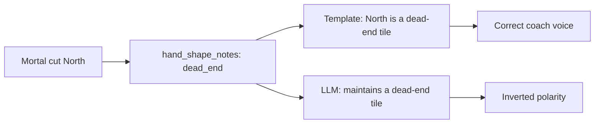

# Fix “maintains a dead-end tile” polarity bug

## Verdict

Yes, that summary is wrong.

- **Correct:** North is a floating honor with no shape goals (`Aiming for: no clear yaku shape yet`), so [`infer_hand_shape_notes`](src/shanten_sensei/features.py) tags it `dead_end` — meaning the *recommended cut* connects to nothing useful.
- **Template voice (correct):** [`_midhand_shape_clause`](src/shanten_sensei/explain.py) would say `North is a dead-end tile` (reason to throw it).
- **What you saw (wrong):** LLM text `This keeps your hand closed and maintains a dead-end tile` inverts polarity. “Dead-end” is why you discard the tile, not something you maintain. “Keeps your hand closed” is also a call-tradeoff idea misapplied to a discard.

Substance scoring currently treats any `\bdead-end\b` mention as a valid `hand_shape_note` anchor, so this bad wording can pass grounding and show in the overlay.

## Fix (locked approach)

### 1. Prompt: cut-note polarity

In [`SYSTEM_PROMPT`](src/shanten_sensei/explain.py), clarify that `hand_shape_notes` describe **why the recommended cut is weak/useless**:

- Prefer template-aligned phrases: `X is a dead-end tile`, `X is a floating honor…`, `X clears a closed middle…`
- Never say you **keep / maintain / preserve** a dead-end, floating, or isolated shape
- Add one short dead-end example, e.g. `Throw North.\nNorth is a dead-end tile—it connects to nothing useful.`

### 2. Validation reject

In `validate_explanation`, reject inverted polarity patterns such as:

- `maintain(s|ing)? a dead-end`
- `keep(s|ing)? a dead-end`
- same for `dead end`

On reject, existing repair already falls back to `template_explain` (which already says `North is a dead-end tile`).

### 3. Tests

In [`tests/test_explanation_substance.py`](tests/test_explanation_substance.py) (or adjacent):

- Assert template with `HandShapeNote(kind="dead_end", …)` emits `is a dead-end tile` (not maintain/keep)
- Assert `validate_explanation` errors on a summary containing `maintains a dead-end tile`

## Out of scope

- Changing when `dead_end` is inferred (current logic is fine for this hand)
- Broader rewrite of all LLM efficiency phrasing
- UI changes