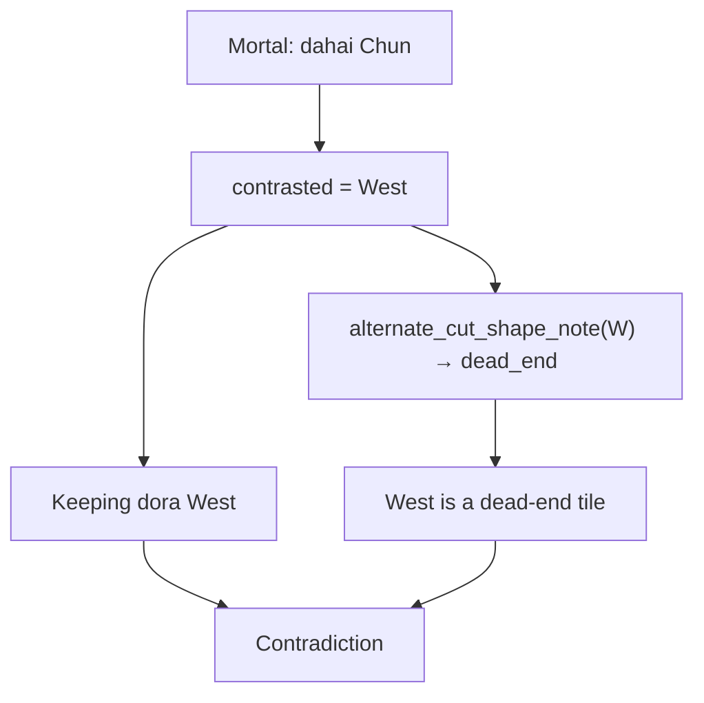

# Fix dora vs dead-end contradiction

## What you're seeing

Your tip (reproduced locally):

```
• Throw Chun, not West. …
• Keeping dora (bonus tile) West.
• West is a dead-end tile.
```

**Not caused by a missing API key.** This is `template_explain()` output — the same path used when no LLM key is set.

Mortal's advice is correct: throw Chun, keep West (dora). The wording contradicts itself because two template hooks both talk about **West**:

| Line | Source in [`explain.py`](src/shanten_sensei/explain.py) | Intent |
|------|--------------------------------------------------------|--------|
| `Keeping dora … West` | `_shape_goal_phrase()` → `_shape_goal_state_sentence()` (~1283, ~2094) | Explain why West stays in hand |
| `West is a dead-end tile` | `_alternate_midhand_shape_clause()` (~2094–2097) | Explain why throwing West would be bad |

The alternate-cut feature ([`consistent_coaching_depth` plan](.cursor/plans/consistent_coaching_depth_ef8bda35.plan.md)) was designed for cases like *"Throw 7-sou, not Chun — Chun is a dead-end tile."* It was **not** guarded for when the contrasted tile is the same tile you're keeping for dora.



## Correct coaching voice for this hand

- **Throw Chun** — Chun is the dead-end / floating honor (structurally useless).
- **Keep West** — it's dora (bonus value), even though honors often don't connect to sequences.

We should **not** call the dora tile a dead-end in the same tip that tells you to keep it for dora.

## Fix (single file + tests)

### 1. Suppress alternate shape note when alt tile is dora

In [`src/shanten_sensei/explain.py`](src/shanten_sensei/explain.py), update `_alternate_midhand_shape_clause()` (or the call site at ~2094):

- If `contrasted_action`'s tile matches any tile in `turn.features.statuses.dora_in_hand`, return `None`.
- Optionally extend to floating-honor / floating-terminal on the dora tile (same polarity issue).

```python
# sketch
dora_bases = {deaka(normalize_tile(d)) for d in turn.features.statuses.dora_in_hand or []}
alt_raw = _action_tile_token_raw(contrasted_action)
if alt_raw and deaka(normalize_tile(alt_raw)) in dora_bases:
    return None
```

### 2. Ensure cut-tile dead-end still appears

Today Chun's dead-end can be missing when `hand_shape_notes` isn't pre-populated on the turn. Confirm the live overlay path sets `turn.features.hand_shape_notes` for Mortal's cut (via [`sensei_adapter.build_turn`](file:///Users/rebeccaclarke/a_new_projects_folder/shanten-sensei-overlay/sensei_adapter.py) / features pipeline). If not wired, add `infer_hand_shape_notes(..., cut_tile=mortal_cut)` when building the turn so move paragraph gets `Chun is a dead-end tile` via existing `_midhand_shape_clause()` (~2024–2026).

### 3. Validation guard (optional but cheap)

In [`validate_explanation`](src/shanten_sensei/explain.py) / [`grounding.py`](src/shanten_sensei/grounding.py), reject summaries where the same tile label appears in both `keeping dora … {tile}` and `{tile} is a dead-end tile` → repair to template. Catches LLM regressions too.

### 4. Tests

Add to [`tests/eval/test_screenshot_regressions.py`](tests/eval/test_screenshot_regressions.py) or [`tests/eval/test_template_goldens.py`](tests/eval/test_template_goldens.py):

- **Screenshot-shaped fixture** (`dahai C`, alt `dahai W`, `dora_in_hand=['W']`, hand from your game):
  - Assert summary contains `Keeping dora` + `West`
  - Assert summary does **not** contain `West is a dead-end`
  - Assert summary contains `Chun is a dead-end` (once hand_shape_notes wired)
- Regression: existing `test_template_dora_keep_and_dead_end_on_separate_lines` (dora ≠ contrasted tile) still passes — dead-end stays on the **cut** tile (1-sou), not dora (red 5-pin).

Run: `uv run pytest tests/eval/test_template_goldens.py tests/eval/test_screenshot_regressions.py -q`

## Out of scope

- Changing Mortal's pick (Chun vs West).
- API key / LLM prompt work (template is the source today).
- Overlay bullet UI formatting (bullets are cosmetic; the underlying sentences are the bug).
