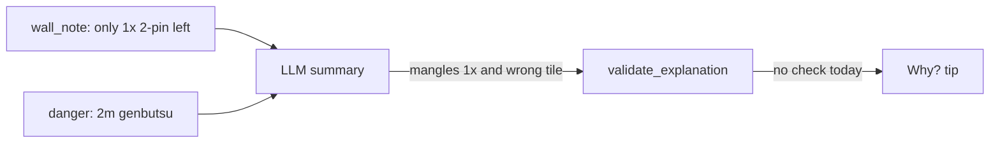

# Fix false “safer / 1 improving tile” tip

## Verdict on the screenshot tip

This clause is **not correct**:

> compared to only 1 improving tile if you throw 1-sou, which is also a safer discard since it's already been played.

Reconstructed from the board (hand `2m 6m 2p2p 4p4p 1s 2s 6s7s8s9s WW`, rivers include **2m** on the right, **no 1s**):

| Claim | Reality |
| --- | --- |
| “only 1 improving tile if you throw 1-sou” | False. Cut `1s` → ~63 visible-adjusted improving tiles, but **shanten worsens 2→3**. Cut `2m` → ~12 ukeire at 2-shanten (UI “Ukeire 11” matches). |
| “1-sou… safer… already been played” | False. `1s` is not in any river. **`2m` is genbutsu.** |

Root cause (Sensei LLM, not Mortal):

1. [`_wall_note_detail`](src/shanten_sensei/explain.py) correctly emits thin-wall prose: `only 1× 2-pin left` (because `remaining_by_tile['2p'] == 1`). Contrast vs `ukeire_alt` does **not** fire (`12 - 63 < 3`).
2. The model rewrote that **“1×”** into **“1 improving tile if you throw 1-sou”** and attached genbutsu gloss (“already discarded” → “already been played”) to **1-sou** instead of **2-man**.
3. [`validate_explanation`](src/shanten_sensei/explain.py) does not check danger-tile attribution or invented ukeire contrasts, so this summary can ship (when `pinfu` is in `shape_goals`).

Grounded template for the same turn is already fine:

> Throw 2-man, not 1-sou. … Improving tiles are thinning (only 1× 2-pin left). 2-man is genbutsu (safe — already discarded). 1-sou isn't.

## Locked approach

Harden grounding so this class of mash-up fails validation and falls back to the template; tighten the prompt so the model stops inventing it.

### 1. Grounding: false genbutsu / “already played”

In [`validate_explanation`](src/shanten_sensei/explain.py), when the summary uses safety language (`genbutsu`, `already discarded`, `already been played`, or “safer … already”), require it to be about a tile that is actually tagged `genbutsu` in `turn.features.danger`.

Practical rule:

- Extract tile mentions near those phrases (reuse [`_mentions_tile`](src/shanten_sensei/explain.py) / action display labels).
- If the summary claims a specific tile is already-discarded-safe, that tile’s danger tag must be `genbutsu`.
- Especially reject when the claim is attached to the contrasted / “if you throw X” tile and `X` is not genbutsu (this screenshot case).

### 2. Grounding: invented improving-tile contrast

When the summary contrasts improving-tile counts with an alternate cut (`improving tiles` + `if you throw` / `vs about`), require:

- The alternate tile matches `ukeire_alt`’s cut (next-best / player contrast), and
- The cited counts match `ukeire.count` and `ukeire_alt.count` (allow “about”; exact integers from the payload).

If `ukeire_alt` is missing or the best cut does **not** beat alt by the wall_note threshold, reject numeric “vs / if you throw” ukeire contrasts (so thin-wall `only 1× …` cannot be rewritten as “1 improving tile if you throw …”).

### 3. Prompt

In `SYSTEM_PROMPT` ([`explain.py`](src/shanten_sensei/explain.py)):

- Wall thinning (`only N× tile left` / `already out`) is about **ukeire remaining copies**, not the alternate cut’s acceptance count.
- Genbutsu / “already discarded” must name the **danger-tagged** tile (usually `mortal_best`), never the alternate unless that alternate is tagged genbutsu.
- Do not invent `ukeire_alt` contrasts unless `wall_note` is the contrast form (`about N … vs about M if you throw …`).

### 4. Tests

Add in [`tests/test_explanation_substance.py`](tests/test_explanation_substance.py) (or a small dedicated test module):

- Golden payload like this hand: `danger={"2m":"genbutsu"}`, `ukeire.count≈12` with `remaining_by_tile={"2p":1,…}`, `ukeire_alt.count≈63` for `1s`.
- Assert `validate_explanation` rejects the screenshot-shaped summary (false “1 improving tile if you throw 1-sou” + “already been played” on 1-sou).
- Assert `template_explain` stays clean: mentions thinning 2-pin and genbutsu on 2-man, not on 1-sou.
- Positive control: a summary that correctly says 2-man is already discarded / genbutsu still validates.

## Out of scope

- Adding `shanten_alt` so tips can say “stays 2-shanten vs falls to 3” (good follow-up; not required to kill this false clause).
- Changing Mortal’s 2m recommendation.