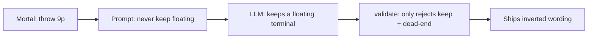

# Fix “keeps a floating terminal” polarity

## Verdict

**Yes, that sentence is incorrect.**

> Throw 9-pin. That keeps a floating terminal, which can connect to 8-pin or 6-pin for improvement.

| Claim | Reality |
| --- | --- |
| “keeps a floating terminal” after throwing 9-pin | Inverted. Cutting 9-pin *discards* that tile; correct voice is “9-pin **is** a floating terminal” (reason to throw it). |
| “connect to 8-pin or 6-pin” | Wrong for a 9. A lone 9 connects with **8** (or **7**), not 6. “8 or 6” describes a **7**. |
| 9-pin as floating in this hand | Likely also false: with `789p` on board, [`_is_floating_terminal`](src/shanten_sensei/features.py) requires neighbor `8p` count `== 0`, so 9p would not be tagged floating at all — the LLM invented the shape note. |

This is the same class of bug as the completed [dead-end polarity fix](.cursor/plans/fix_dead-end_polarity_1bca24d8.plan.md): the model treated a cut-reason note as something to keep.



## Root cause

- Prompt already says never keep/maintain/preserve a dead-end, floating, or isolated shape ([`SYSTEM_PROMPT`](src/shanten_sensei/explain.py) ~L91–92) and shows the correct example: `9-pin is a floating terminal…`.
- Template path via [`_midhand_shape_clause`](src/shanten_sensei/explain.py) is already correct: `{cut} is a floating terminal`.
- Hard reject only covers dead-end:

```190:195:src/shanten_sensei/explain.py
_DEAD_END_POLARITY_PATTERN = re.compile(
    r"\b(?:maintain(?:s|ing)?|keep(?:s|ing)?|preserve(?:s|ing)?)\s+"
    r"(?:a\s+)?dead[-\s]?end\b",
    re.IGNORECASE,
)
```

So `keeps a floating terminal` still passes when substance anchors (pinfu + ukeire/shanten) are otherwise satisfied.

Safe “keeps” language that must **not** be rejected: wait phrasing like `That keeps a ryanmen wait` (tenpai template ~L1174).

## Fix (locked)

### 1. Broaden polarity validation

In [`explain.py`](src/shanten_sensei/explain.py):

- Replace / generalize `_DEAD_END_POLARITY_PATTERN` to also match keep/maintain/preserve + `floating` / `isolated` / `closed middle` / `kanchan` / `penchan` / `edge` (same cut-note vocabulary as substance anchors).
- Keep error tag stable or use one shared tag e.g. `cut_note_polarity_inverted` (update the existing dead-end test accordingly).
- Do **not** match bare `keeps a ryanmen` / wait language — only cut-note nouns above.

On reject, existing repair already falls back to `template_explain` (clean summary; grounding-repair suffix already hidden).

### 2. Regression tests

In [`tests/test_explanation_substance.py`](tests/test_explanation_substance.py):

- Reject summary matching the screenshot voice: `Throw 9-pin. That keeps a floating terminal, which can connect to 8-pin or 6-pin…` → `cut_note_polarity_inverted` (or renamed tag).
- Keep / adjust the existing dead-end polarity test for the same error family.
- Sanity: a good summary with `That keeps a ryanmen … wait` still validates (no false positive).

No prompt rewrite required beyond what’s already there; validation is the missing hard gate.

## Out of scope

- Changing Mortal’s recommended discard (9p vs cutting a 3s for pair/pinfu) — separate efficiency question.
- Validating invented “connects to X or Y” tile math (nice-to-have later; polarity reject already drops this summary).
- Changing when `floating_terminal` is inferred.