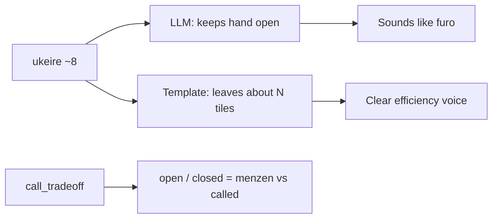

# Fix “keeps your hand open” conflating ukeire with furo

## Verdict

You’re right. In this tip, **open** is figurative English (“options open / flexible accepts”), not riichi **open hand** (called melds / broken menzen).

Your hand is still **closed** (menzen). Throwing the extra 8-sou is about **ukeire** (~8 improving tiles), not chii/pon. The coach should sound like the template: *That leaves about 8 tiles that can improve your hand* — never *keeps your hand open*.

## Where it comes from

- Screenshot text is LLM-shaped; templates in [`src/shanten_sensei/explain.py`](src/shanten_sensei/explain.py) already say `That leaves {note}` for ukeire contrast and reserve **open/closed** for call tips (`Calling would open the hand—no riichi`, `You’re … closed with about N improving tiles`).
- [`SYSTEM_PROMPT`](src/shanten_sensei/explain.py) examples use open correctly for calls and for `ryanmen (two-sided open)` waits, but never forbid figurative *hand open*.
- Thin-claim regex already catches `keeps your hand flexible` / `keeps your options open`, but **not** `keeps your hand open` — so this wording can ship.

## Fix (locked)

### 1. Prompt: open/closed = menzen vs called only

In `SYSTEM_PROMPT`, add an explicit terminology rule:

- **open / closed** only for called vs menzen (call tips / `call_tradeoff`).
- Never write *keeps your hand open*, *hand open with … improving tiles*, or similar for discard ukeire.
- Prefer existing examples: *That leaves about N tiles that can improve your hand…*

Do not change legitimate uses: *opens the hand—no riichi*, *still … closed*, *ryanmen (two-sided open)*.

### 2. Validation reject + fallback

In `validate_explanation`, reject figurative misuse on summaries, e.g.:

- `keeps? (your )?hand open`
- `hand open with`

On reject, existing repair falls back to `template_explain` (already correct for this shape).

Keep patterns narrow so call copy (`Calling would open the hand`) and wait glosses (`two-sided open`) still pass.

### 3. Tests

In [`tests/test_explanation_substance.py`](tests/test_explanation_substance.py):

- Reject a screenshot-shaped summary: `Throw 8-sou. That keeps your hand open with about 8 tiles that can improve it…`
- Assert a normal call-skip template summary that says *open the hand* / *closed with* still validates.

## Out of scope

- Overlay Hand stats / Aiming for copy
- Broader rewrite of all efficiency phrasing (`intact`, `efficient`, etc.) beyond this open/closed mix-up
- Changing when Mortal recommends the cut
