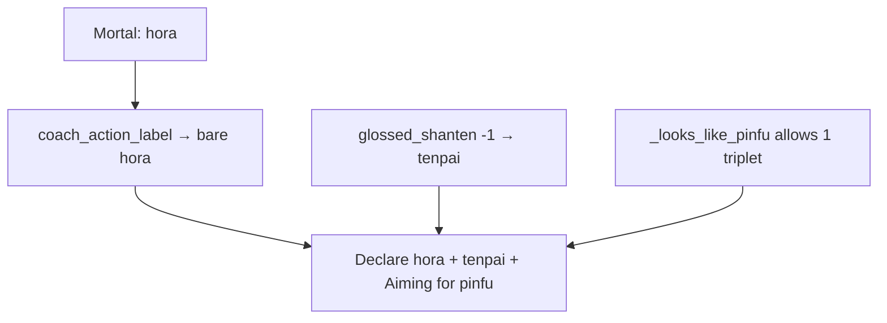

# Fix hora / agari coaching bugs

## What “hora” means

**Hora** (和了) is the formal Japanese term for **declaring a winning hand** — the same moment Majsoul shows as **Tsumo** (self-draw) or **Ron** (win on a discard). Mortal’s action label is literally `hora`; Sensei currently surfaces that jargon instead of beginner English.

`shanten -1` in the status strip is **not** wrong math: the schema already documents `0 = tenpai`, `-1 = agari` ([`schema.py`](src/shanten_sensei/schema.py)). The hand is complete; `ukeire 0` is expected.

## What’s wrong in the screenshot

Three Sensei bugs stack:

1. **Jargon lead-in** — [`coach_action_label`](src/shanten_sensei/tiles.py) has no `hora` case, so it falls through to bare `"hora"`. The LLM then wrote “Declare hora.” There is also no hora tip branch (unlike call/riichi).
2. **Completed hand called tenpai** — [`glossed_shanten`](src/shanten_sensei/glosses.py) uses `if shanten <= 0: return "tenpai (ready)"`, so agari (`-1`) is glossed like ready. Same `<= 0` → `"ready"` in [`build_user_payload`](src/shanten_sensei/explain.py) `hand_metric_glossary`.
3. **False pinfu** — Hand has `888p` (a triplet). Real pinfu forbids triplets. [`_looks_like_pinfu`](src/shanten_sensei/features.py) only rejects `triplets >= 2`, so one triplet still tags. Aiming-for then shows `pinfu (closed all-sequences; no value pair)` incorrectly.

Mortal recommending win here is correct; the bugs are Sensei’s wording and shape tagging.

## Locked fixes

### 1. Beginner label for hora

In [`tiles.py`](src/shanten_sensei/tiles.py) `coach_action_label`:

- `hora` → `"Take the win"` (parallel to `"Declare riichi"` / `"Skip"`)

Recognize `hora` in `parse_action_kind` as `"hora"` (not `"other"`).

### 2. Agari gloss (not tenpai)

In [`glosses.py`](src/shanten_sensei/glosses.py) `glossed_shanten`:

- `-1` → `"complete (winning hand)"`
- `0` → `"tenpai (ready)"` (unchanged)
- `>= 1` unchanged

Mirror in `hand_metric_glossary` in [`explain.py`](src/shanten_sensei/explain.py): `-1` → `"winning hand"`, `0` → `"ready"`.

### 3. Pinfu: reject any triplet

In `_looks_like_pinfu`: change `if triplets >= 2` to `if triplets >= 1` (return False).

### 4. Thin hora tip path + prompt

- Add `is_hora_decision_*` helpers (mortal_best / player is `hora`) next to riichi helpers in [`live.py`](src/shanten_sensei/live.py) / [`tiles.py`](src/shanten_sensei/tiles.py).
- Template branch: lead with `Take the win`; state sentence uses agari gloss + dora if present; **do not** claim tenpai/wait; **suppress Aiming-for / shape_goals in coaching** when `shanten == -1` (via `coaching_shape_goals` or serve) so a finished hand doesn’t still “aim.”
- `SYSTEM_PROMPT`: short hora rule — lead with `Take the win`, never bare `hora`; when shanten is `-1`, say the hand is complete/winning, not tenpai.

### 5. Tests

- [`tests/test_glosses.py`](tests/test_glosses.py): `glossed_shanten(-1)`
- [`tests/test_shape_goals.py`](tests/test_shape_goals.py): hand with one non-value triplet + sequences → no `pinfu`
- New small hora coaching test (or extend riichi tests): template summary contains `Take the win`, not `hora` / not `tenpai`; Aiming-for empty or “no clear yaku shape” when shanten `-1`

## Out of scope

- Overlay raw status string `shanten -1` (sibling overlay repo); this slice fixes Sensei labels/prose/API `shanten_label` / `aiming_for`.
- Full yaku enumeration of the winning hand (riichi + dora etc.).
