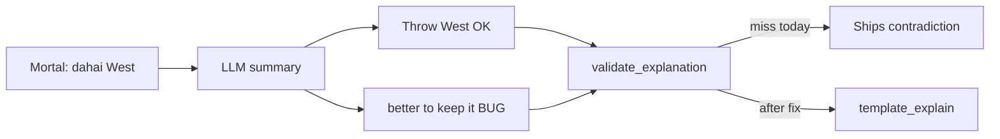

# Fix Throw-then-keep (and sibling) tip contradictions

## What’s going wrong

Your read is right: **the lead action is correct; the later clause contradicts it.**

Screenshot summary (LLM path + detail merge):

> Throw West. … You’re 3-shanten … holding a dead-end tile—West connects to nothing useful, **but it's still better to keep it for now.**  
> West — connects to nothing useful. you're even on points.

| Chunk | Source | OK? |
|---|---|---|
| `Throw West` | LLM lead (matches Mortal) | Correct |
| dead-end / connects to nothing | cut-note teaching | Correct as a *cut* reason |
| `better to keep it for now` | LLM invention | **Bug** |
| `West — connects…` / even points | [`build_detail_paragraph`](src/shanten_sensei/explain.py) via [`_finalize_explanation`](src/shanten_sensei/explain.py) | Fine; reinforces cut |

This is the same family as [dead-end polarity](.cursor/plans/fix_dead-end_polarity_1bca24d8.plan.md) and [floating polarity](.cursor/plans/fix_floating_polarity_a2b17102.plan.md): the model treats a cut-reason as something to preserve. Those fixes only reject `keep/maintain/preserve` **immediately followed by** cut-note nouns:

```223:228:src/shanten_sensei/explain.py
_CUT_NOTE_POLARITY_PATTERN = re.compile(
    r"\b(?:maintain(?:s|ing)?|keep(?:s|ing)?|preserve(?:s|ing)?)\s+"
    r"(?:a\s+|an\s+)?"
    r"(?:dead[-\s]?end|floating|isolated|closed\s+middle|kanchan|penchan|edge)\b",
    re.IGNORECASE,
)
```

That **misses** `better to keep it` / `keep it for now` / `keep West`.

Template path is already clean (`Throw X` + `X is a dead-end tile`). Repair already swaps bad LLM text to [`template_explain`](src/shanten_sensei/explain.py)—we just need validation to catch this surface form.



## Where the same class can fire

Audit targets in [`validate_explanation`](src/shanten_sensei/explain.py) / prompt (template generators themselves are consistent):

1. **Discard (this bug):** `Throw {pinned}` then `keep it` / `better to keep` / `keep {pinned label}` while cut notes describe that same tile.
2. **Discard (already partly covered):** `keeps a floating/dead-end…` — keep existing `_CUT_NOTE_POLARITY_PATTERN`.
3. **Call:** lead `Skip…` then recommend taking the call (or lead `Call/Pon/Chi…` then “better to skip”) — not covered by [`_call_kind_mismatch_error`](src/shanten_sensei/explain.py) (only pon↔chi↔kan).
4. **Riichi:** lead `Declare riichi` then “stay silent” / vice versa.

Legitimate “keep” language that must **not** be rejected:

- `That keeps a ryanmen wait`
- `keeping dora …` / keeping a **non-pinned** tile while throwing the cut
- `keeps your hand closed` on skip tips
- Contrast frames: `if you throw …` / `not West`

## Implementation (concrete)

All changes in [`src/shanten_sensei/explain.py`](src/shanten_sensei/explain.py) + goldens in [`tests/test_explanation_substance.py`](tests/test_explanation_substance.py).

### 1. Discard: pinned-cut keep contradiction

Add `_pinned_discard_keep_error(turn, summary_l) -> str | None` and call it from `validate_explanation`:

- Only when `mortal_best` is a discard (`dahai` / tile cut).
- Reject when summary matches any of:
  - `\bbetter to keep\b` / `\bstill better to keep\b` / `\bkeep(?:s|ing)? it(?:\s+for now)?\b`
  - `\b(?:keep(?:s|ing)?|preserve(?:s|ing)?|hold(?:s|ing)? onto)\s+{pinned_label}\b` via existing [`_tile_claim_label_pattern`](src/shanten_sensei/explain.py)
- Do **not** treat `keeps your hand…` or `keeps a … wait` as hits.
- Error tag: `pinned_cut_keep_contradiction` (repair → template).

### 2. Broaden cut-note + keep-it coupling

When `hand_shape_notes` includes dead-end / floating / isolated on the **pinned** cut, also reject summaries that mention that cut-note vocab **and** `\bkeep(?:s|ing)? it\b` / `\bbetter to keep\b` in the same summary (covers pronoun form without requiring adjacency to the noun). Can fold into the helper above or a thin companion check under the same error family / `cut_note_polarity_inverted`.

**Chosen default:** use `pinned_cut_keep_contradiction` for keep-it / keep-{tile}; leave `cut_note_polarity_inverted` for the existing noun-adjacent pattern.

### 3. Call + riichi action polarity (same family, prevent next screenshot)

Add `_action_lead_polarity_error(turn, summary_l)`:

| Mortal pin | Reject if summary also… |
|---|---|
| skip (`none` on call turn) | recommends taking call: `\b(?:call\|take\|pon\|chi)\b` as a positive lead-style claim *after* Skip — practical regex: `\b(?:better to \|should )?call\b` / `\btake the (?:pon\|chi\|kan)\b` while lead is skip |
| call (`pon`/`chi`/`kan`) | `\bbetter to skip\b` / `\bshould skip\b` / `\bstay closed instead\b` as the advice (allow “Calling would…” tradeoff language on skip tips only) |
| `reach` | `\bstay silent\b` / `\bbetter not to (?:riichi\|reach)\b` |
| `none` on riichi turn | `\bdeclare riichi\b` as advice |

Keep checks conservative so tradeoff sentences (`Calling would open…`) on skip tips still pass.

### 4. Prompt one-liner

In [`SYSTEM_PROMPT`](src/shanten_sensei/explain.py), next to the existing never-keep-dead-end line (~116): explicitly forbid `better to keep it` / keeping the recommended cut tile; cut notes justify **throwing** that tile. Add a dead-end example note that does not hedge with keep.

### 5. Tests

In [`tests/test_explanation_substance.py`](tests/test_explanation_substance.py):

- Screenshot golden: summary with `Throw West` + dead-end + `better to keep it for now` → `pinned_cut_keep_contradiction`; `explain()`/`validate` → template with `Throw West` + `is a dead-end tile`, no keep-it.
- `keep West` / `keeping West` with pinned `dahai W` → reject.
- Allow: `That keeps a ryanmen wait`; allow `keeping dora red 5-man` while throwing West.
- Call: `Skip the pon… better to call` → reject; template skip tip still validates clean.
- Riichi: `Declare riichi… better to stay silent` → reject.

## Out of scope

- Changing Mortal’s pick (West vs East when ukeire ties).
- Overlay UI / detail gloss line (`West — connects to nothing useful`).
- Thin-claim hardening for `keeps your hand efficient` (separate substance issue; not the contradiction).
