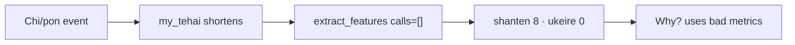

# Fix live shanten-8 status + wording nits

## What the screenshots show

| Issue | Verdict |
| --- | --- |
| `shanten 8 · ukeire 0` on every tip | **Real bug** — sentinel, not a mahjong distance |
| `about 0 acceptances (tiles that improve the hand)` | **Wording nit** — “about” + exact 0 |
| Tip names Haku / 5-man not in hand | **Related bug** — stale/desynced tip vs board |
| `isolated edge wait fragment with 9-sou` | **LLM mash** of gloss `edge wait fragment` + “isolated”; template says `clears an edge (penchan) shape` |
| `Failed to parse … Route.heartbeat` / `Error: 'Route'` | **Noise** — liqi schema miss; does not mutate hand |
| `Main Thread(404)` green checks | **Not HTTP 404** — liqi/msg ids; OK |
| Practice banner `friend only — not for ranked` | Fine as authored |

Mortal’s own meta in the terminal reports real shanten (e.g. 4) while Sensei’s status strip shows 8 — Sensei’s hand assembly is wrong, not Mortal.

## Root cause of `shanten 8 · ukeire 0`

In [`features.py`](src/shanten_sensei/features.py), `_shanten_with_melds` returns sentinel **8** when `len(closed) + 3×melds ∉ {13,14}`. Ukeire on that shape stays **0** (drawing still leaves a non-13/14 count).

Live path never passes melds:

- Overlay [`game_state.py`](file:///Users/rebeccaclarke/a_new_projects_folder/shanten-sensei-overlay/game/game_state.py) removes chi/pon consumed tiles from `my_tehai` (~472–475) but does **not** keep a Sensei `calls` list.
- [`build_turn`](file:///Users/rebeccaclarke/a_new_projects_folder/shanten-sensei-overlay/sensei_adapter.py) / `refresh_board_features` call `turn_from_live` / `extract_features` **without** `calls=`.
- Review/ingest already uses `fuuros` ([`ingest.py`](src/shanten_sensei/ingest.py)); live does not.

After chi/pon the closed hand is 10–11 tiles → status becomes `shanten 8 · ukeire 0`, and tips then invent “dead-end / genbutsu / 0 acceptances” on top of garbage metrics.

## Locked fix

### 1. Track and pass open melds (overlay + live)

In **shanten-sensei-overlay**:

- On `ChiPengGang` / kan paths that already update `my_tehai`, append a Sensei-shaped call dict (same shape ingest uses: type + tiles / consumed + called tile).
- Clear melds on new kyoku.
- Expose them on the object `hand_tiles_from_game_info` / `build_turn` already reads (e.g. `kyoku_state.my_calls` → `GameInfo`).
- Pass `calls=` into `turn_from_live` from `build_turn`, and into `extract_features` from `refresh_board_features`.

`turn_from_live` already accepts `calls` ([`live.py`](src/shanten_sensei/live.py) ~222).

### 2. Stop showing the sentinel in the HUD

In overlay `status_line_from_features` (and any parallel review chip if needed): when `features.shanten == 8`, show a sync message (e.g. `hand sync · status unavailable`) instead of `shanten 8 · ukeire 0`.

### 3. Wording: zero acceptances

In [`explain.py`](src/shanten_sensei/explain.py) `_glossed_acceptances_phrase`:

- `count == 0` → `no improving tiles` (or `0 acceptances (…)`) — **drop “about”**.
- `count > 0` keep `about {n} acceptances (tiles that improve the hand)`.

Update the few tests that hard-code the zero form if any; keep positive-count tests as-is.

### 4. Light tip guard (same PR if cheap)

When `mortal_best` is `dahai X` and `X` is not in the current hand, clear/skip Why (or force template only after reject) so tips cannot name Haku/5-man while the board shows neither. Prefer failing closed over shipping a wrong cut noun.

## Tests

- Overlay: after simulated chi/pon, `build_turn` / refresh yields shanten in `[-1, 6]`, not 8; status includes `open` when melds present.
- Sensei unit: short hand without calls → sentinel 8; same hand + one call → real shanten.
- `_glossed_acceptances_phrase(0)` has no `about`.
- Optional: dahai tile missing from hand → no shipped tip naming that tile.

## Out of scope

- Silencing `Route.heartbeat` parse warnings (separate liqi.json issue).
- Broader LLM “isolated edge wait fragment” voice (already partly covered by tip-hallucination / kanchan-phrasing work); fixing metrics removes most of the bad prose fuel.
- Changing Mortal’s recommended discard.