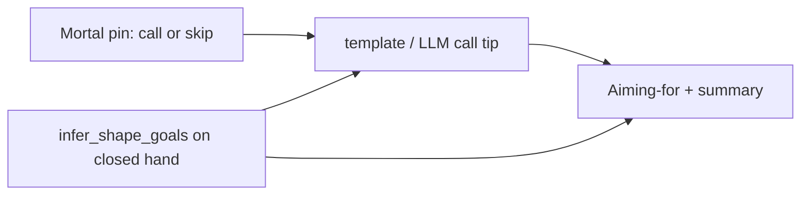

# Fix open-call + pinfu contradiction

## Verdict: Sensei bug (not Mortal inventing pinfu)

- **Pinfu Aiming-for** comes from Sensei heuristics in [`infer_shape_goals`](src/shanten_sensei/features.py) / [`_looks_like_pinfu`](src/shanten_sensei/features.py) on the **current closed** hand. That tag is valid *until* you call.
- **“Call … opens … still aiming for pinfu”** is explain-layer prose. The skip-path example in [`SYSTEM_PROMPT`](src/shanten_sensei/explain.py) teaches “still aiming for …” while staying closed; on a **call-win** tip the model (or template’s “That fits pinfu…”) incorrectly keeps the closed goal. Mortal does not supply yaku names.
- **Chii UI vs “Call pon”** is separate. Template would say `Chi …` if `mortal_best` were `chi …`. Either the LLM said “Call pon” over a chi pin (Sensei; no call-kind check in [`validate_explanation`](src/shanten_sensei/explain.py)), or upstream pinned `pon` while Majsoul only offered Chii (overlay/Mortal mask — out of scope for this slice). This plan hardens Sensei so wrong call-kind prose fails grounding.

## Locked approach

When `mortal_best` is an opening call (`is_call_action` + `call_tradeoff.opens_hand`), treat `pinfu` and `chiitoi` as **closed-only** and drop them from coaching presentation. Keep raw tags elsewhere if useful; coaching surfaces use the filtered list.

### 1. Closed-only goal filter

In [`explain.py`](src/shanten_sensei/explain.py) (or a tiny helper next to glosses):

- `CLOSED_ONLY_GOALS = frozenset({"pinfu", "chiitoi"})`
- `coaching_shape_goals(turn)` → filter those out when recommending an open call; otherwise return `turn.features.shape_goals` unchanged (Skip tips may still say “still aiming for pinfu”).

Wire into:

- `_shape_goal_phrase` / `_template_explain_call` call-win branch (stop “That fits pinfu…” on open)
- `build_user_payload` `shape_goals` + glossary keys (so LLM never sees pinfu as allowed while calling)
- [`serve.py`](src/shanten_sensei/serve.py) `aiming_for` / `shape_goals` in the explain response (so the Aiming-for strip matches)

On call-win when filtered goals dropped `pinfu`/`chiitoi`, template may add one short open note if missing: e.g. “That opens the hand—no riichi” (reuse existing skip-path idea; do **not** claim the closed yaku).

### 2. Validation

Extend [`validate_explanation`](src/shanten_sensei/explain.py):

- Allowed yaku for mention = `coaching_shape_goals(turn)` (+ dora as today), so “pinfu” in summary while recommending open → grounding error → template repair.
- Call-kind alignment: if `mortal_best` is `chi*`, reject summary lead/verb “Call pon” / bare “pon”; if `pon`, reject “Chi …” as the recommended action (tile mention alone is not enough).

### 3. Prompt

Update call section of `SYSTEM_PROMPT`:

- Add a **chi** example (`Chi 7-sou, don’t skip` / skip-the-chi).
- Explicit rule: when recommending a call that opens the hand, do **not** say the hand is still aiming for closed-only yaku (`pinfu`, `chiitoi`); cite tempo/shanten/`call_tradeoff` instead.
- Require call verb to match `mortal_best` kind.

### 4. Tests

Add in [`tests/test_call_coaching.py`](tests/test_call_coaching.py):

- `test_template_call_does_not_claim_pinfu` — pin `shape_goals=["pinfu"]`, recommend pon with `opens_hand`, assert summary has no `pinfu`, `validate_explanation` clean.
- `test_grounding_rejects_pinfu_on_open_call` — LLM-shaped summary mentioning pinfu while pinned open call → errors.
- `test_grounding_rejects_pon_verb_when_chi_best` — `mortal_best` chi, summary “Call pon on …” → errors.

Keep existing skip+tanyao golden unchanged (pinfu/chiitoi stay allowed on Skip).

## Out of scope

- Overlay/Mortal mask audit for illegal pon when only chi is offered (needs a live `mortal_best` capture next time).
- Changing when Mortal prefers call vs skip — Sensei verbalizes Mortal; it should not override the pin.