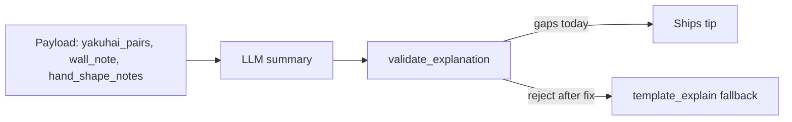

# Fix screenshot tip hallucinations

## Triage

| Screenshot tip | Verdict |
| --- | --- |
| “pair of East/South” with a singleton East/South | **Bug** — LLM invented a pair |
| “pair of South” **and** “South is a floating honor” | **Bug** — contradiction; template never emits both |
| “65 … vs … 73 if you throw North” / “only 36” when 36 > 31 | **Bug** — unauthorized or inverted ukeire contrast |
| “3-sou is a dead-end…” (alt / pair of 3s) | **Bug** — cut notes only describe Mortal’s cut |
| “2-pin is an isolated kanchan” with no 2+4 kanchan shape | Likely same wrong-attribution / invented shape note |
| “pair of Haku” with two Haku | **Correct** — leave alone |

Deterministic paths in [`explain.py`](src/shanten_sensei/explain.py) / [`features.py`](src/shanten_sensei/features.py) are already safe: `_yakuhai_pair_labels` requires `count >= 2`, floating honor requires `count == 1`, `wall_note` contrast only when best ukeire beats alt by ≥3, and dead-end notes attach only to Mortal’s cut. The LLM is inventing claims that skip those gates; validation lets them ship.

## Locked fix (grounding only)

All changes in [`src/shanten_sensei/explain.py`](src/shanten_sensei/explain.py) + regressions in [`tests/test_explanation_substance.py`](tests/test_explanation_substance.py). On reject, existing repair already falls back to `template_explain`.

### 1. Ground “pair of {Honor}” against `yakuhai_pairs`

Add a validator (wired in `validate_explanation`):

- Match claims like `pair of East/South/…`, `holding a pair of …`, `a pair of … for that`.
- Every named honor/dragon in that claim must appear in `_yakuhai_pair_labels(hand, context)` (payload `yakuhai_pairs`).
- Reject when the tile is only in `yakuhai_singleton_value_tiles` or tagged `floating_honor` / `dead_end`.

Catches false East/South pairs and the pair+floating contradiction. Correct Haku pair still passes.

### 2. Broaden ukeire-contrast detection + polarity

Extend [`_false_ukeire_contrast_error`](src/shanten_sensei/explain.py) so screenshot voice is caught:

- Match `N tiles that can improve` (prompt’s own example voice), not only `N improving tiles`.
- Match `while throwing {alt}` / `while {alt} leaves` in addition to `if you throw`.
- Keep existing rules: contrast requires `wall_note` kind `"contrast"` and exact `ukeire` / `ukeire_alt` counts + correct alt tile.
- Extra polarity: if the summary uses `only` / `only about` next to a count, that count must be the **smaller** of the two cited numbers (rejects “only 36” when 36 > 31).

This rejects 65-vs-73 and “only 36” whenever contrast isn’t authorized (best does not beat alt by ≥3). Recommending a lower-ukeire cut for shape/yaku remains allowed **without** a fake ukeire-win contrast.

### 3. Ground cut-note nouns to the note’s tile

When the summary uses cut-note vocabulary (`dead-end`, `floating (honor|terminal)`, `isolated kanchan/penchan`, `closed middle`), require the claimed tile to match a corresponding `hand_shape_notes[].tile` (Mortal cut). Reject attaching those nouns to the contrasted/alt tile or any other hand tile.

Catches “3-sou is a dead-end” and invented “isolated kanchan” on the wrong tile. Existing keep/maintain polarity ([`_CUT_NOTE_POLARITY_PATTERN`](src/shanten_sensei/explain.py)) stays as-is.

### 4. Prompt nudge (small)

In `SYSTEM_PROMPT`:

- Yakuhai because-clause: only say `pair of X` when `X` is in `yakuhai_pairs`; singletons use `can still pair`.
- Cut notes describe **only** the recommended cut tile from `hand_shape_notes`.
- Do not invent improving-tile contrasts unless `wall_note` is the contrast form.

## Regression tests (screenshot-shaped)

In [`tests/test_explanation_substance.py`](tests/test_explanation_substance.py):

- Singleton East + summary `pair of East` → reject.
- Singleton South tagged floating + `pair of South` / `floating honor` → reject.
- Two Haku + `pair of Haku` → still validates (control).
- Summary `65 tiles that can improve… vs about 73 if you throw North` with no contrast `wall_note` → reject.
- `only 36` when best ukeire is 31 and alt is 36 → reject.
- Good contrast `37 … only about 35 if you throw 2-pin` with authorized contrast → still passes.
- Mortal cut Chun with floating/dead-end note; summary says `3-sou is a dead-end` → reject.

## Out of scope

- Changing Mortal’s recommended discard when ukeire favors the alt (efficiency vs shape is Mortal’s call).
- Dora strip mismatches (`dora: 5s` vs board indicator) — separate from tip prose.
- Replacing the LLM; template fallback is the safety net.