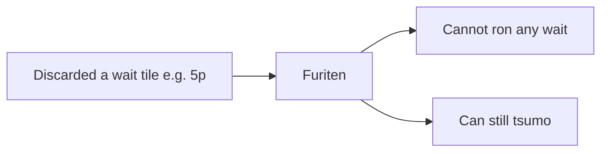

# Furiten options + Sensei teaching

## What “furiten options” means (rules)

In riichi there are three furiten situations—not five separate waits each with their own rule. Mahjong Soul’s red **Furiten** tags on every wait mean you are furiten for the hand: **you cannot ron any of those tiles**; you can only win by **tsumo**.

| Kind | Trigger | How long |
|------|---------|----------|
| **Discard / permanent furiten** | Any of your *current* wait tiles is already in your river | Until your wait set changes (open hand / different shape). In **riichi**, wait can’t change → stuck for the hand |
| **Temporary furiten** | You could have ron’d this turn and passed | Until your next discard |
| **Riichi furiten** | Same mechanics while declared riichi (pre-riichi discard matches wait, or you skip a win after riichi) | Rest of the hand |

Your screenshot is **discard furiten**: river has **5p**, which is among the waits after discarding red 5s, so MJS marks **all** waits Furiten—not because each was discarded.

## What Sensei does today

- Detects permanent furiten via `is_furiten(waits, discards)` in [`features.py`](src/shanten_sensei/features.py).
- Why? copy via [`_furiten_because_sentence`](src/shanten_sensei/explain.py): *“You’re furiten on X—you already discarded it—so this is for defense, not a win this turn.”*
- Overlay chip is bare `"furiten"` ([`sensei_adapter.py`](../shanten-sensei-overlay/sensei_adapter.py)); review chip is the same ([`review.html`](web/review.html)).
- No gloss in [`glosses.py`](src/shanten_sensei/glosses.py); `temporary_furiten` is schema-only and never set live.

## Why your live tip missed it

In the screenshot Sensei shows `shanten 0 · ukeire 0` and **no furiten**, while recommending Declare riichi—so detection failed for this turn:

1. Overlay [`build_turn`](../shanten-sensei-overlay/sensei_adapter.py) never passes `discards=` into `turn_from_live` → river is empty for `is_furiten`.
2. Board refresh without a reaction also omits player discards.
3. Riichi tips use action `"reach"` with no cut tile → [`live.py`](src/shanten_sensei/live.py) only sets `ukeire_after_discard` for `dahai …`, so waits/ukeire are computed on the **14-tile** hand (hence `ukeire 0` / empty waits / no furiten).

Teaching copy won’t help until those are fixed.

## Implementation (concrete)

### 1. Fix live furiten + riichi-shape waits

**Overlay** ([`sensei_adapter.py`](../shanten-sensei-overlay/sensei_adapter.py)):
- Derive player river from `visible_discards` / seat (same source as `get_visible_discards`).
- Pass `discards=player_river` in `build_turn` and in the no-reaction `extract_features` path.

**Core** ([`live.py`](src/shanten_sensei/live.py) + action helpers):
- For `reach` recommendations, resolve the cut tile from the reaction (`pai` / paired dahai meta) and pass it as `ukeire_after_discard` so waits, ukeire, wait_shape, and furiten match the post-riichi 13-tile shape.
- Fallback: if only `visible_discards` is provided, use the player’s seat river as `discards` inside `turn_from_live` when `discards` is omitted.

### 2. Teach the rule beginners miss

Rewrite [`_furiten_because_sentence`](src/shanten_sensei/explain.py) (and LLM prompt example) to:

- Name the discarded wait(s) that *cause* furiten.
- State that **ron is blocked on every wait**; **tsumo still works**.
- On riichi tips (`_template_explain_riichi`), keep the sentence in the summary so Declare riichi isn’t silent about tsumo-only EV.

Example tone: *“You’re furiten—you already discarded 5-pin, so you can’t win on any discard (only tsumo).”*

Add a short `temporary_furiten` sentence when that flag is ever true (wire later if the client exposes pass-on-win; not required for this screenshot).

### 3. Gloss + wait-row badges (MJS-like)

- [`glosses.py`](src/shanten_sensei/glosses.py): `glossed_furiten()` → e.g. `furiten (can’t win on discard — tsumo only)`.
- Overlay status strip + review chips use the gloss.
- [`serve.py`](src/shanten_sensei/serve.py) / [`review.html`](web/review.html): expose `furiten_blocking_tiles`; in the Waits/ukeire row, mark wait tiles that are in the river (and/or show a single “all waits: furiten for ron” note when `statuses.furiten`).

### 4. Tests

- Unit: `is_furiten` + extract_features with river ∩ waits.
- Live: `turn_from_live` with `reach` + `pai` cut tile computes non-empty waits and `furiten=True` when river contains a wait.
- Template golden: furiten-because mentions **tsumo only** / **all waits** (update [`test_explanation_substance.py`](tests/test_explanation_substance.py)).
- Overlay adapter: `build_turn` passes discards from rivers.

## Out of scope

- Full temporary-furiten detection from Mahjong Soul (needs pass-on-win / `at_furiten` live hook).
- Changing Mortal’s riichi EV (only explain tsumo-only; don’t override the tip).
