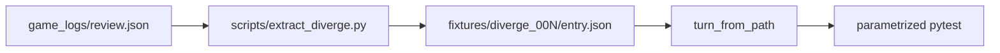

# Golden diverge fixtures

## Goal

Close the README Phase 1 gap for golden fixtures: keep synthetic [`fixtures/diverge_001`](fixtures/diverge_001), commit real [`fixtures/diverge_002`](fixtures/diverge_002/entry.json), and add a few more single-entry wrappers from [`game_logs/review.json`](game_logs/review.json) (39 diverges). Do **not** check in the full report, mjlog, or Mortal weights under `game_logs/`.

Target set (5 fixtures total — lower end of the 5–10 checklist):

| Fixture | Source | Why |
|---------|--------|-----|
| `diverge_001` | already in repo | Synthetic ryanmen tenpai baseline |
| `diverge_002` | k0h0 junme 12 | Already cut; Mortal `dahai 8s` vs player `dahai 6p`, shanten 1 (aka `5mr` in hand) |
| `diverge_003` | k0h0 junme 3 | Early honor efficiency: `dahai P` vs `dahai 9p`, shanten 3 |
| `diverge_004` | k1h0 junme 1 | Call miss: Mortal `pon W` vs player `none` |
| `diverge_005` | k1h1 junme 7 | Call + aka: Mortal `chi 5mr` vs player `none` |

Offline `explain` + grounding already pass on these shapes (verified against the live package).

## Layout (match existing wrapper)

Same shape as diverge_001/002:

```text
fixtures/diverge_00N/
  entry.json   # { note, kyoku: {kyoku,honba,relative_scores}, entry: <raw Entry> }
```

`note` should cite log id `2026071901gm-0009-7126-0c7cc61e`, seat, kyoku/honba/junme, and Mortal vs player actions.

## Extraction helper

Add a small script [`scripts/extract_diverge.py`](scripts/extract_diverge.py):

```bash
uv run --python .venv/bin/python scripts/extract_diverge.py \
  game_logs/review.json --kyoku 0 --honba 0 --junme 3 \
  -o fixtures/diverge_003/entry.json
```

- Read full report via existing [`kyokus_from_report`](src/shanten_sensei/ingest.py)
- Find the entry matching kyoku/honba/junme with `is_equal: false` (error if missing/ambiguous)
- Write the thin wrapper; do not trim `details` (needed for candidates)

Use it once to create 003–005; keep the script so future logs are one command.

## Tests

Extend [`tests/test_ingest_explain.py`](tests/test_ingest_explain.py):

- Parametrize ingest + offline `explain` + `validate_explanation == []` over all `fixtures/diverge_*/entry.json`
- Keep diverge_001-specific asserts (ryanmen / ukeire 6) as a dedicated test
- Add light pins for the new reals, e.g.:
  - 002 → `mortal_best == "dahai 8s"`, `player_action == "dahai 6p"`
  - 004 → `mortal_best == "pon W"`, `player_action == "none"`
  - 005 → `mortal_best` starts with `chi` and includes `5m` / `5mr`

No LLM calls in CI.

## Docs

- [`README.md`](README.md): mark golden-fixtures checklist item done (or “5 fixtures: 1 synthetic + 4 real”); mention `diverge_002`–`005` and the extract script one-liner
- [`docs/phase1-contract.md`](docs/phase1-contract.md): point “Obtaining a diverge fixture” at `scripts/extract_diverge.py`

## Out of scope

- Review UI / companion panel
- Checking in `game_logs/review.json`, `.mjlog`, or `mortal_model/`
- Enriching discards/dora/suji from the full log (entries lack `player_discards`; leave ingest as-is)
- Growing to a full 10 fixtures (easy follow-up via the extract script)


