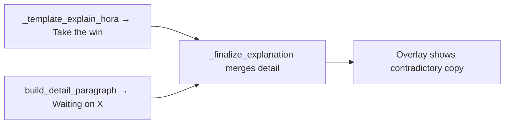

# Fix hora "Waiting on" phrasing

## Problem

Your screenshot is a **hora decision** (Mortal recommends `hora`, UI shows Ron/Skip). The tip correctly leads with **"Take the win"**, but [`build_detail_paragraph`](src/shanten_sensei/explain.py) still appends tenpai copy:

```887:894:src/shanten_sensei/explain.py
    if statuses.tenpai and ukeire.tiles:
        labels = ", ".join(human_tile_label(t) for t in ukeire.tiles[:6])
        wait_label = _glossed_wait(statuses.wait_shape)
        if wait_label:
            bits.append(f"Waiting on {labels} ({wait_label})")
        else:
            bits.append(f"Waiting on {labels}")
```

That block runs for **all** turns, including hora. [`_finalize_explanation`](src/shanten_sensei/explain.py) merges it into `summary`, so users see the contradictory pair:

> Take the win. You're complete (winning hand).  
> **Waiting on** 2-sou (tanki (pair)).

"Waiting on" implies the tile is still unseen. At a ron prompt, **2-sou is on the table now** — you chose **"Win on 2-sou (tanki (pair))"**.



The original hora plan ([`fix_hora_coaching`](.cursor/plans/fix_hora_coaching_fd18e2c2.plan.md)) fixed the lead-in and agari gloss but did not branch the **detail merge** path.

## Locked wording (your choice)

- **Ron / hora with tile available:** `Win on {tile} ({wait_label})` — e.g. `Win on 2-sou (tanki (pair))`
- **Tsumo (14-tile hand):** omit the tile line — the lead already says the hand is complete; "Win on" would sound like the tile is still out there
- **Non-hora tenpai:** keep `Waiting on …` unchanged

## Implementation

### 1. Hora-aware wait sentence in `build_detail_paragraph`

In [`explain.py`](src/shanten_sensei/explain.py), branch the `statuses.tenpai and ukeire.tiles` block:

```python
if is_hora_decision_turn(turn):
    if len(turn.game_state.hand) >= 14:
        pass  # tsumo — skip
    else:
        tile = _hora_winning_tile(turn)  # new helper
        labels = human_tile_label(tile) if tile else ", ".join(...)
        wait_label = _glossed_wait(statuses.wait_shape)
        bits.append(f"Win on {labels} ({wait_label})" if wait_label else f"Win on {labels}")
elif statuses.tenpai and ukeire.tiles:
    # existing Waiting on … logic
```

### 2. Small helper: `_hora_winning_tile(turn)`

Add next to other coaching helpers in [`explain.py`](src/shanten_sensei/explain.py):

1. **Reaction `pai`** from `turn.mortal_output.raw_expected` (live overlay already passes the full mjai reaction dict — same pattern as [`_reaction_call_tile`](src/shanten_sensei/live.py))
2. **Single wait** — if `ukeire.tiles` has exactly one entry, use it
3. **Last river tile** — if one of the wait tiles matches the most recent tile in any `visible_discards` river, use that (ron on the just-thrown tile)

Prefer (1) when present so shanpon waits don't list the wrong tile.

### 3. Prompt alignment

Extend the hora rule in `SYSTEM_PROMPT` (~lines 102–105) and the hora example (~220–221):

- On `hora_decision`, never say **"Waiting on"** — say **"Win on {tile}"** with wait_shape gloss when the winning tile is known
- Update example to: `Take the win. You're complete (winning hand).\nWin on 🀛2-sou (tanki (pair)).`

### 4. Tests

Extend [`tests/test_hora_coaching.py`](tests/test_hora_coaching.py):

- **Ron fixture:** 13-tile tenpai hand, `recommended="hora"`, `ukeire.tiles=["2s"]`, `wait_shape="tanki"` → summary contains `Win on` + `2-sou`, does **not** contain `Waiting on`
- **Tsumo fixture:** same hand + winning tile (14 tiles, shanten -1) → `Take the win` present, no `Waiting on` / no `Win on`
- Optional: reaction-dict fixture with `{"type": "hora", "pai": "2s"}` and two wait tiles → names `2-sou` only

No overlay changes required; live path already stores `raw_expected`.

## Out of scope

- Status strip labels (`tenpai`, `tanki` chips) — still correct mid-hand metadata
- Full yaku breakdown on the winning hand
- Overlay-repo threading of `hora_tile` into `context` (reaction `pai` via `raw_expected` is enough for v1)
