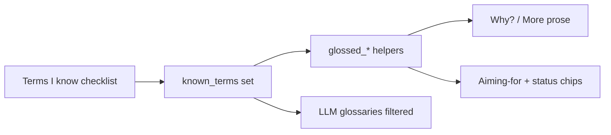

# Known-terms checklist (hide definitions)

## Why this works

Glosses are already centralized in [`glosses.py`](src/shanten_sensei/glosses.py) as `term (definition)` helpers (`glossed_goal`, `glossed_wait`, `glossed_danger`, `glossed_shanten`, `glossed_furiten`, plus dora/acceptances in [`explain.py`](src/shanten_sensei/explain.py)). Tips, Aiming-for, and status chips all go through those helpers (or LLM glossary maps built from the same dicts). A `known_terms` set can strip parentheticals at that single layer.

## Locked behavior

- **Check = I know this** → show bare term (`tanyao`, `3-shanten`); **uncheck** → keep `tanyao (2–8 only…)`.
- **Default:** empty known set (all definitions on) — beginner-safe.
- **Surfaces:** overlay Settings (persist) + review page (localStorage). Same term ids on both.
- **Scope:** parentheticals only — never hide the term itself or change coaching logic.
- **Cache:** Why? cache keys include a stable fingerprint of `known_terms` so toggling refreshes tips.

## Term inventory (checklist ids)

Export a single ordered catalog from Sensei (e.g. `GLOSS_CHECKLIST` in [`glosses.py`](src/shanten_sensei/glosses.py)) so UI and API stay in sync:

| Group | Term ids |
|-------|----------|
| Yaku | `tanyao`, `yakuhai`, `honitsu`, `chinitsu`, `toitoi`, `chiitoi`, `pinfu`, `ittsu` |
| Waits | `ryanmen`, `kanchan`, `penchan`, `tanki`, `shanpon`, `complex` |
| Defense | `genbutsu`, `suji`, `one-chance` |
| Metrics | `shanten`, `tenpai`, `ukeire`, `acceptances`, `dora` |
| Status | `furiten`, `temp_furiten` |
| Shape notes | `floating_terminal`, `floating_honor`, `isolated_kanchan`, `isolated_penchan`, `dead_end` |

UI labels = id + short gloss preview (so users know what they’re checking off).

## 1. Sensei gloss layer — [`glosses.py`](src/shanten_sensei/glosses.py) + [`explain.py`](src/shanten_sensei/explain.py)

- Add `known_terms: Collection[str] | None = None` to every `glossed_*` and `format_aiming_for`.
- If `tag in known_terms`, return bare label (e.g. `glossed_shanten(3)` → `3-shanten`; known `tenpai` → `tenpai`; known `dora` → `dora {tile}` without `(bonus tile)`).
- Thread `known_terms` into `explain` / `template_explain` / `explain_llm` via `features.context["known_terms"]` (same pattern as `include_score_tips`).
- Template call sites use context-aware thin wrappers (or pass the set through) so every `_glossed_*` / `_glossed_dora_phrase` / `_glossed_acceptances_phrase` respects it.
- LLM: in `build_user_payload`, **omit** known keys from `shape_goal_glossary`, `wait_shape_glossary`, `danger_glossary`, `hand_shape_note_glossary`, and metric/dora entries; nudge `SYSTEM_PROMPT` to only add parentheticals when that term appears in the payload glossaries.
- Detail paragraph (`build_detail_paragraph`) uses the same helpers.

## 2. Overlay — sibling [`shanten-sensei-overlay`](../shanten-sensei-overlay)

- [`common/settings.py`](../shanten-sensei-overlay/common/settings.py): `known_terms: list[str]` (validated against catalog; unknown ids dropped).
- Settings UI: button **“Terms I know…”** opens a scrolled checklist dialog (Settings is already crowded at 700×710) — not dozens of boxes on the main settings grid.
- On Save: write `known_terms`, invalidate Why? cache.
- [`sensei_adapter.py`](../shanten-sensei-overlay/sensei_adapter.py): pass `known_terms=set(self.st.known_terms)` into `explain(...)`; use the same set for `format_aiming_for` / status gloss labels; include sorted tuple in cache key.
- [`common/lan_str.py`](../shanten-sensei-overlay/common/lan_str.py): short label + helper text (“Checked terms keep their names but hide definitions”).

## 3. Review — [`serve.py`](src/shanten_sensei/serve.py) + [`web/review.html`](web/review.html)

- Accept `known_terms` (comma-separated query or JSON body list) on `/api/explain/{i}`; pass into explain; extend cache key.
- Small “Terms I know” panel (grouped checkboxes) near Why?; persist with `localStorage`; re-fetch / clear tip cache when selection changes.
- Status chips / Aiming-for from the API should also respect the set when those labels are server-rendered.

## 4. Tests

In [`tests/test_explanation_substance.py`](tests/test_explanation_substance.py) (and a small gloss unit test):

- Empty known → parentheticals present (current goldens).
- `known_terms={"tanyao","shanten"}` → `tanyao` / `N-shanten` without defs; other terms still glossed.
- Payload glossaries omit known keys.
- Invalid / unknown ids ignored safely.

## Out of scope

- Hover tooltips / glossary modal encyclopedia
- Hiding entire tip categories (that’s the separate score-tips toggle)
- Syncing overlay settings.json ↔ review localStorage
- Changing Mortal recommendations

## Test plan

- Overlay: check `tanyao` + `genbutsu` → Aiming-for and Why? show bare names; uncheck restores defs; survives restart via settings.json.
- Review: toggle checklist → tip text updates; reload page keeps selection.
- `pytest tests/test_explanation_substance.py` (plus any new gloss tests) passes.
