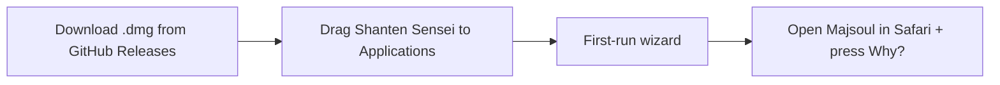
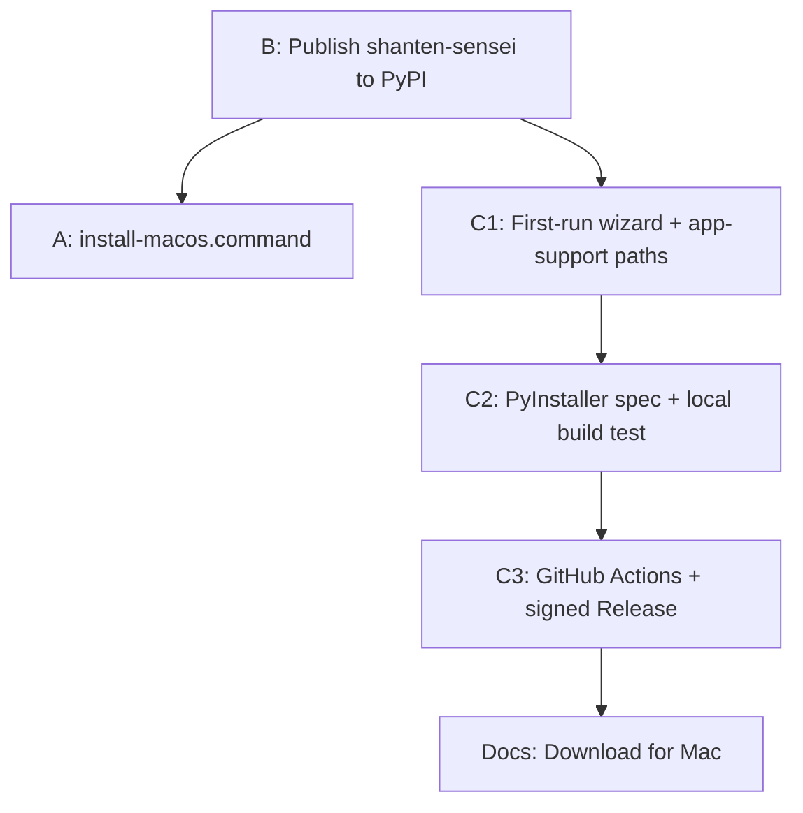

# Package Shanten Sensei for non-dev macOS users

## Problem today

A beginner must follow a multi-repo dev workflow documented in [`docs/live-setup.md`](docs/live-setup.md):

- Clone **two** sibling repos (`shanten_sensei` + `shanten-sensei-overlay`)
- Install Python 3.11, create venvs, run manual `pip` pins for torch/mitmproxy compat
- Install Playwright Chromium (even if they only want Safari)
- Download and place a Mortal `.pth` model separately
- Trust a locally generated MITM certificate

That is reasonable for contributors, not for “download and play.”

## Target experience



**Default path:** Safari companion mode (already supported — no Chromium bundle needed for v1).

---

## Strategy: three layers (ship incrementally)

| Layer | Effort | What non-devs get |
|-------|--------|-------------------|
| **A. One-click installer** | Low | Double-click `Install Shanten Sensei.command` → working source install |
| **B. PyPI dependency** | Low | Overlay no longer needs sibling clone |
| **C. macOS .app + Releases** | Medium | Real “download and use” product |

Layers A+B can land in a week; C is the durable answer for macOS live coaching.

---

## Layer A — One-click macOS installer (bridge)

Add to **overlay repo** ([`shanten-sensei-overlay`](https://github.com/rclarke009/shanten-sensei-overlay)):

**`scripts/install-macos.command`** (double-clickable):

1. Check for Python 3.11 (`python3.11` or prompt to install from python.org)
2. Create `~/Applications/ShantenSensei/` app support dir with a venv
3. `pip install` overlay from git tag **and** `shanten-sensei` from git/PyPI (no sibling folder)
4. Apply existing compat pins from [`docs/live-setup.md`](docs/live-setup.md) (`numpy<2`, httpx/httpcore/h11 pins)
5. **Skip** `playwright install chromium` when Safari companion is the default (document Chromium as optional/advanced)
6. Write a small **launcher `.app`** (Platypus, or AppleScript + `open -a Terminal` wrapper) that runs `main.py` from the venv
7. Open a **first-run checklist window** or print clear next steps:
   - Download Mortal model (link to [Akagi](https://github.com/shinkuan/Akagi))
   - Enable Safari companion in Settings
   - Optional API key for LLM Why?

**Docs:** Add a top-level **“Download for Mac”** section to overlay README and link from [`README.md`](README.md) / [`docs/live-setup.md`](docs/live-setup.md) that points non-devs to Releases (once C exists) or “Run `install-macos.command`” (until then).

---

## Layer B — Publish Sensei to PyPI (remove two-repo requirement)

In **this repo** ([`pyproject.toml`](pyproject.toml)):

1. **Bundle static assets in the wheel** — today [`serve.py`](src/shanten_sensei/serve.py) looks for `web/` at repo root, which breaks a plain `pip install`. Add package data so `web/review.html` ships inside the wheel (useful later; low cost now):

```toml
[tool.hatch.build.targets.wheel]
packages = ["src/shanten_sensei"]
# also include web/ as package data under shanten_sensei
```

Update `resolve_web_dir()` to check `importlib.resources` / package-relative path first.

2. **Publish** `shanten-sensei` to PyPI (GitHub Actions `publish` workflow on tag).

3. In overlay [`requirements.txt`](../shanten-sensei-overlay/requirements.txt), replace `pip install -e ../shanten_sensei` with:

```text
shanten-sensei>=0.1.0
```

4. Update [`sensei_adapter.py`](../shanten-sensei-overlay/sensei_adapter.py) error text and [`main.py`](../shanten-sensei-overlay/main.py) `.env` lookup to use app-support path (`~/Library/Application Support/ShantenSensei/.env`) instead of sibling `../shanten_sensei/.env`.

**Result:** Users only need the overlay repo (or eventually just the `.app`).

---

## Layer C — macOS `.app` via GitHub Releases (primary deliverable)

The overlay already has PyInstaller scaffolding ([`MahjongCopilot.spec`](../shanten-sensei-overlay/MahjongCopilot.spec), `_MEIPASS` handling in [`common/utils.py`](../shanten-sensei-overlay/common/utils.py)). Extend it for Sensei.

### Build spec changes (overlay repo)

Create `ShantenSensei.spec` (fork of existing spec):

- **Entry:** `main.py`
- **hiddenimports:** all `shanten_sensei.*` modules used by adapter/GUI
- **datas:** `resources/`, `libriichi/`, `libriichi3p/`, `gui/` assets, mitm PAC template dir, NOTICE/GPL files
- **binaries:** platform `libriichi` shared libs (already vendored in overlay)
- **Exclude from v1 bundle:** Playwright browsers (Safari-mode default); document Chromium as dev/advanced
- **Torch:** use CPU-only wheel in build venv to keep download size manageable (~500MB–1GB total still expected)
- **Console:** `console=False` for normal GUI; optional `ShantenSensei-debug` target with console for support

### First-run wizard (overlay GUI)

Add a simple modal on first launch (persist flag in `settings.json`):

1. **Practice-only acknowledgment** (matches existing ranked gate)
2. **Model file** — file picker → `models/mortal.pth`; link to Akagi download instructions (do **not** redistribute weights)
3. **Optional API key** — writes `Application Support/ShantenSensei/.env`
4. **Safari setup** — toggle Safari companion on; explain cert Keychain prompt; link to [`docs/proxy-trust-precautions.md`](docs/proxy-trust-precautions.md)
5. **Quit Safari & reopen Majsoul** button (reuse existing [`safari_reconnect.py`](../shanten-sensei-overlay/common/safari_reconnect.py))

### Code signing and trust

Per [`docs/proxy-trust-precautions.md`](docs/proxy-trust-precautions.md), users must trust **your** distributed binary. For a public release:

- Sign the `.app` with a Developer ID certificate
- Notarize with Apple (`notarytool`) and staple ticket
- Document uninstall: remove app + delete overlay `mitm_config/` + remove trusted cert (existing doc)

Until signing is ready, Releases can ship unsigned builds with a prominent “right-click → Open” + “we are not yet notarized” banner.

### CI release pipeline

GitHub Actions workflow in overlay repo (`.github/workflows/release-macos.yml`):

- Trigger on tag `v*`
- `runs-on: macos-14`
- Install Python 3.11, deps, PyInstaller
- Build `dist/ShantenSensei/`
- Create `.dmg` (create-dmg or `hdiutil`)
- Upload to GitHub Release with checksums
- Attach `INSTALL.md` (3-step user guide with screenshots)

### User-facing install doc (new: `docs/install-mac.md`)

Replace dev commands with:

1. Download latest `.dmg` from Releases
2. Open Shanten Sensei → complete first-run wizard
3. Open Majsoul in Safari → friend/practice game → press **Why?**

Keep [`docs/live-setup.md`](docs/live-setup.md) as the **developer / from-source** appendix.

---

## What we are explicitly not doing in v1

- Windows/Linux installers (you chose macOS only)
- Bundling Mortal weights (license + size; first-run wizard instead)
- Hosted zero-install proxy (already out of scope per [`docs/dual-client-architecture.md`](docs/dual-client-architecture.md))
- Docker for live play (MITM + GUI + Safari proxy don’t map cleanly)

---

## Recommended ship order



1. PyPI + overlay depends on `shanten-sensei` (unblocks everything)
2. `install-macos.command` for early testers this week
3. First-run wizard + `.env` in Application Support
4. PyInstaller spec; test Safari path on a clean Mac VM
5. Signed/notarized GitHub Release + simplified README

---

## Success criteria

A non-developer on macOS can:

- Get the app without cloning repos or opening a terminal (after Layer C)
- Complete setup in one sitting (model + optional API key + cert prompt understood)
- Play a practice game with Safari + companion window and press **Why?**
- Uninstall cleanly using existing cert/proxy guidance
