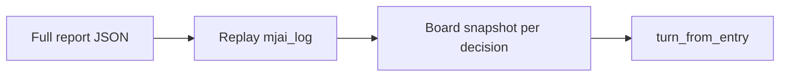

# Phase 1 polish

## Scope

Three small, related upgrades in this repo — no Phase 2 / overlay work.

1. Auto-load `.env` for `OPENAI_API_KEY` / `SENSEI_API_KEY` (and related `SENSEI_*`)
2. Enrich board context from top-level `mjai_log` so furiten / danger / visible dora work on real reports
3. Serve UI: LLM Why? first; offline template fallback when key missing or LLM fails

## 1. Auto-load `.env`

Add a tiny stdlib loader in a new [`src/shanten_sensei/envutil.py`](src/shanten_sensei/envutil.py) (no `python-dotenv` dependency):

- Parse `KEY=VALUE` lines; ignore blanks/`#` comments; strip optional quotes
- **Do not override** variables already set in the process environment
- Search order: `./.env`, then walk parents a few levels (covers running from subdirs)

Call `load_dotenv()` once at the start of [`cli.main`](src/shanten_sensei/cli.py) so `explain` / `review` / `serve` all see keys.

Docs: one README line — put keys in `.env` at the repo root; export still works.

## 2. Enrich from `mjai_log`

Full mjai-reviewer exports already have top-level `mjai_log` + `player_id`. Entries only have `state.tehai` / `fuuros`, so [`turn_from_entry`](src/shanten_sensei/ingest.py) currently leaves `discards` / `visible_discards` / `dora_indicators` empty unless the thin fixture wrapper supplies them.

**New helper** in [`src/shanten_sensei/ingest.py`](src/shanten_sensei/ingest.py) (or small `mjai_board.py` if it gets long):

- Replay `mjai_log` for `player_id`
- On each `start_kyoku`: reset river / dora (`dora_marker`); map **kyoku ordinal** — `review.kyokus[i]` ↔ i-th `start_kyoku` (review uses 0-based East index; mjai uses 1-based `kyoku` — do **not** equate the integers)
- Track per-actor dahai rivers; append `dora` events to indicators
- Snapshot **before** the player’s action:
  - **Dahai turns:** each player `tsumo` increments junme; snapshot = player river so far + all rivers + dora indicators
  - **Call / `none` turns:** after an opponent `dahai` of `entry.tile` near that junme, snapshot the same rivers/dora (for genbutsu + context)

Wire into `iter_diverge_turns` / `diverge_turns_from_path`: when `mjai_log` is present, pass snapshot fields into `turn_from_entry` as if the entry had `player_discards` / `visible_discards` / `dora_indicators`. Entry-supplied fields still win if already set (fixtures stay authoritative).

Single-entry fixtures without `mjai_log` are unchanged.

**Tests** ([`tests/test_ingest_explain.py`](tests/test_ingest_explain.py) or new `tests/test_mjai_enrich.py`):

- Synthetic mini `mjai_log` (one kyoku, a few tsumo/dahai) → assert player discards / visible rivers / dora at junme N
- Assert genbutsu danger tags appear when a candidate tile is in an opponent’s river
- Existing diverge fixtures still pass offline (no log → no enrichment)

Do **not** require `game_logs/review.json` in CI.

## 3. Why? template fallback

Keep Why? **LLM-first** (current contract). Add an explicit offline path:

| Request | Behavior |
|---------|----------|
| `POST /api/explain/{index}` | `explain(..., use_llm=True)` — unchanged |
| `POST /api/explain/{index}?mode=template` | `explain(..., use_llm=False)` — offline template |

Response adds `"source": "llm" | "template"`.

In [`web/review.html`](web/review.html):

- Why? still hits the LLM route
- On missing-key / LLM error: show the error and a secondary **Offline explanation** control that retries with `?mode=template`
- When `source === "template"`, badge the result as offline (so it’s obvious it wasn’t the LLM)

Update [`tests/test_serve.py`](tests/test_serve.py): template mode returns pinned explanation without needing a monkeypatched LLM; LLM path tests stay as they are.

Startup banner in [`serve.py`](src/shanten_sensei/serve.py): mention `.env` / offline fallback briefly.

## Docs

- [`README.md`](README.md): `.env` note; that full reports with `mjai_log` enrich rivers/dora; Status line → Phase 1 polish / ready (not “scaffold in progress”)
- [`docs/phase1-contract.md`](docs/phase1-contract.md): one sentence on mjai_log enrichment + Why? `mode=template`

## Out of scope

- Phase 2 live overlay / forking MahjongCopilot or Akagi
- Board / tile graphics
- suji / one-chance heuristics beyond current genbutsu-from-rivers
- Checking `game_logs/` into git
- Adding `python-dotenv` as a dependency
