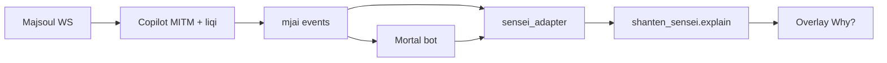

# Phase 2 kickoff — live overlay (practice / vs-AI only)

## Locked decisions

| Decision | Choice | Why |
|----------|--------|-----|
| Upstream | **Fork [MahjongCopilot](https://github.com/latorc/MahjongCopilot)** | Python end-to-end (matches Sensei), existing HUD overlay, MITM → mjai → Mortal already wired. Copilot itself is based on Akagi. |
| Not Akagi v3 | Skip [Akagi](https://github.com/shinkuan/Akagi) `v3` (Rust + Tauri) | Would force IPC/FFI to call Python `explain()`; larger stack for Majsoul-only coaching. Revisit only if Copilot bitrots. |
| Repo layout | **Sibling fork** + Sensei as dependency | Explainer stays in [shanten_sensei](.); overlay fork stays GPL-3.0. Do not merge Copilot into this monorepo. |
| Call path | **In-process** `explain(turn)` | Same process as Copilot; no live HTTP required. `sensei serve` stays post-game review only. |
| Live Why? semantics | **Pre-decision coaching** | When the player has not acted yet: `player_action = mortal_best`, `diverge=False`, contrast vs next-best Mortal candidate. Post-action diverge (if exposed) reuses Phase 1 diverge framing. |
| Mode policy | Practice / friend / vs-AI only | Startup + overlay banner; disable Why? (and prefer autoplay off) when ranked/ladder is detected. Soft gate first; harden once lobby fields are mapped. |
| Autoplay | Off by default in the Sensei fork | Product is coaching, not ladder botting. |

## Repo / license

1. Create GitHub fork of `latorc/MahjongCopilot` → e.g. `shanten-sensei-overlay` (name flexible).
2. Keep upstream LICENSE (GPL-3.0); add NOTICE that Sensei coaching is layered on Copilot.
3. In this repo: add an explicit permissive license (Apache-2.0 or MIT) so the fork can depend on Sensei cleanly; document the two-repo split in README.
4. Install path for local dev: `pip install -e ../shanten_sensei` (or git URL) from the fork; pin a documented Python ≥3.11.

## Sensei library work (this repo)

Add a **live turn builder** next to existing ingest — do not force mjai-reviewer `Entry` shape for live play.

- New helper (e.g. [`src/shanten_sensei/live.py`](src/shanten_sensei/live.py)):
  - Inputs: hand / calls / rivers / dora / scores / kyoku meta (mjai-ish strings), Mortal recommended action + candidate list (`action`, `q_value`/`prob` if present), optional `player_action`.
  - Output: `TurnExplainInput` via existing [`extract_features`](src/shanten_sensei/features.py) + [`schema.py`](src/shanten_sensei/schema.py).
  - `source="live-copilot"`, `diverge=False` when pending.
- Extend template + LLM user payload slightly for non-diverge: “why Mortal’s top over #2”, not “why player’s discard was wrong”.
- Unit tests with synthetic live payloads (no Majsoul); reuse tile/action labels from [`tiles.py`](src/shanten_sensei/tiles.py).
- Docs: [`docs/phase2-kickoff.md`](docs/phase2-kickoff.md) (adapter contract + mode policy); README Phase 2 section points at fork + this contract.

Out of scope for kickoff in this repo: changing `sensei serve` into a live proxy; board graphics; suji/one-chance beyond current features.

## Overlay fork work (sibling repo)

Hook points in upstream Copilot (explore after clone; names are current main):

- State / Mortal reaction: `game/game_state.py`, `bot_manager.py` (`get_pending_reaction`, overlay update)
- Overlay injection: `game/browser.py` + overlay update path in `bot_manager.py` (`_update_overlay_guide`)
- Settings / branding: `gui/main_gui.py`, `gui/settings_window.py`

MVP implementation steps:

1. **Bootstrap** — fork clones, runs on Mac from source (per upstream help), local Mortal model loads, overlay shows recommendations in a practice/vs-AI game.
2. **`sensei_adapter.py`** — map pending reaction + game state → `live_from_*` → `explain(..., use_llm=…)`. Cache by (kyoku, junme, recommended action) so repeated Why? is free.
3. **Why? control** — add a button/control on the HUD (or bottom-left overlay strip) that triggers explain on demand only; show summary text + pin Mortal action; reuse Phase 1 offline/template fallback if no API key.
4. **Status strip** — surface Sensei `HandStatuses` / shanten / ukeire beside the existing recommendation (same fields as [`web/review.html`](web/review.html)).
5. **Mode gate** — parse lobby/mode from liqi where available; always show “Practice / vs-AI only — not for ranked”; if mode is ranked/ladder, hide Why? and show a hard warning. Document unknown-mode as “treat as restricted”.
6. **Branding** — rename window/strings to Shanten Sensei coach; keep GPL attribution to MahjongCopilot / Akagi / Mortal.

## Kickoff success criteria

- Sibling fork runs; Mortal recommendation visible in practice/vs-AI.
- Pressing **Why?** returns a grounded `Explanation` pinned to Mortal (LLM or template).
- Ranked path does not offer Why? when mode is detected.
- Sensei tests for `live.py` pass; Phase 1 `explain` / review / serve remain unchanged in behavior.

## Suggested sequence

1. Finish or park Phase 1 polish (enrichment / template fallback) — **not a blocker** for fork bootstrap.
2. Fork + prove Copilot boots with Mortal + overlay.
3. Land `live.py` + tests in Sensei.
4. Wire adapter + Why? + banner in the fork.
5. Mode detection pass + README / phase2 docs.

## Explicit non-goals (this kickoff)

- Ranked / live-ladder assistance
- Akagi v3 / Tenhou / Riichi City ports
- Shipping autoplay as a Sensei feature
- Replacing Mortal or inventing LLM-only evaluation
- Merging the GPL fork into `shanten_sensei`
