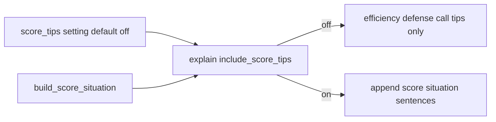

# Points tips toggle + richer lead/trail copy

## Locked choices

- **Scope:** option 2 — toggle + clearer lead/trail tips; still `leading` / `trailing` / `even` only (no 1st–4th, uma, orasu, target-score math).
- **Default:** **off** so beginners focus on tile efficiency, calls, waits, and defense rules.
- **Features stay computed:** keep building [`ScoreSituation`](src/shanten_sensei/schema.py); only gate **prose** (template + LLM payload).
- **Primary UX:** overlay Settings checkbox (same pattern as `auto_why`). Review gets a matching checkbox that passes the flag into `/api/explain`.

## 1. Sensei API flag — [`explain.py`](src/shanten_sensei/explain.py)

Add `include_score_tips: bool = False` to `explain()` / `template_explain()` (thread through `_finalize_explanation` / LLM path).

When **off**:

- Skip [`_append_score_situation`](src/shanten_sensei/explain.py) in call / riichi / discard / hora branches.
- Omit `score_situation` from [`build_user_payload`](src/shanten_sensei/explain.py) so the LLM cannot invent point claims.
- Skip score lines in [`build_detail_paragraph`](src/shanten_sensei/explain.py) when merging into summary.

When **on**: use richer `_score_situation_sentence` below.

## 2. Richer tip copy (still coarse facts)

Keep [`build_score_situation`](src/shanten_sensei/features.py) thresholds (±3000 even, late = `tiles_left ≤ 30` or `kyoku ≥ 7`). Expand teaching voice in `_score_situation_sentence` to at most **one** sentence that names the tradeoff:

| Situation | New teaching sentence (examples) |
|-----------|----------------------------------|
| Opponent riichi + leading + safe cut | `You’re ahead and an opponent is in riichi—prefer the safer cut over chasing efficiency.` |
| Opponent riichi (else) | `An opponent is in riichi—fold toward safer tiles even if ukeire drops.` |
| Trailing + late + declaring riichi | `You’re behind late—this riichi fights for points instead of playing safe.` |
| Trailing + late | `You’re behind late—aim for value and speed over slow safe builds.` |
| Leading + late + safe cut | `You’re ahead late—safer cuts protect the lead even if they leave fewer improving tiles.` |
| Even + late + safe cut | `Scores are close late—avoid needless deal-in risk when a safer cut exists.` |

Still never invent placement ranks or exact point gaps in prose. Update goldens in [`tests/test_explanation_substance.py`](tests/test_explanation_substance.py):

- Default (`include_score_tips=False`) → no score phrases even when `ScoreSituation` is set.
- Opt-in → new teaching voice; `score_situation` still in substance anchors when present.

## 3. Overlay setting — sibling [`shanten-sensei-overlay`](../shanten-sensei-overlay)

Mirror `auto_why`:

- [`common/settings.py`](../shanten-sensei-overlay/common/settings.py): `score_tips: bool = False`
- [`gui/settings_window.py`](../shanten-sensei-overlay/gui/settings_window.py): checkbox
- [`common/lan_str.py`](../shanten-sensei-overlay/common/lan_str.py): e.g. `SCORE_TIPS = "Point situation tips (lead / trail / late game)"` (+ Chinese mirror)
- [`sensei_adapter.py`](../shanten-sensei-overlay/sensei_adapter.py): pass `include_score_tips=self.st.score_tips` into `explain(...)`; include the flag in the Why cache key so toggling invalidates stale tips

Scores / `riichi_flags` are already passed via [`build_turn`](../shanten-sensei-overlay/sensei_adapter.py)—no new game-state plumbing.

## 4. Review UI — [`serve.py`](src/shanten_sensei/serve.py) + [`web/review.html`](web/review.html)

- Accept `score_tips=1` (query or POST body) on `/api/explain/{i}`; pass into `template_explain` / `explain`.
- Checkbox near Why? / More: “Point tips” (unchecked by default); re-fetch when toggled.
- Cache key must include the flag (today: `(index, mode)` → `(index, mode, score_tips)`).

## Out of scope

- Placement ranks, uma, oya/kyotaku/honba stakes, target-score tables
- Changing Mortal’s recommended move based on points
- New danger heuristics
- Making point tips the default

## Test plan

| Area | Assert |
|------|--------|
| Sensei default | `ScoreSituation` present + `include_score_tips=False` → summary has no ahead/behind/leading/trailing late phrasing |
| Sensei on | Opt-in → one richer score sentence; focus nudge still works |
| Payload | Off → no `score_situation` key; on → key present |
| Overlay | Setting persists; cache key differs when flag flips |
| Review | Checkbox off/on changes explain response |

Run: `pytest tests/test_explanation_substance.py tests/test_features.py -q` plus overlay adapter/settings tests if present.