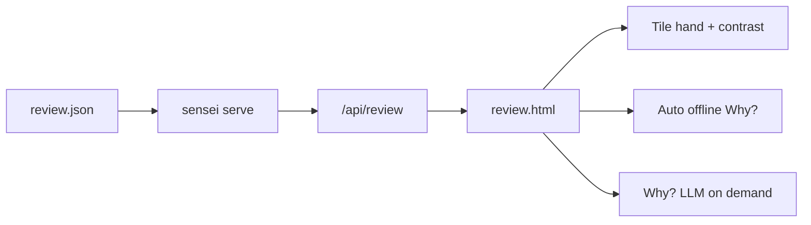

# Polish review UI for diverge explanations

## Context

Phase 1 CLI + UI already exist. Open a report with:

```bash
uv run --python .venv/bin/python sensei serve game_logs/review.json
```

Today’s [`web/review.html`](web/review.html) is functional but sparse: mono action strings, status chips, Why? only after a click. The API summary in [`serve.py`](src/shanten_sensei/serve.py) (`_diverge_summary`) does not send the hand or wait tiles, so the page cannot render them.

## Goal

Selecting a diverge turn should read as a small coaching card:

- Visual hand (tiles)
- Mortal pick vs player pick highlighted
- Status strip with beginner-friendly labels where we already gloss in explain text
- Offline explanation shown immediately; LLM Why? still on demand



## Implementation

### 1. Enrich review API payload

In [`ReviewSession._diverge_summary`](src/shanten_sensei/serve.py), add fields already on `TurnExplainInput`:

- `hand` — `turn.game_state.hand`
- `ukeire_tiles` — `turn.features.ukeire.tiles`
- `wait_shape` — from statuses (convenience)
- `calls` — `turn.game_state.calls` (for open-hand context)

Keep the payload lean (no full turn dump).

### 2. Tile rendering in the UI

In [`web/review.html`](web/review.html):

- Add a small `tileFace(label)` helper mapping mjai labels (`1m`…`9s`, `E`/`S`/`W`/`N`/`P`/`F`/`C`, red fives) to Unicode mahjong glyphs + suit color classes (man/pin/sou/honor)
- Render **Hand** as a row of tile faces; mark the Mortal discard candidate and the player’s actual discard with distinct outlines (accent vs warn)
- Render **Waits / ukeire** as a secondary tile row when tiles exist
- Keep plain-text fallback next to glyphs for screen readers / copy (`aria-label` / title = `5s`)

### 3. Immediate offline explanation

On diverge select (and on first auto-select):

- Fire `POST /api/explain/{index}?mode=template` automatically so the Why? box fills without a click
- Keep primary **Why?** for LLM (cached as today)
- Label template results with the existing “offline template” badge

This makes “nicely formatted explanation” the default view, not a second step.

### 4. Layout polish (same file, light touch)

- Detail header: `E# · kyoku/honba/junme`
- Contrast block: “Mortal wanted …” / “You played …” with tile faces, not only `dahai 9p` strings
- Status chips: slightly clearer copy where cheap (`ready` when tenpai; keep shanten number)
- No new framework; stay single-file HTML/CSS/JS

### 5. Tests

Update [`tests/test_serve.py`](tests/test_serve.py):

- Assert `/api/review` diverge objects include `hand` and `ukeire_tiles`
- Existing explain/list tests remain green

## Out of scope

- Live overlay changes (sibling fork)
- Static HTML export / PDF
- New tile image assets or CDN fonts beyond system/Unicode
- Changing explainer prompt logic (gloss work already landed separately)
