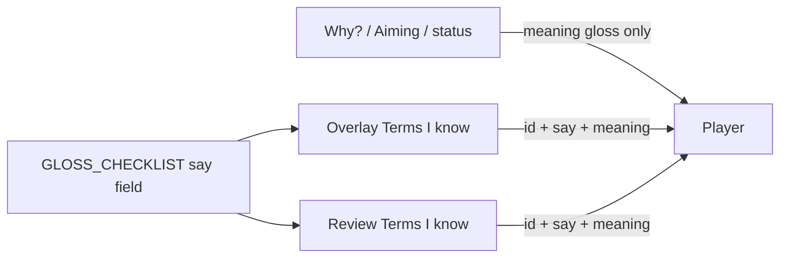

# Pronunciation help (checklist only)

## Verdict

**Add it, but keep it off the live tip line.**

Why? already glosses meaning (`ryanmen (two-sided open)`, `3-shanten (3 steps from ready)`). Those parentheticals were built for *decision time*. Pronunciation does not change the discard, and the Why panel is already tight (90-word budget, wrapping/clipping work). Putting `ryanmen (RYAHN-men; two-sided open)` in every tip would fight that.

Pronunciation *does* help beginners talk about the game later (streams, table play, the real-tile transition on the wishlist). The natural home is the existing **Terms I know** UI, which already lists every catalog id + meaning.



## Locked behavior

- **Where:** overlay Terms dialog and review Terms panel only.
- **Not in:** `_with_gloss`, Why? copy, Aiming-for, status chips, LLM glossary, goldens.
- **Form:** English respelling (e.g. `SHAHN-ten`), not IPA and not audio.
- **Known-terms checkbox:** unchanged — check still means “hide the definition,” not “I can pronounce this.”

## Data ([glosses.py](src/shanten_sensei/glosses.py))

Add `say: str` to `GlossChecklistItem`. Keep meaning in `gloss`. Example:

```python
GlossChecklistItem("ryanmen", "Waits", "two-sided open", say="RYAHN-men")
GlossChecklistItem("ukeire", "Metrics", "tiles that improve the hand", say="oo-KEH-reh")
```

Fill `say` for every existing catalog id (yaku, waits, defense, metrics, status, shape notes). Approximate Japanese as spoken in English riichi communities — stress the mora that English speakers usually miss (`ukeire`, `chiitoi`, `genbutsu`, `furiten`).

Do **not** add honor tiles (Hatsu / Haku / Chun) or table-talk words (riichi, pon, chi) as `known_terms` ids. Those names never get parentheticals today; a checkbox that hides nothing would confuse the “I know this” model.

## UI

**Overlay** — [terms_window.py](../shanten-sensei-overlay/gui/terms_window.py) currently renders:

```text
ryanmen  (two-sided open)
```

Change to:

```text
ryanmen  ·  RYAHN-men  ·  two-sided open
```

Widen the dialog slightly (~480px) so the extra token wraps cleanly. Fallback rows if Sensei is missing should include a `say` too.

**Review** — [web/review.html](web/review.html) Terms I know panel: same `id · say · gloss` label. The checklist is built from the `/api` `gloss_checklist` payload; add `say` to that JSON (today it is id / group / gloss from `GLOSS_CHECKLIST`).

## Tests / out of scope

- Unit test: every `GLOSS_CHECKLIST` item has a non-empty `say`; a couple of high-misspell terms (`ukeire`, `chiitoi`, `ryanmen`) match the locked respellings.
- Do not retouch template goldens or `glossed_*` output.
- No TTS, no hover tooltips on Why?, no IPA, no new Settings toggle.

## Later (explicitly not this slice)

If pronunciation still feels missing in-game: a one-line legend in Terms I know (“These spellings are how to say the Japanese names”) is enough. Honor-tile respellings can be a separate non-checkable “Tiles” section if you want them after this ships.
