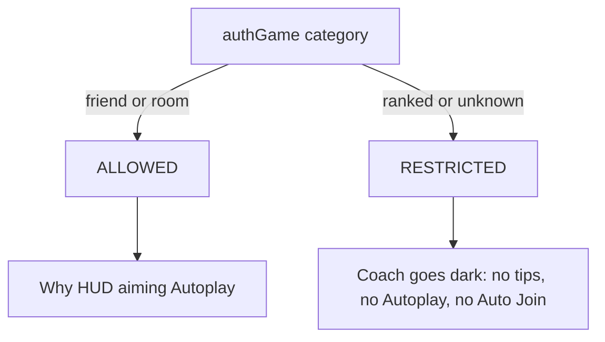

# Harden ranked, then ship

Coaching copy on Sensei `main` is in good shape (dama Stay silent, last-copy draw, isolated-keep). Do not re-touch that. The embarrassing public gap is the **soft ranked gate** plus **August 9 packages**.

Today [`why_enabled`](../shanten-sensei-overlay/sensei_mode.py) only blocks Why? / Auto Why?. In ranked or unknown mode, Mortal HUD, companion AI Guidance, Aiming-for / status, **Autoplay**, and **Auto Join** (Bronze–Throne queue) still run.

Safari is the Mac default (`hide_ai_options=True`), so the in-page HUD is often hidden — the live leak there is aiming/status + Autoplay/Auto Join.

Work is almost entirely in [shanten-sensei-overlay](../shanten-sensei-overlay). Sensei repo: docs + version bump for the release cut.

## Locked behavior

When `ModePolicy.RESTRICTED` (category 2 段位戦, or unknown):

- No overlay Mortal HUD (`_update_overlay_guide` clears)
- No companion AI Guidance
- No Why? / Auto Why? (already true)
- No Aiming-for / status coaching (`refresh_board_features` clears; GUI blanks those fields)
- No Autoplay: `automate_action` must not run; entering restricted **forces** `disable_automation()`; the switch cannot turn it back on
- No Auto Join: Copilot’s lobby join is ranked Bronze–Throne. Disable the switch for Sensei (cannot enable; `decide_lobby_action` no-op)

Keep Mortal inference running (simpler, no game-state skip bugs). Do not display it. Keep reconnect / “game running” chrome. Banner copy: **Coaching disabled in this mode** (not only Why?).

Lobby before `authGame` is already classified unknown → restricted, so Auto Join stays dead in lobby too. That is intended.

## Overlay code

**[`sensei_mode.py`](../shanten-sensei-overlay/sensei_mode.py)** — add `assist_enabled` (same as today’s `why_enabled`: `policy == ALLOWED`). Keep `why_enabled` as an alias. Update the “kickoff soft gate” comment.

**[`bot_manager.py`](../shanten-sensei-overlay/bot_manager.py)**

- `assist_enabled()` next to `why_enabled()`
- `_update_overlay_guide`: if not assist, `overlay_clear_guidance()` and return
- `_do_automation`: return immediately if not assist
- `enable_automation`: refuse if in-game and restricted
- After `ms_auth_game` / when verdict is restricted: `disable_automation()` (and autojoin off)
- `refresh_board_features`: no-op / clear Sensei board features when restricted
- `_update_overlay_botleft`: do not append status / Why coaching lines when restricted; mode line uses the new “Coaching disabled” string

**[`game/automation.py`](../shanten-sensei-overlay/game/automation.py)** — `can_automate` false unless assist (pass verdict or check `game_state.get_mode_verdict()`). `decide_lobby_action` returns immediately (Auto Join dead).

**[`gui/main_gui.py`](../shanten-sensei-overlay/gui/main_gui.py)**

- Skip `ai_guide_var` fill when not assist
- Blank aiming / status when not assist
- Autoplay click: if restricted, refuse + banner; switch shows off
- Auto Join: switch cannot turn on (always off)
- Banner already uses `WHY_DISABLED` when in-game and not `why_enabled` — new string covers all coaching

**[`common/lan_str.py`](../shanten-sensei-overlay/common/lan_str.py)** — `WHY_DISABLED` → “Coaching disabled in this mode” (and Chinese equivalent). Overlay bot-left in `bot_manager` currently hardcodes `"Why? disabled —"`; use the lan string.

**[`gui/first_run_wizard.py`](../shanten-sensei-overlay/gui/first_run_wizard.py)** — Skip still skips the practice checkbox. In-game hard gate makes that less dangerous; optional: Skip still sets `safari_mode=True` so Mac users do not land on Chromium. Do not block this slice on wizard polish.

## Tests

- [`tests/test_sensei_mode.py`](../shanten-sensei-overlay/tests/test_sensei_mode.py): `assist_enabled` true only on ALLOWED; ranked + unknown false
- Adapter ranked Why? test stays
- New overlay tests: restricted → `_do_automation` does not call `automate_action`; `_update_overlay_guide` clears; `enable_automation` does not stick while restricted. Prefer a small helper on `BotManager` if that is easier than constructing a full GUI.

## Docs (both repos)

Say **coaching and Autoplay are disabled** in ranked/unknown, not only Why?:

- [docs/live-setup.md](docs/live-setup.md)
- overlay `INSTALL.md`
- Sensei [README.md](README.md) ethical / Phase 2 bullets

Fix overlay `INSTALL.md` 404: it links `proxy-trust-precautions.md` which lives only in Sensei. Point at the Sensei GitHub URL (or copy the file into overlay).

README “macOS app bundle when published” → Releases already exist.

## Then cut a release

Public PyPI `shanten-sensei==0.1.1` and overlay `v0.6.13` are **2026-08-09**. Tonight’s coach is on Sensei `main` only.

1. Bump Sensei to **0.1.2** (`pyproject.toml` + `__init__.__version__`), GitHub Release so [publish.yml](.github/workflows/publish.yml) uploads PyPI
2. Overlay `requirements.txt`: `shanten-sensei>=0.1.2`
3. Tag overlay (e.g. `v0.6.14`) so [release-macos.yml](../shanten-sensei-overlay/.github/workflows/release-macos.yml) builds the DMG/zip with the hard gate + new Sensei

Unsigned / unnotarized stays as “right-click → Open” for this cut. Installer Terminal linger and pytest CI are later.

## Out of scope this slice

- Apple Developer ID / notarization
- Stopping Mortal inference in ranked
- More coaching copy
- Windows/Linux