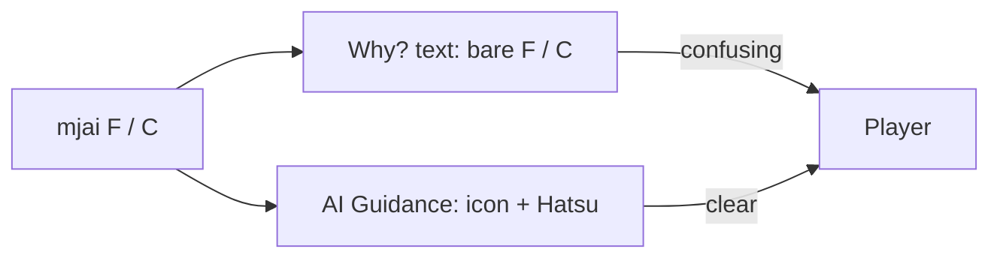

# Readable tile names in Why? text

## Problem

In the live overlay, **AI Guidance already teaches the tile**:

- `Discard 🀅Hatsu` with icon + English name
- Option list: `🀅Hatsu 54%`, `🀄Chun 23%`, …

But the **Sensei explanation** (from [`explain.py`](src/shanten_sensei/explain.py)) still writes bare mjai codes:

- Template: `Mortal prefers F over C; …` via [`_action_display`](src/shanten_sensei/explain.py) which only strips `dahai `
- LLM: payload contains `dahai F` / `F`, and the prompt only nudges suit language (`5-sou`), so the model often echoes `F` / `C` (as in your screenshot)

A player who doesn’t know dragons never maps `F` → green 發, even though the recommendation line already shows it.

## Approach

Centralize beginner-facing tile labels in Sensei (source of Why? text for overlay + review), matching the overlay’s naming in [`lan_str.MJAI_2_STR`](../shanten-sensei-overlay/common/lan_str.py).

### 1. Add `human_tile_label()` in [`tiles.py`](src/shanten_sensei/tiles.py)

Map canonical codes to coach-facing strings:

- Honors: `F` → `�sensei/tiles.py)

Map canonical codes to coach-facing strings:

- Honors: `F` → `🀅Hatsu`, `C` → `🀄Chun`, `P` → `🀆Haku`, winds → `🀀East` / etc.
- Suits: `9p` → `9-pin`, `5s` → `5-sou`, aka → `red 5-man` / etc.
- Non-dahai actions (`pon W`, `chi …`): leave action type, humanize tile args

Keep internal `pinned_action` / schema as mjai (`dahai F`); only change **display** strings.

### 2. Use it in template + prompt path in [`explain.py`](src/shanten_sensei/explain.py)

- Change `_action_display` to return `human_tile_label(...)` (or call it from `template_explain`).
- Update `SYSTEM_PROMPT` to prefer those names (Hatsu/Chun/Haku/5-sou) and **never** bare honor letters F/C/P when addressing the player.
- In `build_user_payload`, add a small `tile_glossary` (or parallel `*_display` fields) so the LLM sees `F` → `🀅Hatsu` before writing prose.

### 3. Expand grounding in `_mentions_tile`

Today suit aliases work (`5s` ↔ `5-sou`); honors do not. Accept:

- code (`f`), name (`hatsu`), and emoji-prefixed label

so LLM answers that say “Hatsu” still pass `validate_explanation`.

### 4. Tests

Update / add cases in [`tests/test_live.py`](tests/test_live.py) and [`tests/test_ingest_explain.py`](tests/test_ingest_explain.py):

- Template on honor discard → summary contains `Hatsu` (or `🀅Hatsu`), not bare ` F `
- `_mentions_tile` / `validate_explanation` accepts Hatsu/Chun for F/C
- Existing suit tests still pass (`9-pin` / `5-sou`)

No overlay UI change required for the core fix — Why? already renders whatever Sensei returns. (Separate plan [`why_panel_height`](.cursor/plans/why_panel_height_680882f8.plan.md) still applies if longer lines clip.)

## Out of scope

- Hover glossary / click-to-highlight on the hand row
- Changing AI Guidance (already correct)
- Longer multi-paragraph coach mode
