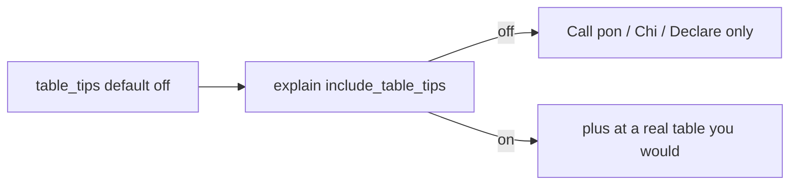

# Real-table tips (opt-in)

## Locked choices

- **Visibility:** players turn it **on/off**. **Default off**.
- **UX grouping:** Point tips and Real table tips live under **Advanced** (not on the main beginner Settings/Why? row). Auto Why? and Terms I know stay outside Advanced.
- **When it fires:** only if Mortal’s recommended action is **Call** (pon / chi / kan) or **Declare riichi**. Never on Skip / Stay silent (nothing to place).
- **Where it lives:** one extra Why? bullet/sentence when the flag is on — **not** `hand_shape_notes`. Lead stays `Call pon on …` / `Chi … for 6-7-8` / `Declare riichi, discard …`.
- **Grounding:** claimed tile + call kind + chi sequence we already compute. Placement is a fixed rule, not Mortal eval. Do not invent discarder seat unless we already know it; chi can say “from your left” because chi is always kamicha.

## Copy (one sentence)

| Mortal best | Example |
|-------------|---------|
| Pon | At a real table, take two 3-sou from your hand and expose them with the claimed 3-sou turned toward whoever discarded it. |
| Chi | At a real table, take 6-sou and 8-sou from your hand and lay 6-7-8 sou, with the claimed 7-sou turned toward your left (chi is only from the player on your left). |
| Kan (claim) | At a real table, take three 5-pin from your hand and expose all four, with the claimed 5-pin turned toward whoever discarded it. |
| Declare riichi | At a real table, say riichi, put the stick out, and discard 9-pin sideways as the cut tile. |

If tile/meld facts are missing, omit the sentence rather than guess. Closed kan / added kan: only mention if the action kind is unambiguous; otherwise skip rather than teach the wrong layout.

## 1. Sensei flag — [`explain.py`](src/shanten_sensei/explain.py)

Mirror [`include_score_tips`](src/shanten_sensei/explain.py) / [`_turn_with_coach_prefs`](src/shanten_sensei/explain.py):

- Add `include_table_tips: bool = False` on `explain()` / `template_explain()` / LLM path; stamp `features.context["include_table_tips"]`.
- Helper `_table_tips_enabled` + `_table_procedure_sentence(turn) -> str | None`.
- Append that sentence in [`_template_explain_call`](src/shanten_sensei/explain.py) when `parse_action_kind(mortal_best)` is pon/chi/kan, and in [`_template_explain_riichi`](src/shanten_sensei/explain.py) when declaring (not Stay silent).
- Also append via `_finalize_explanation` / [`build_detail_paragraph`](src/shanten_sensei/explain.py) so More stays in sync if the summary merge drops it as duplicate.
- LLM: when **on**, put a short `table_procedure` string in [`build_user_payload`](src/shanten_sensei/explain.py) and instruct: if present, add that sentence; never invent table etiquette. When **off**, omit the key so the model cannot add it.

Reuse existing helpers: `action_tile_arg`, [`_chi_meld_detail`](src/shanten_sensei/explain.py) / `enumerate_chi_melds`, `human_tile_label`, `is_call_decision_action` / `is_riichi_decision_action`.

## 2. Review — [`serve.py`](src/shanten_sensei/serve.py) + [`web/review.html`](web/review.html)

Same plumbing as `score_tips`:

- Parse `table_tips=1` / JSON body; pass `include_table_tips`.
- Cache key includes the flag (`…:table0/1`).

**Advanced group** on the Why? actions row (today Point tips sits beside Why?): wrap both checkboxes in a compact `
` (or equivalent) labeled **Advanced**. Closed by default. Inside: **Point tips** (existing) + **Table tips**. Why? / Offline stay on the main row. Toggling either still re-fetches like today’s Point tips handler.

## 3. Overlay — sibling [`shanten-sensei-overlay`](../shanten-sensei-overlay)

Copy the `score_tips` wiring, then nest both flags under Advanced:

- [`common/settings.py`](../shanten-sensei-overlay/common/settings.py): `table_tips: bool = False`
- [`gui/settings_window.py`](../shanten-sensei-overlay/gui/settings_window.py): after Auto Why?, add a Label **Advanced**, then indent/move the existing Point situation tips checkbox and add Real table tips under it. Do not put Terms I know in Advanced.
- [`common/lan_str.py`](../shanten-sensei-overlay/common/lan_str.py): `ADVANCED = "Advanced"` (+ Chinese mirror); `TABLE_TIPS = "Real table tips (how to pon/chi/riichi with physical tiles)"`
- [`sensei_adapter.py`](../shanten-sensei-overlay/sensei_adapter.py) + [`bot_manager.py`](../shanten-sensei-overlay/bot_manager.py): pass `include_table_tips=self.st.table_tips`; include in Why cache key (adapter test like `test_score_tips_flag_busts_why_cache`)

## 4. Docs / wishlist

Update [`docs/feature-wishlist.md`](docs/feature-wishlist.md): this item is an opt-in sentence, not a separate practice mode. Primer / meld diagrams stay later.

## Out of scope

- Diagrams of meld orientation, scoring sticks, dora flip
- Changing Mortal’s action
- Teaching Skip as table procedure
- Default-on for anyone

## Tests

- Default off: call/riichi goldens unchanged (no “at a real table”).
- Flag on: pon + chi + declare-riichi goldens contain the procedure sentence; Skip / Stay silent still do not.
- Payload: off → no `table_procedure`; on → present on call/declare only.
- Serve: `table_tips` cache key flips like [`test_api_explain_score_tips_cache_key`](tests/test_serve.py).
