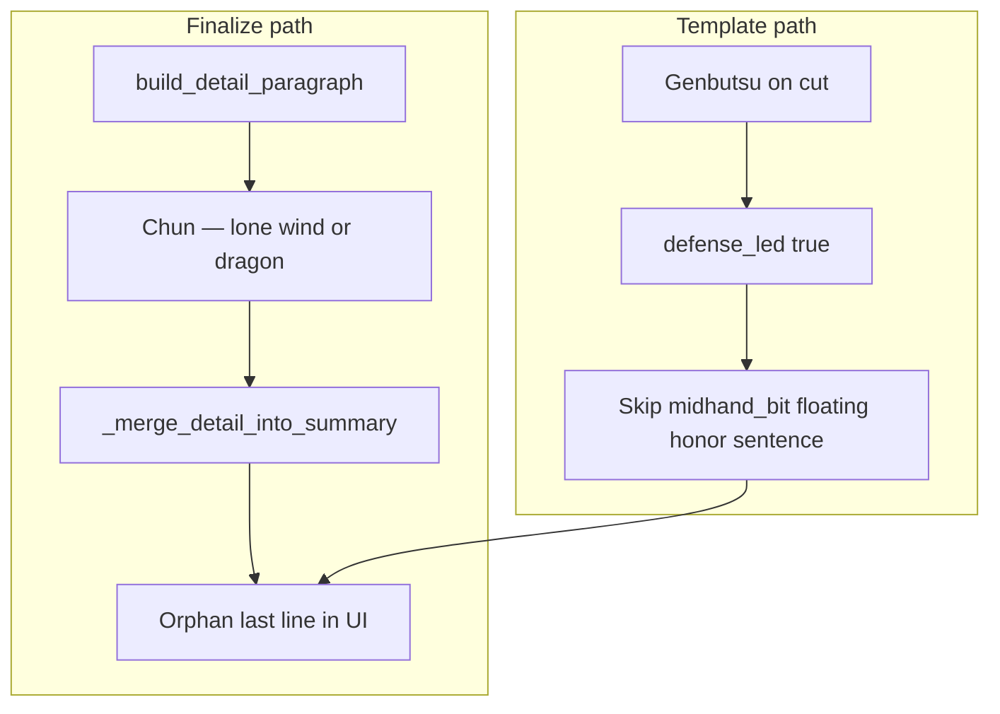

# Remove orphan shape-note gloss on defense-led tips

## Why that line exists

Every explanation goes through [`_finalize_explanation`](src/shanten_sensei/explain.py), which always builds a **detail** paragraph and merges missing chunks into **summary**:

```837:868:src/shanten_sensei/explain.py
def _finalize_explanation(
    turn: TurnExplainInput, explanation: Explanation
) -> Explanation:
    detail = build_detail_paragraph(turn)
    ...
    summary = _merge_detail_into_summary(explanation.summary, detail)
```

[`build_detail_paragraph`](src/shanten_sensei/explain.py) appends shape-note teaching rows from [`SHAPE_NOTE_GLOSS`](src/shanten_sensei/glosses.py):

```807:814:src/shanten_sensei/explain.py
    for note in turn.features.hand_shape_notes[:2]:
        gloss = _SHAPE_NOTE_GLOSS.get(note.kind)
        ...
        bits.append(f"{human_tile_label(note.tile)} — {gloss}")
```

For Chun on a pinfu hand, [`infer_hand_shape_notes`](src/shanten_sensei/features.py) tags the Mortal cut as `floating_honor`. The gloss text `lone wind or dragon` is the beginner definition for that tag (same catalog as the “Terms I know” checklist).

**What your screenshot shows:** Mortal prefers throwing Chun because it is **genbutsu** (opponent already discarded it). The main tip correctly leads with ukeire contrast, then adds the genbutsu sentence. But the template **deliberately suppresses** shape-goal and mid-hand cut-reason sentences when defense leads:

```1742:1783:src/shanten_sensei/explain.py
    if goal_bit and not defense_led:
        ...
    if midhand_bit and not defense_led:
        ...
```

So the prose version — `Chun is a floating honor outside pinfu (closed all-sequences; no value pair)` from [`_midhand_shape_clause`](src/shanten_sensei/explain.py) — never appears.

Dedup in [`_detail_shape_gloss_redundant`](src/shanten_sensei/explain.py) only skips the gloss when summary **already** contains `floating honor` for that tile. Here it does not, so merge appends the orphan footnote:

`🀄 Chun — lone wind or dragon.`

This is the same class of bug already fixed for **dora + dead-end** ([`dora_dead-end_line_breaks` plan](.cursor/plans/dora_dead-end_line_breaks_acf56d29.plan.md)): redundant detail gloss after the template intentionally omitted the real cut-reason sentence.



## Recommended fix (small, consistent with existing voice rules)

**Do not merge shape-note glossary rows when the template would have skipped `_midhand_shape_clause` due to `defense_led`.**

Aligns with [`tighten_tip_verbosity`](.cursor/plans/tighten_tip_verbosity_fc5dc5cd.plan.md): defense-led tips teach **why the cut is safe**, not shape taxonomy.

### Implementation

1. **Add a shared helper** in [`explain.py`](src/shanten_sensei/explain.py), e.g. `_defense_led_for_discard(turn)`, that mirrors the discard template’s danger compare for `mortal_best` vs contrast tile (same inputs as [`_template_explain_body`](src/shanten_sensei/explain.py) ~1716–1725). Return whether `danger_bits` would be non-empty.

2. **Gate shape-note gloss in `build_detail_paragraph`:**

```python
if not _defense_led_for_discard(turn):
    for note in turn.features.hand_shape_notes[:2]:
        ...
```

   - `detail` can still retain gloss for review API when defense does not lead.
   - Only the auto-merge into player-facing `summary` changes.

3. **Optional belt-and-suspenders** in `_merge_detail_into_summary`: skip `tile — gloss` chunks when summary already teaches genbutsu/suji/one-chance **for that tile** (regex on cut label + defense phrase). Low cost if helper is already shared.

### Tests in [`tests/test_explanation_substance.py`](tests/test_explanation_substance.py)

| Test | Assert |
|------|--------|
| `test_defense_led_tip_omits_orphan_shape_gloss` | Fixture: `mortal_best=dahai C`, `shape_goals=[pinfu]`, `hand_shape_notes=[floating_honor on C]`, `danger[C]=genbutsu`, ukeire contrast. `template_explain` / `_finalize_explanation` summary has genbutsu teaching; **no** `lone wind or dragon` / `floating_honor` gloss line. |
| `test_efficiency_led_tip_still_dedupes_shape_gloss` | Non-defense tip where summary already says `is a floating honor` — merged summary still omits redundant `— lone wind or dragon` (existing dedup behavior). |

### Out of scope

- Removing shape-note gloss from `build_detail_paragraph` entirely (still useful when efficiency leads and summary lacks the midhand sentence).
- Re-adding `floating honor` prose on defense-led tips (would lengthen tips and mix “safe to throw” with “bad for pinfu”).

## Summary for you

The line is a **teaching glossary stub** for `floating_honor`, not a separate coach judgment. It looks wrong here because defense-led tips hide the full sentence it was meant to support, but finalize still injects the stub at the end.
