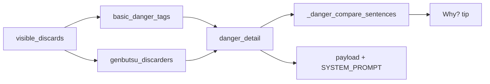

# Richer genbutsu discard explanations

## Locked decisions

- **Default voice:** `An opponent already discarded {tile}, so they can't ron it from you.`
- **Riichi refinement:** If any **opponent** seat that is in riichi also has the tile in their river → `The riichi player already discarded {tile}, so they can't ron it.` Otherwise keep “an opponent.”
- **No overlay changes.** `visible_discards` is already seat-keyed; live already passes `self_seat` via `context`.
- **Suji / one-chance unchanged** (short gloss + existing compare templates).
- **Tagging heuristics unchanged** (`basic_danger_tags` still flattens all rivers for the tag). Seat awareness is for prose/facts only.



## 1. Seat-aware facts — [`features.py`](src/shanten_sensei/features.py) + [`schema.py`](src/shanten_sensei/schema.py)

Add:

```python
def genbutsu_discarders(
    tile: str,
    visible_discards: dict[str, list[str]] | None,
    *,
    exclude_seat: str | int | None = None,
) -> list[str]:
```

- Normalize tile with `deaka(normalize_tile(...))`.
- Return sorted seat id strings whose river contains the tile.
- Skip `exclude_seat` when known (`context["self_seat"]` / live `player_seat` already merged into `feat_context`).

In `extract_features`, after `basic_danger_tags`:

- Build `danger_detail: dict[str, dict]` for each tagged candidate, e.g. `{"E": {"tag": "genbutsu", "seats": ["2"]}}`.
- For genbutsu tiles, `seats` = `genbutsu_discarders(...)` (own seat excluded when known).
- Non-genbutsu tags get `{"tag": "...", "seats": []}` (or omit seats) so templates can stay tag-driven.

Add field on [`DerivedFeatures`](src/shanten_sensei/schema.py):

```python
danger_detail: dict[str, dict[str, Any]] = Field(default_factory=dict)
```

Include `danger_detail` in [`build_user_payload`](src/shanten_sensei/explain.py) next to `danger`.

## 2. Clearer gloss + template teaching voice

### Gloss — [`glosses.py`](src/shanten_sensei/glosses.py)

```python
"genbutsu": "safe — opponent already discarded it, so they can't ron it",
```

Keep `glossed_danger` format (`genbutsu (…)`); suji/one-chance strings untouched.

### Compare sentences — [`_danger_compare_sentences`](src/shanten_sensei/explain.py) (~954–989)

When Mortal’s cut tag is **genbutsu**, replace `{tile} is genbutsu (safe — already discarded)` with a full teaching clause:

| Case | New sentence |
|---|---|
| Best safer than contrast | `{teaching}.` (optional short contrast only if useful; do not keep jargon-only “X isn't”) |
| Best tagged, no weaker contrast (“also”) | Same teaching clause (drop “also genbutsu”) |
| Player cut tagged genbutsu but efficiency worse | Teaching clause on **player** tile + keep “but efficiency is worse” |

Helper e.g. `_genbutsu_teaching_sentence(turn, tile_code, tile_label) -> str`:

1. Read `danger_detail[tile].seats` (else recompute via `genbutsu_discarders` from `game_state.visible_discards` + `context.self_seat`).
2. If intersection of those seats with riichi opponent seats is non-empty → riichi wording.
3. Else → “an opponent” wording.

Riichi seats: treat `game_state.riichi_flags[i]` as absolute seat `str(i)` when `self_seat` is known (live overlay path). Exclude self. If `self_seat` missing or flags empty → never claim “the riichi player.”

Suji / one-chance branches keep current `{tile} is {glossed}` templates.

Detail paragraph (~796–803) can keep `glossed_danger` (now richer for genbutsu chips).

## 3. LLM + grounding alignment — [`explain.py`](src/shanten_sensei/explain.py)

**SYSTEM_PROMPT** (~84–88): when danger is genbutsu, explain the rule (opponent already discarded → that player can’t ron that tile from you); may name “the riichi player” only when grounded in danger_detail / rivers. Still forbid attaching that language to the wrong tile.

**`_false_genbutsu_error` / `_tile_claimed_as_genbutsu_safe`:**

- Trigger safety checks on new teaching phrases: `\balready\s+discarded\b` (not only “already been played”) and `\bcan'?t\s+ron\b` / `\bcan'?t\s+win on\b`.
- Detect claim word order **`already discarded {tile}`** / **`can't ron {tile}`**, not only `{tile} is genbutsu`.
- Keep rejecting genbutsu language on non-genbutsu tiles; require a genbutsu tile to be named when those phrases appear.

Update golden accepted summary in [`test_grounding_accepts_correct_genbutsu_on_best_cut`](tests/test_explanation_substance.py) to the new teaching voice.

## 4. Tests

| File | Assert |
|---|---|
| [`tests/test_glosses.py`](tests/test_glosses.py) | New `DANGER_GLOSS["genbutsu"]` / `glossed_danger` text |
| [`tests/test_features.py`](tests/test_features.py) | Seat-keyed rivers → `genbutsu_discarders` / `danger_detail[...].seats` exclude own seat; tag still `genbutsu` |
| [`tests/test_explanation_substance.py`](tests/test_explanation_substance.py) | Template genbutsu cut contains `already discarded` + (`can't ron` or `can't win`); riichi+matching river → `riichi player`; update goldens that lock `safe — already discarded` |

Run focused: `pytest tests/test_glosses.py tests/test_features.py tests/test_explanation_substance.py -q`

## Out of scope

- New danger heuristics (kabe, matagi, EV)
- Overlay UI / `lan_str.py`
- Temporary furiten / `tiles_left` wiring
- Changing which rivers feed the genbutsu **tag** (own river still can tag; prose prefers opponent discarders via `seats`)
