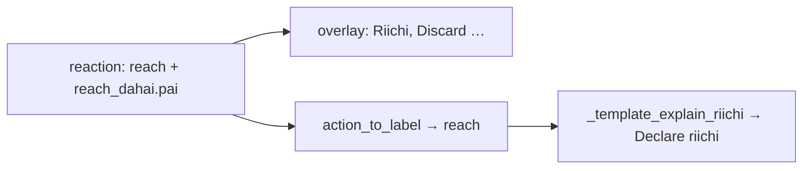

# Include riichi discard in Sensei tip

## What you saw

Overlay HUD: **Riichi, Discard Red 5 Sou** (joins `reach` + nested `reach_dahai`).

Sensei Why?: **Declare riichi…** + tenpai/dora — no cut named.

That is not random truncation from “too many signals.” Riichi tips were designed as Declare / Stay silent only ([`defense_riichi_score_10968c34`](.cursor/plans/defense_riichi_score_10968c34.plan.md)). Crowding (tenpai + dora + Aiming-for pinfu) makes the missing discard more noticeable, but the cut was never in the template.



## Locked approach

Keep `mortal_best == "reach"` (branching, pinning, Stay silent contrast unchanged). Thread the cut tile as `features.context["reach_discard"]` and name it in the riichi **lead** when present:

> Declare riichi, discard red 5-sou

Use **discard** (not Throw) so we keep the existing invariant that riichi tips never say “Throw reach” / bare Throw voice ([`tests/test_riichi_coaching.py`](tests/test_riichi_coaching.py)). Stay-silent tips stay discard-free.

## Implementation

### 1. Extract `reach_dahai` in live turn build

In [`src/shanten_sensei/live.py`](src/shanten_sensei/live.py) `turn_from_live`:

- When `recommended` is a dict with `type == "reach"` and nested `reach_dahai.pai`, normalize that tile.
- Also accept `context["reach_discard"]` for string-only recommended fixtures.
- Set `ukeire_after_discard` to that tile (today only `dahai …` sets it ~266–268), so tenpai/ukeire/shape match the real cut.
- Put `reach_discard` into `feat_context` so it lands on `features.context`.

Small helper next to other reaction parsers (same file as `_reaction_call_tile`):

```python
def _reaction_reach_discard(reaction: dict | None) -> str | None:
    ...
```

`action_to_label` stays `"reach"` — do not change the compact pin label.

### 2. Riichi template lead

In [`src/shanten_sensei/explain.py`](src/shanten_sensei/explain.py) `_template_explain_riichi`:

When `best_kind == "reach"` and `turn.features.context.get("reach_discard")` is set, lead with:

`Declare riichi, discard {human_tile_label(tile)}`

(then existing “don’t stay silent” contrast / tenpai / dora / score as today).

### 3. Prompt + payload

Same file:

- `SYSTEM_PROMPT`: for `riichi_decision`, when `reach_discard` is present, require naming that cut in the lead; update the example to include it.
- `build_user_payload`: expose `reach_discard` (and optionally a display string) so the LLM sees the same fact as the template.

### 4. Grounding

In `validate_explanation`: if riichi decision, Mortal best is reach, and `reach_discard` is set, require the summary to mention that tile via existing `_mentions_tile` (same pattern as dahai pin). Stay silent / no-tile cases unchanged.

### 5. Tests

Update/extend [`tests/test_riichi_coaching.py`](tests/test_riichi_coaching.py):

- Live fixture with `recommended={"type": "reach", "reach_dahai": {"type": "dahai", "pai": "5sr"}}` (and a 14-tile hand that includes it).
- Assert summary has `Declare riichi` **and** `red 5-sou` (or emoji form from `human_tile_label`).
- Assert `"Throw" not in result.summary` and `"Skip" not in result.summary` still hold.
- Keep Stay silent + low-prob-reach→Throw cases.

Optional: one grounding check that an LLM-style summary omitting the cut fails validation when `reach_discard` is set.

## Out of scope

- Overlay HUD formatter (already correct).
- Review-chip label staying “Declare riichi” without the cut (can follow later if desired).
- Changing Aiming-for / shape_goals crowding in the short tip.