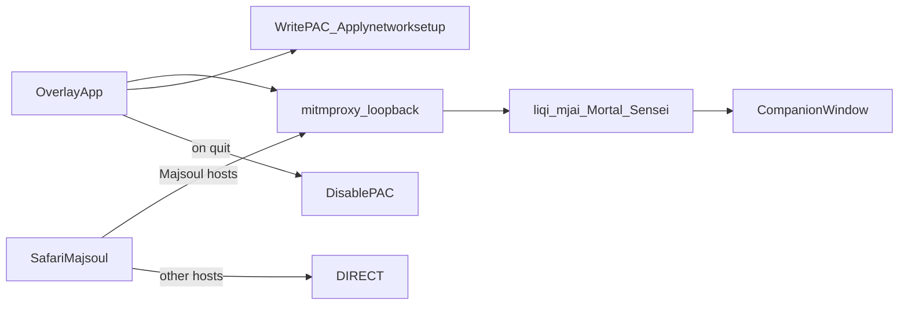

# Implement Safari companion mode

## Locked decisions

- **Safari browser only** (no Mac Majsoul app).
- **Companion window only** for coaching (no Safari in-page HUD).
- **macOS PAC** routes Majsoul hosts to `127.0.0.1:{mitm_port}`; everything else `DIRECT`.
- Reuse existing `GameClientType.PROXY` capture when WS hits mitm without Playwright.
- Code in sibling **[shanten-sensei-overlay](file:///Users/rebeccaclarke/a_new_projects_folder/shanten-sensei-overlay)** (GPL); Sensei repo gets **docs status updates only**.

## Architecture (what we build)

## Overlay implementation

### 1. New macOS proxy helper — `common/macos_proxy.py`

- Write a PAC file under overlay temp/`mitm_config` (e.g. `sensei-majsoul.pac`) using `MAJSOUL_DOMAINS` from [`common/utils.py`](file:///Users/rebeccaclarke/a_new_projects_folder/shanten-sensei-overlay/common/utils.py) (`maj-soul.com`, `majsoul.com`, `mahjongsoul.com`, `yo-star.com`) matching host/suffix.
- Apply via `networksetup`: detect primary Ethernet/Wi-Fi service, `-setautoproxyurl` + `-setautoproxystate on`.
- Store previous auto-proxy URL/state so disable can restore (not only turn off).
- `disable()` / `atexit` / best-effort restore; never leave PAC on after overlay stop.
- Non-Darwin: no-op + clear error if Safari mode is turned on.

### 2. Settings — [`common/settings.py`](file:///Users/rebeccaclarke/a_new_projects_folder/shanten-sensei-overlay/common/settings.py)

- Add `safari_mode: bool = False` (persist in `settings.json`).
- When true: do not auto-launch Chromium; companion-only toolbar behavior.

### 3. Bot manager lifecycle — [`bot_manager.py`](file:///Users/rebeccaclarke/a_new_projects_folder/shanten-sensei-overlay/bot_manager.py)

- After mitm start + cert install, if `safari_mode`: call macOS proxy enable with `mitm_port`; skip `auto_launch_browser`.
- Optionally construct `MitmController(allowed_domains=MAJSOUL_DOMAINS)` in Safari mode (WS allowlist already supported in [`mitm.py`](file:///Users/rebeccaclarke/a_new_projects_folder/shanten-sensei-overlay/mitm.py); currently unrestricted).
- On `_run` cleanup (next to `mitm_server.stop()`): always `macos_proxy.disable()` if we enabled it.
- Refuse `start_browser()` while `safari_mode` (or force-disable browser start).

### 4. Companion-only UI — [`gui/main_gui.py`](file:///Users/rebeccaclarke/a_new_projects_folder/shanten-sensei-overlay/gui/main_gui.py) + [`common/lan_str.py`](file:///Users/rebeccaclarke/a_new_projects_folder/shanten-sensei-overlay/common/lan_str.py) + [`gui/settings_window.py`](file:///Users/rebeccaclarke/a_new_projects_folder/shanten-sensei-overlay/gui/settings_window.py)

- Settings checkbox: **Safari companion mode** (macOS); note that Chromium path is the default.
- When `safari_mode`:
  - Disable/hide **Start Web Client** and **Overlay** (in-page HUD).
  - Status copy: dual-window instructions — open Majsoul in Safari; tips appear here; Proxy Client when flows connect.
- Keep Why?, practice banner, autoplay-off expectations unchanged.

### 5. Darwin cert hardening — [`common/utils.py`](file:///Users/rebeccaclarke/a_new_projects_folder/shanten-sensei-overlay/common/utils.py)

- Fix `sub_run_args()` so Darwin/Linux do not use Windows `STARTUPINFO`.
- Improve cert find/install messaging for macOS (login vs System keychain as needed); keep per-machine `mitm_config` CA.
- Document failure path: user must trust cert or Safari TLS to mitm fails.

### 6. Tests

- Unit-test PAC generation (Majsoul host → PROXY, unrelated → DIRECT).
- Unit-test enable/disable restore logic with mocked `subprocess` / service name.
- GUI/settings: `safari_mode` disables browser start / overlay switch (lightweight if harness allows).

## Sensei docs (this repo)

Update status to “supported on macOS” and add player steps:

- [`docs/live-setup.md`](docs/live-setup.md) — Safari section: enable mode → trust cert → start overlay → open Safari Majsoul → companion Why?; quit clears PAC; link precautions.
- [`docs/dual-client-architecture.md`](docs/dual-client-architecture.md) — Path B status → shipped (macOS).
- [`docs/proxy-trust-precautions.md`](docs/proxy-trust-precautions.md) — real ON/OFF behavior (PAC + quit cleanup) and manual `networksetup` off if crash.

## Manual verify (before calling done)

On a Mac with the overlay venv:

1. Enable Safari mode, start overlay, confirm PAC/auto-proxy on for Wi-Fi/Ethernet.
2. Open YoStar Majsoul in Safari; companion shows Proxy Client after login/lobby.
3. Practice game: tips/Why? in companion; no Chromium window.
4. Quit overlay: auto-proxy off/restored; normal browsing works.
5. Chromium path with `safari_mode=false` still works via Start Browser.

## Out of scope

- Mac native Majsoul app, Windows Safari, in-page Safari HUD, Docker, hosted live proxy, notarized installer.