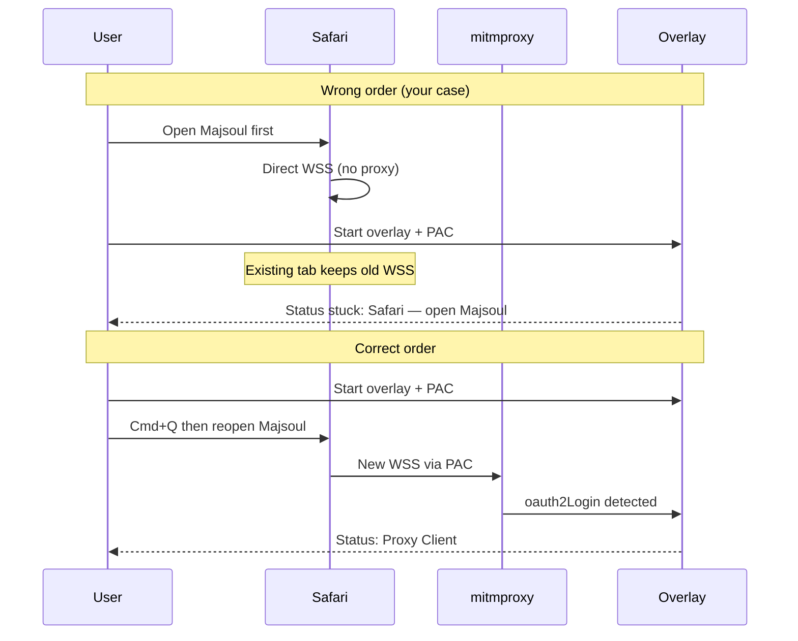

# Safari reconnect button

## What you're hitting

This is a **connection-order bug**, not a Sensei coaching bug. In Safari companion mode, the overlay enables a Majsoul-only PAC proxy after startup. If [MahjongSoul](https://mahjongsoul.game.yo-star.com) was already open, Safari keeps its existing WebSocket connection **direct** — it never routes through mitm. The status bar stays on **"Safari — open Majsoul"** until you fully quit Safari (`Cmd+Q`) and reopen the game.



Documented today in [`docs/live-setup.md`](docs/live-setup.md) (step 4 under Safari companion) but there is **no in-app action** — only manual quit/reopen.

## Recommendation: do this now, separate from UI polish

| Work | When | Why |
|------|------|-----|
| **Reconnect button** (this plan) | Now | Fixes a real, recurring setup pain point |
| **Broader "pretty/modern" UI** | Later | Larger tkinter refactor (CustomTkinter, layout, typography) |

Recent overlay polish already shipped incrementally ([dark theme](.cursor/plans/overlay_dark_theme_f5bb71fd.plan.md), [compact coach](.cursor/plans/compact_coaching_overlay_0b56cbf3.plan.md), collapsible toolbars). A reconnect button fits that UI without waiting for a full redesign.

**Repo:** implementation lives in sibling **[shanten-sensei-overlay](file:///Users/rebeccaclarke/a_new_projects_folder/shanten-sensei-overlay)** (GPL). This Sensei repo only needs a small doc tweak in [`docs/live-setup.md`](docs/live-setup.md).

---

## UX design (your preference: labeled full Safari restart)

### When visible
- `safari_mode == True`
- Client status is **not** `Proxy Client` (i.e. `get_game_client_type() != PROXY`)
- Button sits in the **practice banner row** beside the existing Safari hint text — high visibility when connection is stuck

### Labeling (avoid surprise)
Use explicit, scary-clear copy — not just "Restart":

- **Button:** `Quit Safari & reopen Majsoul`
- **Confirmation dialog** (required before action):
  - Title: `Reconnect Majsoul`
  - Body: `This will quit Safari completely and close all open tabs and windows. Majsoul will reopen in a fresh Safari window so the coach can connect.`
  - Buttons: `Cancel` / `Quit Safari & reopen`

Add matching strings to [`common/lan_str.py`](file:///Users/rebeccaclarke/a_new_projects_folder/shanten-sensei-overlay/common/lan_str.py) (EN + CN mirror).

### After success
- Status bar should transition to **Proxy Client** once `oauth2Login` arrives (existing detection in [`bot_manager.py`](file:///Users/rebeccaclarke/a_new_projects_folder/shanten-sensei-overlay/bot_manager.py) ~482–487)
- Optional short banner: `Reopened Majsoul — waiting for Proxy Client…`

### When hidden
- Once connected (`PROXY_CLIENT`), hide or disable the button (connection is live; user shouldn't need it mid-game)

---

## Implementation

### 1. Safari relaunch helper — new `common/safari_reconnect.py`

Small macOS-only module (parallel to [`common/macos_proxy.py`](file:///Users/rebeccaclarke/a_new_projects_folder/shanten-sensei-overlay/common/macos_proxy.py)):

```python
def quit_safari_and_open(url: str) -> None:
    # osascript: tell application "Safari" to quit
    # brief sleep (0.5–1s) so PAC applies to new process
    # subprocess: open -a Safari <url>
```

- Non-macOS: raise clear error (Safari mode already macOS-only)
- Log each step; surface failures in status bar via existing `error_to_str` patterns
- Use `settings.ms_url` (default `https://mahjongsoul.game.yo-star.com/`)

No AppleScript tab targeting — full quit is intentional and matches docs.

### 2. Bot manager hook — [`bot_manager.py`](file:///Users/rebeccaclarke/a_new_projects_folder/shanten-sensei-overlay/bot_manager.py)

Add `reconnect_safari_client()`:
- Guard: only when `safari_mode` and not in ranked-critical state
- Call `quit_safari_and_open(self.st.ms_url)`
- **Reset stale flow IDs** so a fresh `oauth2Login` can attach:
  - `lobby_flow_id = None`
  - `game_flow_id = None`
  - clear `game_state` if any (avoid tips from old session)
- Do **not** restart mitm (commented-out mitm restart is known broken; PAC stays active)

### 3. UI wiring — [`gui/main_gui.py`](file:///Users/rebeccaclarke/a_new_projects_folder/shanten-sensei-overlay/gui/main_gui.py)

- In `_create_widgets`, add `btn_reconnect_safari` next to `banner_label` (ttk.Button, existing dark-theme styling via `GuiStyle`)
- Handler `_on_reconnect_safari_clicked`:
  1. `messagebox.askokcancel` with the explicit warning copy
  2. On OK → `bot_manager.reconnect_safari_client()` on a short background thread (avoid freezing tkinter during `osascript` / `open`)
  3. Show errors via `messagebox.showerror` or status bar
- In `_update_gui` (~767–783 practice banner block): show/hide button based on `safari_mode` + connection state

### 4. Tests — `tests/test_safari_reconnect.py`

Mock `subprocess` / `osascript` runner:
- Calls quit + open with correct URL
- `reconnect_safari_client` clears `lobby_flow_id` / `game_flow_id`
- Non-Darwin raises cleanly

### 5. Docs — [`docs/live-setup.md`](docs/live-setup.md)

Update Safari troubleshooting row and step 4:

> If you opened Majsoul before the overlay, click **Quit Safari & reopen Majsoul** in the coach window (this closes all Safari tabs).

---

## Out of scope (future polish)

- **Chromium reload** (`page.reload()` in [`game/browser.py`](file:///Users/rebeccaclarke/a_new_projects_folder/shanten-sensei-overlay/game/browser.py)) — you selected Safari path; add later if needed
- **Auto-detect wrong order on startup** — could show the reconnect button proactively (already covered by "show when not Proxy Client")
- **Full tkinter modernization** (CustomTkinter, rounded cards, animations) — separate project
- **In-page Chromium HUD** — Safari mode intentionally has no in-page overlay; coach window is the teaching surface

---

## Manual test plan

1. Enable Safari companion mode → restart overlay
2. Open Majsoul in Safari **before** starting overlay → confirm status stuck on "Safari — open Majsoul"
3. Click **Quit Safari & reopen Majsoul** → confirm dialog shows tab-closing warning
4. Accept → Safari quits, Majsoul reopens → status becomes **Proxy Client**
5. Join friend/practice → Why? works
6. Cancel dialog → no Safari quit
7. After connected, button hidden/disabled
