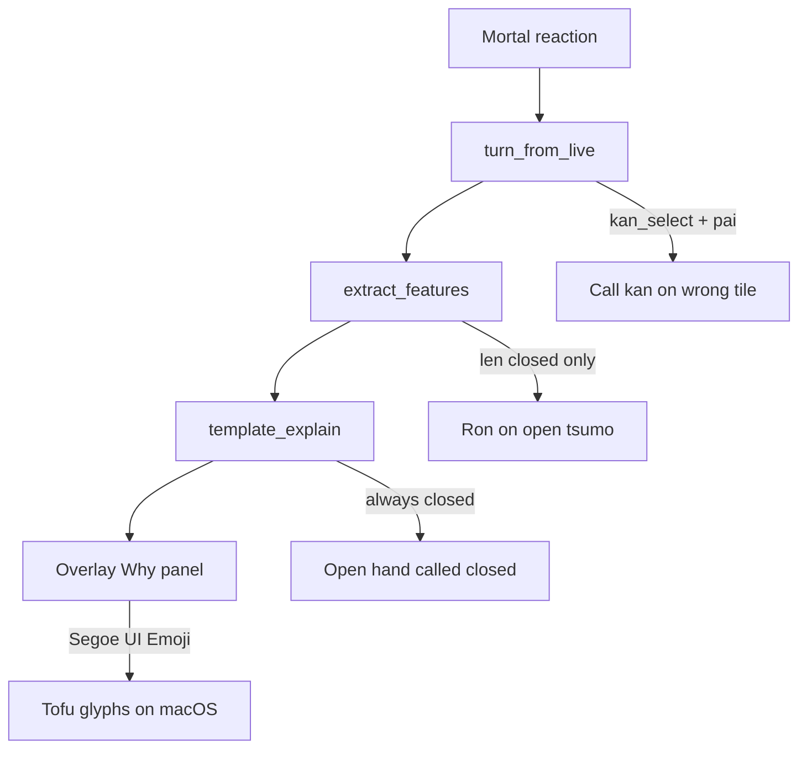

# Screenshot coaching and wait-claim fixes

Tonight’s shots mix **copy bugs** (clear, testable) with **impossible claims** (kan on one Hatsu, shanpon on a singleton 5-pin, riichi while not tenpai). Copy bugs we can ship immediately. Impossible claims get **grounding guards** so Why? will not assert them even when Mortal/meta is messy, plus targeted tests around open-hand shanten/wait.



Not bugs (leave alone): `Main Thread(404)` is a message/FPS counter; `✖3P` means the 3-player model is not loaded; `shanten -1` is agari.

Work spans this repo and sibling [`../shanten-sensei-overlay`](../shanten-sensei-overlay).

---

## 1. Ron vs Tsumo on open-hand wins

**Shot:** Majsoul shows **Tsumo**; Yakuman says **“Ron — take the win.”** Status correctly shows `open`.

[`hora_coach_label`](src/shanten_sensei/explain.py) uses `len(turn.game_state.hand) >= 14`. Overlay [`hand_tiles_from_game_info`](../shanten-sensei-overlay/sensei_adapter.py) is **closed tiles + tsumohai**. After a pon, that is 11 tiles on tsumo, so the label always falls through to Ron.

Fix: treat as tsumo when `len(hand) + 3 * len(calls) >= 14` (same accounting as [`features.py`](src/shanten_sensei/features.py) `hand_total`). Keep Ron + `Win on {tile}` for the 13-tile / opponent-discard case.

Prefer reaction `pai` in `_hora_winning_tile` before scanning rivers, so a matching tile on someone else’s pond is not named as the win tile.

Tests in [`tests/test_hora_coaching.py`](tests/test_hora_coaching.py): 11 closed + one pon + `hora` → `Tsumo — take the win`; existing 13-tile ron fixture unchanged.

---

## 2. Call tips always say “closed”

**Shots:** Open pon on the table, status strip says `open`, but the tip says “You’re 3-shanten **closed**…” / “tenpai **closed**…”.

[`_template_explain_call`](src/shanten_sensei/explain.py) hardcodes `closed with`:

```1956:1960:src/shanten_sensei/explain.py
    if shanten is not None:
        move_sents.append(
            f"You’re {_glossed_shanten_phrase(shanten)} closed with "
            f"about {ukeire.count} improving tiles"
        )
```

Use `statuses.menzen`: `closed with` vs `open with`. Update [`tests/test_call_coaching.py`](tests/test_call_coaching.py) with an already-open skip/pon fixture.

---

## 3. Kan labeling: `kan_select` becomes `daiminkan {pai}`

**Shot:** Kan/Skip with one Hatsu in hand; tip **“Call kan on Hatsu.”** You need three (daiminkan) or four (ankan).

Two stacked bugs:

- [`enrich_call_action_label`](src/shanten_sensei/tiles.py) always emits `daiminkan {tile}` for any kan family, including `kan_select` / `ankan`.
- Overlay passes `reaction["pai"]` as `call_tile` even when that pai is not a legal kan tile.

Fix in Sensei:

- Preserve `ankan` / `kakan` / `daiminkan` when the reaction already has a type; only attach a tile, do not rewrite the kind to daiminkan.
- For bare `kan_select`, pick the tile from `consumed` / `pai` **only if** the closed hand has ≥3 of it (daiminkan/kakan) or ≥4 (ankan). Otherwise leave the label as `Call kan` (no tile) rather than naming a singleton.

Mirror a Why skip in overlay (same pattern as `_dahai_reaction_missing_from_hand`): if recommended kan tile fails that count check, do not show “Call kan on X”.

Tests: ankan of 5p stays `ankan 5p`; `kan_select` + `pai=F` with one Hatsu in hand does not produce `Call kan on Hatsu`.

---

## 4. “Throw X, not Haku” when Haku is not in the hand

**Shots:** “Throw Hatsu, not Haku” / “Throw 3-pin, not Haku” with no Haku in tehai (or Haku already in the pond).

[`next_best_action`](src/shanten_sensei/live.py) returns Mortal’s second meta candidate with **no in-hand check**. Overlay already drops Why when the *recommended* dahai is missing; contrast is unguarded.

Fix: when contrasting dahai, skip candidates whose tile is not in `game_state.hand`. If none remain, emit `Throw X` with no `not Y`. Add a screenshot-shaped test (best `dahai F`, next `dahai P`, hand has F but not P).

---

## 5. macOS tile-glyph tofu

**Shot:** boxes before `Haku`, `3-pin`, `7-man`, etc. Apple Color Emoji includes **only** 🀄 (Chun). The rest of U+1F000 is missing. The Why panel is forced to `Segoe UI Emoji` ([`gui/main_gui.py`](../shanten-sensei-overlay/gui/main_gui.py)), a Windows family.

On Darwin, use a font that actually has the mahjong block (`Apple Symbols`, or a bundled Noto Sans Symbols 2 if you want the same look on every Mac). Keep `Segoe UI Emoji` on Windows. Apply to Why, AI Guidance, and the hand unicode strip.

Do not strip names; glyphs stay beside `Hatsu` / `3-pin` once they render.

---

## 6. Impossible tenpai / wait claims (guards + tests)

These need **guards**, not a full rewrite of Mortal.

| Shot | Claim | Board |
| --- | --- | --- |
| Riichi 6-pin, ryanmen 4s/7s | tenpai | Pairs-heavy / not that wait (left tiles may be covered — still guard) |
| Shanpon 5-pin + East | tenpai | Pair is **8-pin** + East; one 5-pin in a sequence |
| Kan Hatsu / tenpai open | kan + tenpai | One Hatsu; likely ankan of another tile |

**Shanpon sanity** in [`classify_wait_shape`](src/shanten_sensei/features.py) / wait listing: a two-tile wait is shanpon only if **both** wait tiles appear as pairs in the closed hand. If one wait is a singleton (the 5-pin case), do not label shanpon; keep the real wait tiles from `wait_tiles_if_tenpai` or fall back to `complex`.

**Riichi / tenpai voice:** [`is_riichi_decision_turn`](src/shanten_sensei/live.py) / riichi template should not say “You’re tenpai… ryanmen” when `features.shanten != 0`. Prefer “Mortal wants riichi” plus the calculator’s actual shanten, or skip the wait sentence.

**Ghost-honor padding:** [`_shanten_with_melds`](src/shanten_sensei/features.py) pads fuuro with dummy honor triplets. Add regressions from the East-shanpon hand (10 closed + chun pon → waits `8p` and `E`, not `5p`) and a closed 14-tile tsumo with one pon → agari / Tsumo label. If a test shows ghost honors inventing waits, stop using honor-slot ghosts (use a padding scheme that cannot collide with real honors/waits).

---

## 7. Small overlay polish (same pass)

Safari banner concatenates `PRACTICE_ONLY + SAFARI_HINT` into one line (`Open Majsoul in Saf…`). Wrap or give the banner a second line in [`gui/main_gui.py`](../shanten-sensei-overlay/gui/main_gui.py). The companion status strip is a `height=1` label, so `Game Running - East 3 Ky…` clips the same way — allow wrap or a slightly taller strip.

Redundant “locks a yakuhai triplet” + “builds toward yakuhai—holding a pair of Hatsu and a triplet of Chun” on pon: drop the second shape sentence when the first already locked that yaku. Nice-to-have if the tests stay cheap.

---

## Out of scope

- Teaching whether skipping daiminkan of an already-complete dragon is “correct” (Mortal’s call).
- Implementing 3P (`✖3P`).
- Silencing `Route.heartbeat` parse logs.
