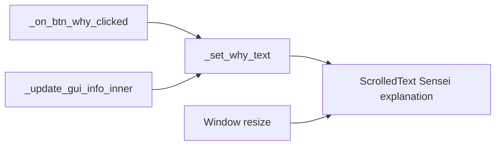

# Scrollable, resizable Sensei explanation

## Problem

In the sibling overlay ([`shanten-sensei-overlay/gui/main_gui.py`](file:///Users/rebeccaclarke/a_new_projects_folder/shanten-sensei-overlay/gui/main_gui.py)), **Sensei explanation** is a `tk.Label` with a hard line cap (`height=4` compact / `5` full) and grid sticky `EW` only. Long Why? text wraps past that cap and is clipped with no scrollbar. Window resize does not grow the panel. The reason log already uses `ScrolledText` and shows the full text.

An earlier height-only bump (documented in [`.cursor/plans/why_panel_height_680882f8.plan.md`](.cursor/plans/why_panel_height_680882f8.plan.md)) is already applied and is not enough for typical gloss-backed summaries.

## Approach

Replace the Why `Label` with a read-only `scrolledtext.ScrolledText`, give that row `sticky=NSEW` so the window can allocate extra height, and route all Why updates through a small setter (same pattern as `_sync_reason_log`).



## Changes (overlay only)

All edits in [`../shanten-sensei-overlay/gui/main_gui.py`](../shanten-sensei-overlay/gui/main_gui.py):

1. **Widget** — Replace `self.why_var` / `tk.Label` (~197–207) with:

```python
why_height = 5 if self.st.hide_ai_options else 6
self.text_why = scrolledtext.ScrolledText(
    self.grid_frame,
    height=why_height,
    wrap=tk.WORD,
    font=GUI_STYLE.font_normal("Segoe UI", 14),
    relief=tk.SUNKEN,
    padx=5,
    pady=5,
    state=tk.DISABLED,
)
self.text_why.grid(row=cur_row, column=0, sticky=tk.NSEW, padx=5, pady=2)
self.grid_frame.grid_rowconfigure(cur_row, weight=2)
```

- Default visible lines: 5 (compact) / 6 (full) so a typical Why fits without scrolling.
- `weight=2` on the Why row (reason log stays `weight=1`) so extra window height prefers the latest explanation.

2. **Setter** — Add `_set_why_text(self, text: str)` that enables → deletes → inserts → disables (mirror `_sync_reason_log`). Skip rewrite when content is unchanged to avoid flicker from the 50ms GUI tick.

3. **Call sites** — Swap `self.why_var.set(...)` in `_on_btn_why_clicked` and `_update_gui_info_inner` for `_set_why_text(...)`.

4. **Compact window** — Bump compact geometry/minsize from `(480, 420)` → `(480, 480)` in `__init__` and `reload_gui` so the taller Why box does not crush Game Info. Full size stays `(620, 580)`.

No PanedWindow/sash, no Sensei package changes, no prompt length changes. Adjustability = scroll when long + grow Why when the user enlarges the window.

## Verify

- Relaunch overlay in compact mode; trigger Why? on a long tanyao-style summary — full sentence visible via scroll, no mid-line clip.
- Enlarge the window — Sensei explanation grows more than the reason log.
- Confirm reason log / Aiming-for / status strip still update as before.
